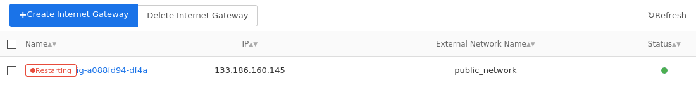
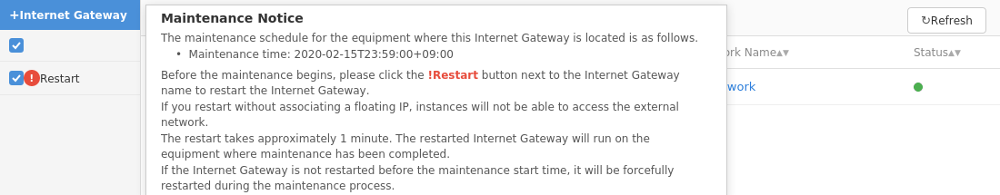
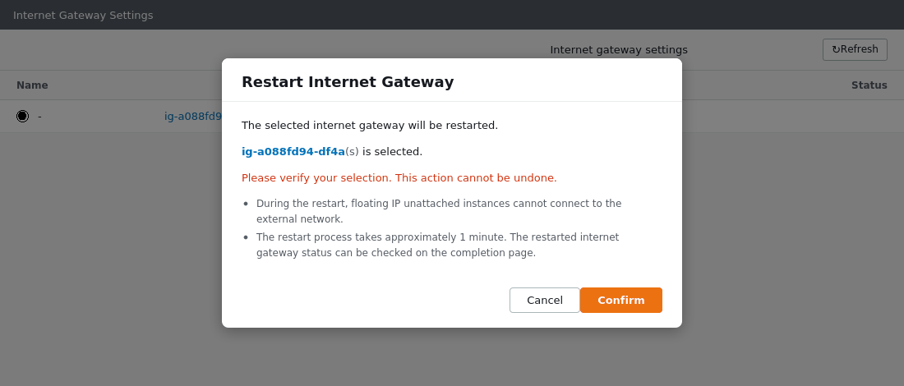
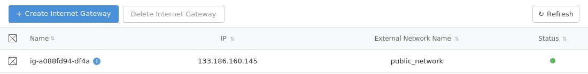

## Network > VPC > Console Guide

This document describes the essential content for managing VPCs in the console.

## Video Guide
<iframe width="560" height="315" src="https://www.youtube.com/embed/faX5L2XA_78" frameborder="0" allow="accelerometer; autoplay; encrypted-media; gyroscope; picture-in-picture" allowfullscreen></iframe>

<iframe width="560" height="315" src="https://www.youtube.com/embed/qLjzBebDaqE" frameborder="0" allow="accelerometer; autoplay; encrypted-media; gyroscope; picture-in-picture" allowfullscreen></iframe>

## VPC

Since VPCs can have multiple subnets, when using divided subnets, you need to set up a sufficiently large network. VPC networks can be described using [CIDR Notation](https://en.wikipedia.org/wiki/Classless_Inter-Domain_Routing). All VPCs must be within the following 3 address ranges that can configure [private networks](https://en.wikipedia.org/wiki/Private_network), and link-local addresses cannot be used. Additionally, you must specify a network area larger than at least 24bit-256.

### Private Network

RFC1918 | IP Address Range | Number of Available Addresses
-------- | ---------- | -----------------
24bit block | 10.0.0.0/8 | 16,777,216
20bit block | 172.16.0.0/12 | 1,047,576
16bit block | 192.168.0.0/16 | 65,536

### Link-Local Addresses

65,536 IP addresses included in 169.254.0.0/16 cannot be used.

### Examples

Example | Availability
-------- | ---------- 
10.0.0.0/8 | Available.
10.0.0.0/16 | Available.
10.0.0.0/24 | Available.
10.0.0.0/28 | Unavailable. The range is too small.
172.16.0.0/16 | Available.
172.16.0.0/8 | Unavailable. Out of available range.
192.168.0.0/16 | Available. Set as default usage range.
192.168.0.0/24 | Available.
192.253.0.0/24 | Unavailable. Out of available range.

<br>


When you first use Compute and Network services, the following items are automatically configured:

Item | Name | Summary
-------- | ---------- | --------------
VPC | Default Network | One VPC with 192.168.0.0/16 range is created.
Subnet | Default Network | One subnet with 192.168.0.0/24 range is created.
Routing Table | vpc-[id] | One routing table with part of the VPC ID as the name is created.
Internet Gateway | ig-[id] | One internet gateway with part of the routing table ID as the name is created.
Security Group | default | One security group with the name "default" is created.

When adding VPCs instead of initial configuration, the following items are configured:

Item | Name | Summary
-------- | ---------- | --------------
VPC | Specified name | One VPC with the specified range is created.
Subnet | - | Not created
Routing Table | vpc-[id] | One routing table with part of the VPC ID as the name is created.
Internet Gateway | - | Not created, so must be created and connected separately.
Security Group | - | Not additionally created.

The quotas for VPCs and each item are as follows:

Item | Maximum Value
-------- | ---------- 
VPC | 3
Subnet | 10 per VPC 
Internet Gateway | 3 
Floating IP | No limit
Routing Table | 10 per VPC 
Route | 10 per routing table
Peering | No limit


> [Note]
To delete a VPC, it's only possible when all subnets can be deleted, and in such cases, it's deleted along with subnets, routing tables, and internet gateways.

* VPCs are completely isolated from other VPCs and safe from traffic.

* Since VPCs are private networks, direct access from the internet is not possible.

* All elements within a VPC cannot use VLANs.

* Local communication is not provided for traffic across regions.

* Without internet gateways, all instances within VPCs are not connected to the internet.

* Excessively transmitted "Broadcast, Multicast, Unknown Unicast" may be blocked without notice.


## Subnet

VPCs can be divided into subnets to configure multiple small networks. However, subnets must be included in the VPC address range and have equal or smaller address lengths. For example, in the case of 192.168.0.0/16, a total of 65,536 IP addresses from 192.168.0.0 to 192.168.255.255 can be used. Also, the smallest subnet is 28bit, and it cannot be configured smaller than this. Subnets also use CIDR notation like VPCs.

When a subnet is created, the gateway IP address is automatically assigned and cannot be changed. It is also automatically registered in the routing table included in the VPC.

> [Note]
Subnet deletion is only possible for empty subnets that do not contain instances or load balancers. Also, there should be no routes leading to that subnet in the routing table to which the subnet is connected.

* When an instance is created, it is assigned one IP address from the specified subnet. (This is called a Fixed IP.)

* When an instance boots, the IP address is applied to the instance through DHCP.

* The address range of a subnet cannot be modified.

* Within the same VPC, different subnets cannot be created with overlapping or conflicting ranges.

* In different VPCs, subnet ranges can overlap or conflict.

* If it's not the MAC address assigned to an instance, it may be blocked on the network. Therefore, VPN services may not work when running on instances.

* When connecting multiple subnets to an instance, appropriate routing configuration is required in the OS within the instance.

* Two subnets within the same VPC are not completely isolated. Use security groups to protect instances.

* Subnets support local communication across different availability zones. Local communication is not charged.


## Internet Gateway

Internet gateways can be connected to routing tables. VPCs created as private networks cannot connect externally, but they can access the internet using internet gateways. To connect to the internet, each instance must set the "default gateway" to the subnet's gateway address, which TOAST handles automatically. When creating an internet gateway, you must select an external network, and TOAST currently operates only one "public_network".

* Internet gateway addresses are automatically assigned when instances are created or when VPCs require internet connection, and cannot be changed arbitrarily.

* Instances cannot be accessed through internet gateway addresses.

* All traffic flowing into internet gateway addresses is blocked.

* When instances connected to the internet generate traffic toward the internet, charges are incurred based on usage.

* Local communication between instances is not charged.

### Internet Gateway Restart Guide for Server Maintenance

TOAST periodically updates internet gateway server software to improve the security and stability of basic infrastructure services.
For internet gateway server maintenance, internet gateways running on servers targeted for maintenance must be restarted to move to internet gateway servers where maintenance has been completed.

Internet gateways that require restart display a **! Restart** button next to their name, and this button can be used to restart them.

Move to the project with internet gateways designated for maintenance and perform restart with the following procedure:

1. Check the internet gateways targeted for maintenance.
   Internet gateways with the **! Restart** button next to their name are the ones targeted for maintenance.
   
   You can check detailed maintenance schedules by placing the mouse cursor over the **! Restart** button.
   
2. Select the internet gateway targeted for maintenance and click the **! Restart** button next to its name.
   Until restart is completed, internet connection of instances using the internet gateway targeted for maintenance will be blocked, so please perform this during times that won't affect services.
   However, instances with connected floating IPs are not affected by internet gateway restarts.
3. When a window asking about internet gateway restart appears, click the **Confirm** button.
   
4. Wait until the status indicator turns green and the **! Restart** button disappears.
   If the internet gateway status indicator doesn't change or the **! Restart** button doesn't disappear, please try refreshing.
   

While the internet gateway is restarting, the internet gateway cannot be operated.
If the internet gateway doesn't restart normally, it's automatically reported to administrators, and TOAST will contact you separately.

## Floating IP

When an instance is created, it is assigned one IP address from the specified subnet. Since this IP address is from the subnet, it's naturally included in the VPC. This is called a Fixed IP. Since this address is from a private network, it cannot be accessed from the internet. Therefore, if you want to access instances directly from outside, you must use IP addresses accessible from outside. Floating IP is a feature needed to directly access instances from the internet. When using floating IP, the address and instance are connected 1:1, enabling direct access from the internet. For detailed information, see [Overview]. To create floating IP, you must select an external network, and TOAST currently operates only one "Public Network".

> [Note] To connect floating IP to an instance, the subnet containing the instance must be connected to a routing table, <br>
> and the "Connect" operation can only be performed when the routing table is connected to the internet through an internet gateway.

* Floating IPs are charged upon creation. They are continuously charged until deletion. (Regardless of instance connection.)

* Connecting floating IP doesn't change the Fixed IP to floating IP.

* Charges are incurred when traffic is generated toward the internet.

* When two instances within the same VPC communicate using floating IP, charges are incurred based on usage.

> [Note] When two instances within the same VPC communicate locally using Fixed IP, no charges are incurred.

### Connecting Floating IP to Instances with Multiple Network Interfaces

Instances with multiple network interfaces can connect floating IP to each network interface. However, to access instances through floating IPs connected to network interfaces other than the first one, Routing Rule configuration within the instance is required.

Instances created with **public Linux image distribution version `2018.12.27` or later** provided by TOAST automatically configure Routing Rules during boot, enabling access through all floating IPs connected to each network interface.

After connecting to the instance, you can check Routing Rule configuration as follows:
```
$ ip rule
0:      from all lookup local
100:    from { eth0 IP address } lookup 1
200:    from { eth1 IP address } lookup 2
300:    from { eth2 IP address } lookup 3
...
32766:  from all lookup main
32767:  from all lookup default
```
When executing the ip rule command as above, if Routing Rule configuration is set for each network interface, access is possible through all floating IPs.

For instances created with other images, you can configure Routing Rules within the instance as follows to enable access through all floating IPs connected to the instance.

After connecting to the instance through floating IP connected to the first network interface (eth0), execute the following commands for the remaining network interfaces you want to connect and access through floating IP:
```
ip rule add from {network interface IP address}/32 table {table number} priority {priority}
ip route add default via {network interface default gateway address} table {table number}
ip route add {network interface subnet CIDR} dev {network interface name} table {table number}
```

For example, when instance network interface information is as follows:
```
1: lo: <LOOPBACK,UP,LOWER_UP> mtu 65536 qdisc noqueue state UNKNOWN
    link/loopback 00:00:00:00:00:00 brd 00:00:00:00:00:00
    inet 127.0.0.1/8 scope host lo
       valid_lft forever preferred_lft forever
    inet6 ::1/128 scope host
       valid_lft forever preferred_lft forever
2: eth0: <BROADCAST,MULTICAST,UP,LOWER_UP> mtu 1454 qdisc pfifo_fast state UP qlen 1000
    link/ether fa:16:3e:8d:71:d6 brd ff:ff:ff:ff:ff:ff
    inet 192.168.100.132/24 brd 192.168.100.255 scope global dynamic eth0
       valid_lft 86379sec preferred_lft 86379sec
    inet6 fe80::f816:3eff:fe8d:71d6/64 scope link
       valid_lft forever preferred_lft forever
3: eth1: <BROADCAST,MULTICAST,UP,LOWER_UP> mtu 1454 qdisc pfifo_fast state UP qlen 1000
    link/ether fa:16:3e:06:96:2f brd ff:ff:ff:ff:ff:ff
    inet 172.16.0.37/24 brd 172.16.0.255 scope global dynamic eth1
       valid_lft 86381sec preferred_lft 86381sec
    inet6 fe80::f816:3eff:fe06:962f/64 scope link
       valid_lft forever preferred_lft forever
4: eth2: <BROADCAST,MULTICAST,UP,LOWER_UP> mtu 1454 qdisc pfifo_fast state UP qlen 1000
    link/ether fa:16:3e:06:ac:10 brd ff:ff:ff:ff:ff:ff
    inet 10.254.0.90/24 brd 10.254.0.255 scope global dynamic eth2
       valid_lft 86386sec preferred_lft 86386sec
    inet6 fe80::f816:3eff:fe06:ac10/64 scope link
       valid_lft forever preferred_lft forever
```
To access through floating IP for `eth1` and `eth2`, configure Routing Rules with the following commands:

```
# Routing Rule configuration for eth1 floating IP access
ip rule add from 172.16.0.37/32 table 2 priority 200
ip route add default via 172.16.0.1 table 2
ip route add 172.16.0.0/24 dev eth1 table 2

# Routing Rule configuration for eth2 floating IP access
ip rule add from 10.254.0.90/32 table 3 priority 300
ip route add default via 10.254.0.1 table 3
ip route add 10.254.0.0/24 dev eth2 table 3
```
After executing the commands, you can check the configured Routing Rules as follows:

```
$ ip rule													
0:	from all lookup local
200:	from 172.16.0.37 lookup 2 	
300:	from 10.254.0.90 lookup 3 	
32766:	from all lookup main
32767:	from all lookup default

$ ip route show table 2					
default via 172.16.0.1 dev eth1
172.16.0.0/24 dev eth1  scope link

$ ip route show table 3
default via 10.254.0.1 dev eth2
10.254.0.0/24 dev eth2  scope link
```

Since the above Routing Rule configuration is initialized when the instance is rebooted, it's recommended to set Routing Rules to be automatically configured during instance reboots.

## Security Group

Security groups are used to protect instances from other traffic. They use a 'positive security model' that allows specified traffic and blocks the rest.

When you first start the service, one default security group is created, which blocks all incoming traffic. Therefore, services like 'ping' and 'ssh' cannot be used, and necessary rules must be configured to use them. This applies equally to external access using floating IPs and internal access using private IPs.

Multiple security groups can be configured for instances. If you create additional security groups with multiple rules and configure them for instances, all rules from all configured security groups are applied to the instances.

For example, if there's a security group called 'CONN' with rules 'Inbound TCP PORT 22' and 'Inbound TCP PORT 23', and a security group called 'WEB' with rules 'Inbound TCP PORT 80' and 'Inbound TCP PORT 8080', configuring both 'CONN' and 'WEB' security groups for one instance applies all four rules together, enabling use of all corresponding services.


| Item        | Description                                                         |
| ----------- | ------------------------------------------------------------ |
| Direction        | Inbound means the direction flowing into the instance. Outbound means the direction going out from the instance. |
| Ether Type  | Means the version of EtherType IP. You can specify IPv4 or IPv6. |
| IP Protocol | You can specify a specific protocol or specify all. Other Protocol 0 has the same meaning as 'any' and allows all IP protocols.       |
| Port Range   | For L4 protocols, you can specify the port range.         |
| Remote        | You can specify security groups or IP address ranges. If the rule direction is 'outbound', the destination is remote, and if 'inbound', the source is remote. <br>Traffic sources and destinations are compared according to rule direction. When specifying security groups, it compares whether it's the IP of instances belonging to the specified security group, <br>and when selecting CIDR to specify IP addresses or ranges, it compares whether it's within the configured IP addresses or ranges. |
| Description        | You can add descriptions for security group rules.         |

Since security groups operate as 'stateful', sessions once connected by rules are allowed even without reverse direction rules.

For example, if the first packet of TCP 80 toward an instance passes according to the 'Inbound TCP PORT 80' rule, packets transmitted from the instance with TCP port 80 as the source are not blocked.

However, if packets matching the rules don't arrive for a certain time and the session expires, packets in the reverse direction are also blocked.

The default security group has rules for all traffic going out from instances configured. If you don't delete this rule, all sessions starting from instances are allowed.

* Specifying ranges is more efficient than adding rules one by one.

* Performance degradation may occur as rules increase.

* Traffic with incorrect session states may be blocked.

* Asymmetric traffic with different inbound and outbound paths is blocked.

* Rules not in the list can be defined and used. [Well-known port](https://en.wikipedia.org/wiki/List_of_TCP_and_UDP_port_numbers)

## Security Group Logging
Security group logging is used to check packets allowed or blocked by security groups.
When security group logging is configured, it applies to all instances using security groups in the current project.
When setting the logging creation action to DROP, all packets blocked by security groups are logged. When setting the logging creation action to ACCEPT, packets allowed by security groups are logged. In this case, when bidirectional communication occurs, only the first packet of the session among allowed packets is logged, and when bidirectional communication doesn't occur, all allowed packets are logged. When setting the logging creation action to ALL, both of the above conditions apply.
When setting the storage type to object storage, the storage location is specified as the Object Store value by clicking the **API Endpoint Settings** button on the object storage service page. It's also possible to specify Object Store of object storage services in other projects. The container to be specified as the storage path must be created in advance, but its subfolders don't need to be created in advance. For example, when specifying the storage path as /mycon/sglog/, the container called mycon must be created in advance, but the sglog folder doesn't need to be created.
Packet information logged by security groups is stored as JSON format files in user-specified object storage every 10 minutes. However, the first logging file after configuring the logging function may be created within 10 minutes. If no packets are logged for 10 minutes, no file is created. Logging files stored in object storage are stored under 'storage path/project ID/instance ID/'. The name of the stored file is specified as YYYY-MM-DDThh:mm±hh_instance ID_action. (Example: 2020-07-10T11:15+0900_a70e7335-a175-45d9-975a-fd2669719dfe_DROP) Charges for object storage used due to security group logging follow the charging policy of the object storage service.
Packet information stored in object storage is as follows:

|Item|  Description
|------|------
|date| Log creation date and time
|action| Action taken by security group. DROP or ACCEPT
|ethernet| ethertype: Ethernet type<br> src: Source MAC address<br> dst: Destination MAC address
|ipv4| src: Source IP address<br> dst: Destination IP address<br> proto: IP protocol number (1: icmp, 6: tcp, 17: udp)<br> total_length: IP packet length (IP header length + data length)<br> identification: IP header Fragment Identifier field<br> flags: IP header Fragmentation Flags field. Output in decimal
|tcp| src_port: Source port<br> dst_port: Destination port<br> seq: Sequence number<br> ack: Acknowledgement number<br> bits: TCP Flags (URG&#124;ACK&#124;PSH&#124;RST&#124;SYN&#124;FIN) Output in decimal (Example: SYN: 2, ACK: 16, SYN&#124;ACK: 18)
|udp| src_port: Source port<br> dst_port: Destination port
|icmp| type: ICMP type number<br> code: ICMP code number


## Routing Table

Routing tables are created together with VPCs and are deleted together when VPCs are deleted. Multiple routing tables can be created in a VPC, and if they're not default routing tables, they can be explicitly deleted. Subnets must be connected to at least one routing table, and multiple routing tables cannot share one internet gateway.

When specifying routing table lists, summarized information is displayed on the detail screen, and routes can be added using the "Route" tab.

> [Note]
When adding routes, you can only add by specifying areas reachable within the VPC. Otherwise, failure messages occur.

* Subnet gateways included in routing tables are automatically added.

* "Default routing tables" cannot be deleted. They are deleted together when VPCs are deleted.

* Subnet gateways and internet gateways cannot be deleted from the route list.

* Disconnecting routing tables from internet gateways cuts off internet connection.


## Peering

Peering is a feature that connects two different VPCs. Usually, VPCs cannot communicate with each other because they have different network areas, and they can be connected using floating IPs, but this incurs additional charges based on network usage. Therefore, a feature to connect two VPCs is provided, which is called peering.

> [Note] Peering connects two different VPCs. Connection to another VPC through a different VPC is not supported. In an A <-> B <-> C connection, A and C are not connected.

* If the IP address areas of two VPCs overlap, they cannot be used.<br>
The IP address areas of one side should not have an inclusion relationship with the other side, and peering creation fails in such cases.

* The size of IP address areas is irrelevant, and communication is not possible with subnets not connected to the "default routing table".

* Peering is charged upon connection.

* Peering has no quota limits but consumes 1 subnet quota.