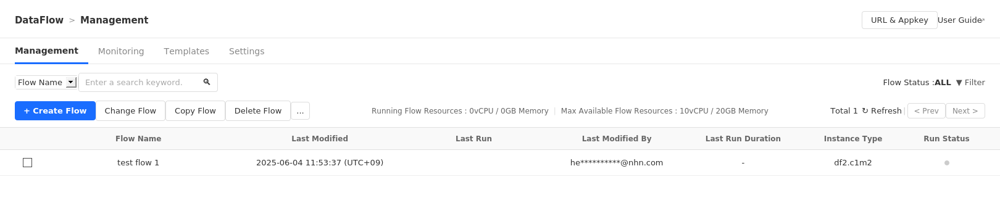

## Data & Analytics > DataFlow > Console Guide

DataFlow can be used in the following order:

* Service Activation
    1. Create a project.
    2. Select the desired project.
    3. Activate the DataFlow service.
* Flow Execution
    1. Create a flow.
    2. Add necessary nodes and enter configuration values to define the behavior of each node.
    3. Complete the flow by connecting nodes to determine the execution order of nodes.
    4. Execute the flow.
    5. Check log information to verify that the flow has executed normally.

## Management

This is a page for retrieving and managing flow metadata information.
Click **Data & Analytics > DataFlow > Management**.

### Search

Search flows based on given criteria.

* When searching by flow name, it searches for flows that contain the search term in their names.

### Filter

Search flows based on given conditions.

* Provides filtering options based on flow status values.

### Flow List

Displays retrieved flows in table format.

* Shows simple flow metadata and current flow execution status.
* Sorted by last modified date.
* You can select flows to use management functions such as changing flows, viewing flow details, and starting flows.
* You can view only flows with specific statuses through the filter condition function.
* Once flows are retrieved, you must click **Refresh** to update the retrieval results.
* 12 flows are displayed per page, and you can navigate pages by clicking **Previous** and **Next**.

#### Flow Status Information

| Flow Execution Status                                   | Description |
|-------------------------------------------------------| --- |
| START_FAILED  | Flow execution request failed. |
| QUOTA_EXCEEDED | Flow execution failed due to insufficient resources for flow execution. |
| STARTING       | Securing resources for flow execution. |
| PREPARING      | Flow execution preparation completed. |
| RUNNING        | Flow is running. |
| ERROR              | An error occurred during flow execution due to communication failure or authentication failure. If <b>ERROR</b> persists, please contact **Customer Support > Inquiry**. |
| STOP_FAILED   | Flow termination request failed. |
| STOPPED        | Flow has been terminated. |
| DRAINING       | Flow is draining. |
| UNKNOWN            | An error occurred during flow execution due to unknown causes. If <b>UNKNOWN</b> persists, please contact **Customer Support > Inquiry**. |

#### Flow Status Change Notification Email
* You can receive notification emails when flows change to target notification status.
* Target notification flow statuses
    * RUNNING
    * ERROR
    * STOPPED
* Default recipients
    * Members with **DataFlow ADMIN** role in the project where the DataFlow service in use is activated

### Create Flow

Creates metadata to define a flow.

* Creates flow metadata by adding names and descriptions for flow identification.
* Flow names can be duplicated with other flows.
* Select execution mode based on flow purpose.
* Users can easily load flows with desired functions by specifying flow templates.
* You can configure the instance type for executing flows.

### Modify Flow

Modifies flow metadata.

* Modifies existing flow names and descriptions and reflects them in flow metadata.
* Flow templates cannot be specified.
* Flow modification is possible even while flows are running.
* You can change the instance type for executing flows.
    * However, the changed instance type applies from the next flow execution.

### Copy Flow

Creates new metadata using existing flow definitions.

* Creates new metadata with `_copy` added to the existing flow name.
* Copies the flow logic of the existing flow as-is.
* Running flows can also be copied.
* Running flows are copied in stopped state.
* If the current save state of the flow is temporary save, the last saved version of the existing flow is not copied.
* Even if you copy a flow with a registered scheduler, the copied flow does not have the scheduler registered.
* The copied flow is completely separate from the existing flow.

### Delete Flow

Deletes flow metadata.

* Completely deletes flow metadata.
* Deleted flows cannot be recovered.
* Running flows cannot be deleted.

### More Options - Start Flow
Starts flows in stopped state.

* Each flow can only run one at a time.
* Temporarily saved flows start with the last saved version.
* Flows that have only been temporarily saved without ever being saved cannot be started.
* Flows must be saved at least once to be started.
* Even if a flow is running by scheduler, you cannot start the flow the same as flows started by users.

### More Options - Stop Flow
* You can terminate flows that are preparing for execution, running, or draining.
* Terminates without processing remaining events.

### More Options - Drain and Stop Flow
* You can drain and then terminate running flows.
* Draining means processing remaining events in the flow.
* If the timeout period is exceeded, it terminates even if draining is not finished.
* If draining finishes while there is remaining timeout time, it terminates immediately.
* Flows that are draining can be terminated immediately through flow termination.