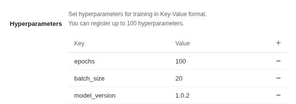
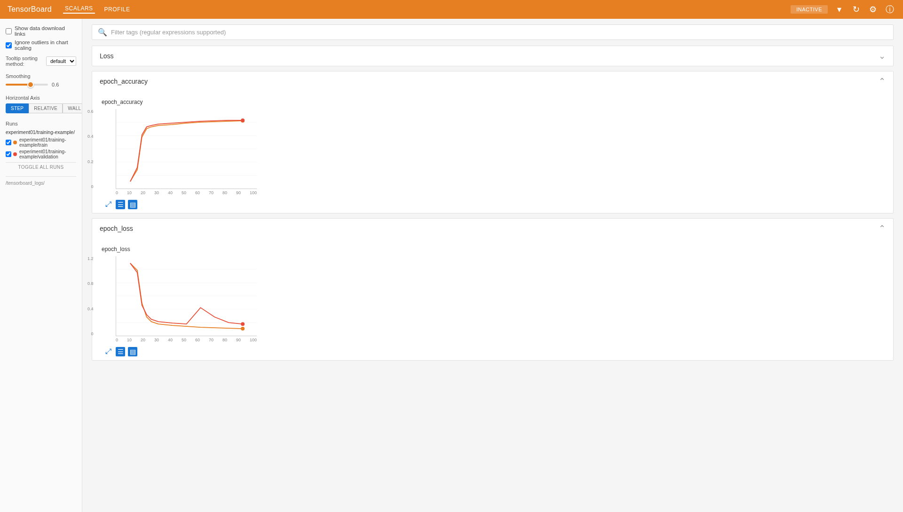

<a id="ai.easymaker.console.guide"></a>

## Machine Learning > AI EasyMaker > Console Guide

<a id="dashboard"></a>

## Dashboard

You can check the usage status of all AI EasyMaker resources on the dashboard.

<a id="dashboard.service.usage.status"></a>

### Service Usage Status

Displays the number of resources in use by resource type.

- Notebook: Number of notebooks in ACTIVE(HEALTHY) status currently in use
- Training: Number of COMPLETE training jobs
- Hyperparameter Tuning: Number of COMPLETE hyperparameter tuning jobs
- Endpoint: Number of endpoints in ACTIVE status

<a id="dashboard.service.monitoring"></a>

### Service Monitoring

- Displays the top 3 endpoints with the most API calls.
- When you select an endpoint, you can check the API success/failure total metrics of the sub-endpoint stages.

<a id="dashboard.resource.usage"></a>

### Resource Usage

- You can check the resources with the highest usage by CPU and GPU core types.
- Resource information is displayed when you hover your mouse pointer over the metrics.

<a id="notebook"></a>

## Notebook

Create and manage Jupyter notebooks with essential packages installed for machine learning development.

<a id="notebook.create"></a>

### Create Notebook

Create a Jupyter notebook.

- **Image**: Select the OS image to be installed on the notebook instance.
    - **Core Type**: Displays the CPU and GPU core type of the image.
    - **Framework**: Displays the framework installed on the image.
        - TENSORFLOW: An image with TensorFlow deep learning framework installed.
        - PYTORCH: An image with PyTorch deep learning framework installed.
        - PYTHON: An image with only Python language installed without deep learning frameworks.
    - **Framework Version**: Displays the version of the framework installed on the image.
    - **Python Version**: Displays the Python version installed on the image.

- **Notebook Information**
    - Enter the notebook name and description.
    - Select the instance type for the notebook. The instance specifications are selected according to the chosen type.

- **Storage**
    - Specify the boot storage and data storage size for the notebook.
        - Boot storage is where the Jupyter notebook and default virtual environment are installed. This storage is initialized when the notebook is restarted.
        - Data storage is block storage mounted to the `/root/easymaker` directory path. Data in this storage is retained even when the notebook is restarted.
    - The storage size of a created notebook cannot be changed, so you must specify sufficient storage size during creation.
    - If needed, you can connect **NHN Cloud NAS** to the notebook.
        - Mount Directory Name: Enter the directory name to be mounted on the notebook.
        - NHN Cloud NAS Path: Enter the directory path in the format `nas://{NAS ID}:/{path}`.

!!! tip "Note"
    Creating a notebook may take several minutes.
    When creating resources for the first time, additional minutes may be required for service environment configuration.

!!! danger "Caution"
    Only NHN Cloud NAS created in the same project as AI EasyMaker can be used.

<a id="notebook.list"></a>

### Notebook List

The notebook list is displayed. Selecting a notebook from the list allows you to check detailed information and modify information.

- **Name**: Displays the notebook name. You can change the name by clicking **Change** on the detail screen.
- **Status**: Displays the notebook status. Refer to the table below for major statuses.

    | Status             | Description                                                                                                                           |
    | ------------------ | ------------------------------------------------------------------------------------------------------------------------------------- |
    | CREATE REQUESTED   | The notebook creation has been requested.                                                                                            |
    | CREATE IN PROGRESS | The notebook instance is being created.                                                                                              |
    | ACTIVE (HEALTHY)   | The notebook application is running normally.                                                                                        |
    | ACTIVE (UNHEALTHY) | The notebook application is not running normally. If this status persists after restarting the notebook, contact customer support. |
    | STOP IN PROGRESS   | The notebook is being stopped.                                                                                                       |
    | STOPPED            | The notebook has been stopped.                                                                                                       |
    | START IN PROGRESS  | The notebook is being started.                                                                                                       |
    | REBOOT IN PROGRESS | The notebook is being rebooted.                                                                                                      |
    | DELETE IN PROGRESS | The notebook is being deleted.                                                                                                       |
    | CREATE FAILED      | The notebook creation has failed. If creation continues to fail, contact customer support.                                          |
    | STOP FAILED        | The notebook stop has failed. Please try again.                                                                                      |
    | START FAILED       | The notebook start has failed. Please try again.                                                                                     |
    | REBOOT FAILED      | The notebook reboot has failed. Please try again.                                                                                    |
    | DELETE FAILED      | The notebook delete has failed. Please try again.                                                                                    |

- **Actions > Open Jupyter Notebook**: Clicking the **Open Jupyter Notebook** button opens the notebook in a new browser window. The notebook is accessible only to users logged into the console.

- **Monitoring**: In the **Monitoring** tab of the detail screen displayed when selecting a notebook, you can check the list of monitoring target instances and basic metric charts.
    - The **Monitoring** tab is disabled when the notebook is being created or has ongoing tasks.

<a id="notebook.user.virtual.run.environment.configuration"></a>

### User Virtual Runtime Environment Configuration

AI EasyMaker notebook instances provide a default Conda virtual environment with various libraries and kernels required for machine learning installed.
The default Conda virtual environment is initialized and runs when the notebook is stopped and started, but virtual environments and external libraries installed by users in arbitrary paths are not automatically initialized and therefore are not retained when the notebook is stopped and started.
To solve this problem, you need to create virtual environments in the `/root/easymaker/custom-conda-envs` directory path and install external libraries in the created virtual environments.
AI EasyMaker notebook instances support virtual environments created in the `/root/easymaker/custom-conda-envs` directory path to be initialized and run when the notebook is stopped and started.

Configure user virtual environments by following the guide below.

1. Click **Open Jupyter Notebook** > **Jupyter Notebook > Launcher > Terminal** from the console notebook menu.
2. Navigate to the `/root/easymaker/custom-conda-envs` path.

        cd /root/easymaker/custom-conda-envs

3. To create a virtual environment named `easymaker_env` with Python 3.8 version, execute the `conda create` command as follows.

        conda create --prefix ./easymaker_env python=3.8

4. The created virtual environment can be verified with the `conda env list` command.

        (base) root@nb-xxxxxx-0:~# conda env list
        # conda environments:
        #
                                /opt/intel/oneapi/intelpython/latest
                                /opt/intel/oneapi/intelpython/latest/envs/2022.2.1
        base                *   /opt/miniconda3
        easymaker_env           /root/easymaker/custom-conda-envs/easymaker_env

<a id="notebook.user.script"></a>

### User Script

Scripts that should be automatically executed when stopping and starting notebooks can be registered in the `/root/easymaker/cont-init.d` path.
They are executed in ascending alphanumeric order.

- Script location and permissions
    - Only files located in the `/root/easymaker/cont-init.d` path are executed.
    - Only scripts with execute permissions are executed.
- Script content
    - The first line of the script must start with `#!`.
    - Scripts are executed with root privileges.
- Script execution records are saved in the following locations:
    - Script exit code: `/root/easymaker/cont-init.d/{SCRIPT}.exitcode`
    - Script standard output and standard error stream: `/root/easymaker/cont-init.d/{SCRIPT}.output`
    - Full execution log: `/root/easymaker/cont-init.output`

<a id="notebook.stop"></a>

### Stop Notebook

Stop a running notebook or start a stopped notebook.

1. Select the notebook you want to start or stop from the notebook list.
2. Click **Start Notebook** or **Stop Notebook**.
3. The requested operation cannot be canceled. Click **Confirm** to continue.

!!! tip "Note"
    Starting and stopping notebooks may take several minutes.

!!! danger "Caution"
    When stopping and starting notebooks, user-created virtual environments and external libraries may be initialized.
    To maintain virtual environments and external libraries when stopping and starting notebooks, configure user virtual environments by referring to [User Virtual Runtime Environment Configuration](#notebook.user.virtual.run.environment.configuration).

<a id="notebook.instance.type.change"></a>

### Change Notebook Instance Type

Change the instance type of a created notebook.
The instance type you want to change can only be changed to an instance type with the same core type as the existing instance.

1. Select the notebook whose instance type you want to change.
2. If the notebook is in a running state (ACTIVE), click **Stop Notebook** to stop the notebook.
3. Click **Change Instance Type**.
4. Select the instance type you want to change to and click confirm.

!!! tip "Note"
    Changing instance type may take several minutes.

<a id="notebook.reboot"></a>

### Reboot Notebook

If problems occur while using the notebook, or if the status is normal (ACTIVE) but the notebook is not accessible,
you can reboot the notebook.

1. Select the notebook you want to reboot.
2. Click **Reboot Notebook**.
3. The requested delete operation cannot be canceled. Click **Confirm** to continue.

!!! danger "Caution"
    When rebooting notebooks, user-created virtual environments and external libraries may be initialized.
    To maintain virtual environments and external libraries when rebooting notebooks, configure user virtual environments by referring to [User Virtual Runtime Environment Configuration](#notebook.user.virtual.run.environment.configuration).

<a id="notebook.delete"></a>

### Delete Notebook

Delete a created notebook.

1. Select the notebook you want to delete from the list.
2. Click **Delete Notebook**.
3. The requested delete operation cannot be canceled. Click **Confirm** to continue.

!!! tip "Note"
    When deleting a notebook, both boot storage and data storage are deleted.
    Connected NHN Cloud NAS is not deleted and must be deleted individually from **NHN Cloud NAS**.

<a id="experiment"></a>

## Experiments

Experiments are managed by grouping related training into experiments.

<a id="experiment.create"></a>

### Create Experiment

1. Click **Create Experiment**.
2. Enter the experiment name and description, then click **Confirm**.

!!! tip "Note"
    Creating an experiment may take a few minutes.
    When creating a resource for the first time, it may take several additional minutes to configure the service environment.

<a id="experiment.list"></a>

### Experiment List

The experiment list is displayed. Select an experiment from the list to view detailed information and modify information.

- **Status**: The status of the experiment is displayed. For key statuses, see the table below.

    | Status             | Description                                        |
    | ------------------ | -------------------------------------------------- |
    | CREATE REQUESTED   | Experiment creation has been requested.           |
    | CREATE IN PROGRESS | The experiment is being created.                  |
    | CREATE FAILED      | Experiment creation has failed. Please try again. |
    | ACTIVE             | The experiment has been created successfully.     |

- **Actions**
    - Clicking **Go to TensorBoard** opens TensorBoard in a new browser window where you can view statistical information of training included in the experiment. TensorBoard is only accessible to users logged into the console.
    - **Retry**: If the experiment status is failed, you can click **Retry** to recover the experiment.
- **Training**: When you select a training, the **Training** tab in the detailed screen that appears shows a list of training included in the experiment.

<a id="experiment.delete"></a>

### Delete Experiment

Delete an experiment.

1. Select the experiment to delete.
2. Click **Delete Experiment**. If the experiment is in the process of being created, you cannot delete the experiment.
3. The requested deletion operation cannot be canceled. To proceed, click **Confirm**.

!!! tip "Note"
    You cannot delete an experiment if there are pipeline schedules associated with the experiment, or if there are training, hyperparameter tuning, or pipeline executions in progress.
    Delete the resources associated with the experiment before deleting the experiment.
    You can check associated resources in the detailed screen at the bottom that appears when you click the experiment you want to delete.

<a id="training"></a>

## Training

Provides an environment where you can train machine learning algorithms and check training results through statistics.

<a id="training.create"></a>

### Create Training

Set up the environment where training will be performed by selecting the instance and OS image for training, and proceed with training by entering algorithm information and input/output data paths.

- **Training Template**: To set up training information by loading a training template, select 'Use' and then choose the training template to load.
- **Basic Information**: Select basic information about the training and the experiment that will include the training.
    - **Training Name**: Enter the training name.
    - **Training Description**: Enter a description.
    - **Experiment**: Select the experiment that will include the training. Experiments group related training together. If no experiment has been created, click **Add** to create an experiment.
- **Algorithm Information**: Enter information about the algorithm you want to train.
    - **Algorithm Type**: Select the algorithm type.
        - **NHN Cloud Provided Algorithm**: Use algorithms provided by AI EasyMaker. For detailed information about the provided algorithms, see the [NHN Cloud Provided Algorithm Guide](./algorithm-guide/#) document.
            - **Algorithm**: Select an algorithm.
            - **Hyperparameters**: Enter the hyperparameter values required for training. For detailed information about hyperparameters for each algorithm, see the [NHN Cloud Provided Algorithm Guide](./algorithm-guide/#) document.
            - **Algorithm Metrics**: Information about the metrics generated by the algorithm is displayed.
        - **Custom Algorithm**: Use an algorithm written by the user.
            - **Algorithm Path**
                - **NHN Cloud Object Storage**: Enter the path of NHN Cloud Object Storage where the algorithm is stored.<br>
                    - Enter the directory path in the format obs://{Object Storage API Endpoint}/{containerName}/{path}.
                    - When using NHN Cloud Object Storage, set permissions by referring to [Appendix > 1. Adding AI EasyMaker System Account Permission to NHN Cloud Object Storage](#appendix.1.object.storage.account.permission). Model creation will fail if the necessary permissions are not set.
                - **NHN Cloud NAS**: Enter the NHN Cloud NAS path where the algorithm is stored. <br>
                    Enter the directory path in the format nas://{NAS ID}:/{path}.

            - **Entry Point**
                - The entry point is the entry point for algorithm execution where training begins. Write the entry point file name.
                - The entry point file must exist in the algorithm path.
                - If you write **requirements.txt** in the same path, the Python packages required by the script will be installed.
            - **Hyperparameters**
                - To add parameters for training, click the **+ button** to enter parameters in Key-Value format. You can enter up to 100 parameters.
                - The entered hyperparameters are input as execution arguments when the entry point is executed. For detailed usage methods, see [Appendix > 3. Hyperparameters](#appendix.3.hyperparameter).

- **Image**: Select the instance image according to the environment where training should be executed.

- **Training Resource Information**
    - **Training Instance Type**: Select the instance type to execute training.
    - **Number of Distributed Nodes**: Enter the number of nodes to perform distributed training. Distributed training can be enabled through settings in the algorithm code. For details, see [Appendix > 6. Distributed Training Settings by Framework](#appendix.6.framework.training.settings).
    - **Use torchrun**: Select whether to use torchrun supported by the Pytorch framework. For details, see [Appendix > 8. How to Use torchrun](#appendix.8.torchrun.usage).
    - **Number of Processes per Node**: When using torchrun, enter the number of processes per node. Using torchrun enables distributed training by running multiple processes on one node. The number of processes affects memory usage.
- **Input Data**
    - **Dataset**: Enter the dataset to execute training. You can set up to 10 datasets.
        - Dataset Name: Enter the dataset name.
        - Data Path: Enter the NHN Cloud Object Storage or NHN Cloud NAS path.
    - **Checkpoint**: If you want to proceed with training from a saved checkpoint, enter the storage path of the checkpoint.
        - Enter the NHN Cloud Object Storage or NHN Cloud NAS path.
- **Output Data**
    - **Output Data**: Enter the data storage path to save the execution results of training.
        - Enter the NHN Cloud Object Storage or NHN Cloud NAS path.
    - **Checkpoint**: If the algorithm provides checkpoints, enter the storage path of the checkpoint.
        - The generated checkpoints can be used when resuming training from previous training.
        - Enter the NHN Cloud Object Storage or NHN Cloud NAS path.
- **Additional Settings**
    - **Data Storage Size**: Enter the data storage size of the instance to execute training.
        - This is only used when using NHN Cloud Object Storage. It should be specified as a sufficient size to store all data required for training.
    - **Maximum Training Time**: Specify the maximum waiting time until training is completed. Training that exceeds the maximum waiting time will be terminated.
    - **Log Management**: Logs generated during training can be saved to the NHN Cloud Log & Crash service.
        - For details, see [Appendix > 2. NHN Cloud Log & Crash Search Service Usage Guide and Log Inquiry](#appendix.2.lncs.service.usage.guide.and.log.inquiry.guide).

!!! danger "Caution"
    - Only NHN Cloud NAS created in the same project as AI EasyMaker can be used.
    - If input data is deleted before training is completed, training may fail.

<a id="training.list"></a>

### Training List

The training list is displayed. When you select a training from the list, you can check detailed information and change information.

- **Training Time**: The time the training has been in progress is displayed.
- **Status**: The status of the training is displayed. See the table below for major statuses.

    | Status                                       | Description                                                                                                                      |
    | -------------------------------------------- | -------------------------------------------------------------------------------------------------------------------------------- |
    | CREATE REQUESTED                             | Training creation has been requested.                                                                                            |
    | CREATE IN PROGRESS                           | Resources required for training are being created.                                                                               |
    | RUNNING                                      | Training is in progress.                                                                                                         |
    | STOPPED                                      | Training has been stopped by user request.                                                                                      |
    | COMPLETE                                     | Training has completed successfully.                                                                                             |
    | STOP IN PROGRESS                             | Training is being stopped.                                                                                                       |
    | FAIL TRAIN                                   | Training has failed during progress. Detailed failure information can be checked through Log & Crash Search logs if log management is enabled. |
    | CREATE FAILED                                | Training creation has failed. If creation continues to fail, contact customer support.                                         |
    | FAIL TRAIN IN PROGRESS, COMPLETE IN PROGRESS | Resources used for training are being cleaned up.                                                                               |

- **Actions**
    - **Go to Tensorboard**: Tensorboard, where you can check statistical information of training, opens in a new browser window.<br/>
        For how to leave tensorboard logs, see [Appendix > 5. Saving Metric Logs for Tensorboard Utilization](#appendix.5.tensorboard.store.metric.log). Tensorboard can only be accessed by users logged into the console.
    - **Stop Training**: You can stop training in progress.

- **Hyperparameters**: In the **Hyperparameters** tab of the detail screen displayed when you select training, you can check the hyperparameter values set for training.

- **Monitoring**: In the **Monitoring** tab of the detail screen displayed when you select training, you can check the list of monitoring target instances and basic metric charts.
    - The **Monitoring** tab is disabled when training is in the creating state.

<a id="training.copy"></a>

### Copy Training

Creates new training with the same settings as existing training.

1. Select the training you want to copy.
2. Click **Copy Training**.
3. The training creation screen is displayed with the same settings as the existing training.
4. If there is information you want to change in the settings, change it and then click **Create Training** to create the training.

<a id="training.model.create"></a>

### Create Model from Training

Creates a model from training in completed status.

1. Select the training you want to create as a model.
2. Click **Create Model**. Only training in COMPLETE status can be created as a model.
3. You will be moved to the model creation page. After checking the content, click **Create Model** to create the model. For detailed information about model creation, see the [Model](#model) document.

<a id="training.delete"></a>

### Delete Training

Deletes training.

1. Select the training you want to delete.
2. Click **Delete Training**. Training in progress can be deleted after stopping.
3. The requested delete operation cannot be canceled. To continue, click **Confirm**.

!!! tip "Good to Know"
    If there is a model created from the training you want to delete, you cannot delete the training. Delete the model first, then delete the training.

<a id="hyperparameter.tuning"></a>

## Hyperparameter Tuning

Hyperparameter tuning is the process of optimizing hyperparameter values to maximize the prediction accuracy of a model. If you don't use this feature, you would have to manually adjust hyperparameters while directly executing many training jobs to find the optimal values.

<a id="hyperparameter.tuning.create"></a>

### Create Hyperparameter Tuning

How to configure a hyperparameter tuning job.

- **Training Template**
    - **Use**: Select whether to use a training template. When using a training template, some configuration values of hyperparameter tuning are filled with predefined values.
    - **Training Template**: Select the training template to use for automatically entering some configuration values of hyperparameter tuning.
- **Basic Information**
    - **Hyperparameter Tuning Name**: Enter the name of the hyperparameter tuning job.
    - **Description**: Enter a description for the hyperparameter tuning job if needed.
    - **Experiment**: Select the experiment to include the hyperparameter tuning. Experiments group related hyperparameter tuning. If no experiment has been created, click **Add** to create an experiment.
- **Tuning Strategy**
    - **Strategy Name**: Select which strategy to use to find optimal hyperparameters.
    - **Random Seed**: Determines random number generation. Specify a fixed value for reproducible results.
- **Algorithm Information**: Enter information about the algorithm you want to train.
    - **Algorithm Type**: Select the algorithm type.
        - **NHN Cloud Provided Algorithm**: Use algorithms provided by AI EasyMaker. For detailed information on provided algorithms, see the [NHN Cloud Provided Algorithm Guide](./algorithm-guide/#) document.
            - **Algorithm**: Select an algorithm.
            - **Hyperparameter Spec**: Enter the hyperparameter value ranges to use for hyperparameter tuning. For detailed information on hyperparameters by algorithm, see the [NHN Cloud Provided Algorithm Guide](./algorithm-guide/#) document.
                - **Name**: Define which hyperparameter to tune. This is predetermined for each algorithm.
                - **Type**: Select the data type of the hyperparameter. This is predetermined for each algorithm.
                - **Value/Range**
                    - **Min**: Define the minimum value.
                    - **Max**: Define the maximum value.
                    - **Step**: Determines the change size of hyperparameter values when using the "Grid" tuning strategy.
            - **Algorithm Metrics**: Information about metrics generated by the algorithm is displayed.
        - **Custom Algorithm**: Use an algorithm written by the user.
            - **Algorithm Path**
                - **NHN Cloud Object Storage**: Enter the NHN Cloud Object Storage path where the algorithm is stored.
                    - Enter the directory path in the format obs://{Object Storage API Endpoint}/{containerName}/{path}.
                    - When using NHN Cloud Object Storage, refer to [Appendix > 1. Add AI EasyMaker System Account Permission to NHN Cloud Object Storage](#appendix.1.object.storage.account.permission) to set permissions. If you do not set the required permissions, model creation will fail.
                - **NHN Cloud NAS**: Enter the NHN Cloud NAS path where the algorithm is stored.
                    - Enter the directory path in the format nas://{NAS ID}:/{path}.
            - **Entry Point**
                - The entry point is the entry point of algorithm execution where training begins. Write the entry point file name.
                - The entry point file must exist in the algorithm path.
                - If you create **requirements.txt** in the same path, the Python packages required by the script will be installed.
            - **Hyperparameter Spec**
                - **Name**: Define which hyperparameter to tune.
                - **Type**: Select the data type of the hyperparameter.
                - **Value/Range**
                    - **Min**: Define the minimum value.
                    - **Max**: Define the maximum value.
                    - **Step**: Determines the change size of hyperparameter values when using the "Grid" tuning strategy.
                    - **Comma-separated values**: Tune hyperparameters using static values (e.g., sgd, adam).
- **Image**: Select the instance image according to the environment where training should be executed.
- **Training Resource Information**
    - **Training Instance Type**: Select the instance type to execute training.
    - **Training Instance Count**: The number of instances to perform training. Training instance count is 'distributed node count × parallel training count'.
    - **Distributed Node Count**: Enter the number of nodes to perform distributed training. Distributed training can be enabled through settings in the algorithm code. For details, refer to [Appendix > 6. Distributed Training Settings by Framework](#appendix.6.framework.training.settings).
    - **Parallel Training Count**: Enter the number of training to perform simultaneously in parallel.
    - **Use torchrun**: Select whether to use torchrun supported by the Pytorch framework. For details, refer to [Appendix > 8. How to Use torchrun](#appendix.8.torchrun.usage).
    - **Number of Processes per Node**: When using torchrun, enter the number of processes per node. With torchrun, distributed training is possible by running multiple processes on one node. The number of processes affects memory usage.
- **Input Data**
    - **Data Set**: Enter the data set to execute training. Up to 10 data sets can be configured.
        - Data Set Name: Enter the data set name.
        - Data Path: Enter the NHN Cloud Object Storage or NHN Cloud NAS path.
    - **Checkpoint**: If you want to proceed with training from a saved checkpoint, enter the storage path of the checkpoint.
        - Enter the NHN Cloud Object Storage or NHN Cloud NAS path.
- **Output Data**
    - **Output Data**: Enter the data storage path to save the execution results of training.
        - Enter the NHN Cloud Object Storage or NHN Cloud NAS path.
    - **Checkpoint**: If the algorithm provides checkpoints, enter the storage path of the checkpoint.
        - Generated checkpoints can be used to resume training from previous training.
        - Enter the NHN Cloud Object Storage or NHN Cloud NAS path.
- **Metrics**
    - **Metric Name**: Define which metrics to collect from the logs output by the training code.
    - **Metric Format**: Enter the regular expression to use for collecting metrics. The training algorithm must output metrics according to the regular expression.
- **Objective Metric**
    - **Metric Name**: Select which metric is the goal to optimize.
    - **Objective Metric Type**: Select the optimization type.
    - **Target Value**: The tuning job ends when the objective metric reaches this value.
- **Tuning Resource Configuration**
    - **Maximum Failed Training Count**: Define the maximum number of failed training. When the number of failed training reaches this value, tuning ends as failed.
    - **Maximum Training Count**: Define the maximum training count. Tuning is executed until the number of automatically executed training reaches this value.
- **Early Stopping for Training**
    - **Name**: Early terminate training when the model no longer improves even if training continues.
    - **Minimum Training Count**: Define how many training to get objective metric values from when calculating the median value.
    - **Starting Step**: Set from which training step to apply early stopping.
- **Additional Settings**
    - **Data Storage Size**: Enter the data storage size of the instance to execute training.
        - Used only when using NHN Cloud Object Storage. It must be specified with sufficient size to store all data required for training.
    - **Maximum Progress Time**: Specify the maximum progress time until training completion. Training that exceeds the maximum progress time is terminated.
    - **Log Management**: Logs generated during training progress can be stored in the NHN Cloud Log & Crash service.
        - For details, refer to [Appendix > 2. NHN Cloud Log & Crash Search Service Usage Guide and Log Inquiry Guide](#appendix.2.lncs.service.usage.guide.and.log.inquiry.guide).

!!! danger "Caution"
    - Only NHN Cloud NAS created in the same project as AI EasyMaker can be used.
    - If input data is deleted before training completion, training may fail.

<a id="hyperparameter.tuning.list"></a>

### Hyperparameter Tuning List

The hyperparameter tuning list is displayed. Select a hyperparameter tuning from the list to view detailed information and modify settings.

- **Duration**: Displays the time taken for hyperparameter tuning.
- **Completed Training**: Shows the number of completed trainings among the trainings automatically generated by hyperparameter tuning.
- **Running Training**: Shows the number of trainings in progress.
- **Failed Training**: Shows the number of failed trainings.
- **Best Training**: Shows the target metric information of the training that recorded the best target metric value among the trainings automatically generated by hyperparameter tuning.
- **Status**: Displays the status of hyperparameter tuning. See the table below for key statuses.

    | Status                                                                           | Description                                                                                                                                              |
    | -------------------------------------------------------------------------------- | -------------------------------------------------------------------------------------------------------------------------------------------------------- |
    | CREATE REQUESTED                                                                 | The hyperparameter tuning creation has been requested.                                                                                                   |
    | CREATE IN PROGRESS                                                               | Resources required for hyperparameter tuning are being created.                                                                                          |
    | RUNNING                                                                          | Hyperparameter tuning is in progress.                                                                                                                    |
    | STOPPED                                                                          | Hyperparameter tuning has been stopped by user request.                                                                                                  |
    | COMPLETE                                                                         | Hyperparameter tuning has completed successfully.                                                                                                        |
    | STOP IN PROGRESS                                                                 | Hyperparameter tuning is being stopped.                                                                                                                  |
    | FAIL HYPERPARAMETER TUNING                                                       | Failed during hyperparameter tuning progress. Detailed failure information can be checked through Log & Crash Search logs if log management is enabled. |
    | CREATE FAILED                                                                    | Hyperparameter tuning creation has failed. If creation continues to fail, please contact customer support.                                               |
    | FAIL HYPERPARAMETER TUNING IN PROGRESS, COMPLETE IN PROGRESS, STOP IN PROGRESS | Resources used for hyperparameter tuning are being cleaned up.                                                                                           |

- **Status Details**: Content in parentheses for the `COMPLETE` status provides detailed status information. See the table below for key detailed information.

    | Details              | Description                                                                                                       |
    | -------------------- | ----------------------------------------------------------------------------------------------------------------- |
    | GoalReached          | Detailed information when hyperparameter tuning training reached the target value and completed.                  |
    | MaxTrialsReached     | Detailed information when hyperparameter tuning completed after reaching the maximum number of training sessions. |
    | SuggestionEndReached | Detailed information when the hyperparameter tuning search algorithm has explored all hyperparameters.            |

- **Actions**
    - **Go to TensorBoard**: Opens TensorBoard in a new browser window where you can check training statistics.<br/>
        For how to log TensorBoard metrics, see [Appendix > 5. Storing Metric Logs for TensorBoard Utilization](#appendix.5.tensorboard.store.metric.log). TensorBoard can only be accessed by users logged into the console.
    - **Stop Hyperparameter Tuning**: You can stop hyperparameter tuning in progress.

- **Monitoring**: In the **Monitoring** tab of the detail screen displayed when you select hyperparameter tuning, you can check the list of monitoring target instances and basic metric charts.
    - The **Monitoring** tab is disabled while hyperparameter tuning is being created.

<a id="hyperparameter.tuning.training.list"></a>

### List of Trainings from Hyperparameter Tuning

The list of trainings automatically generated by hyperparameter tuning is displayed. You can view detailed information by selecting a training from the list.

- **Target Metric Value**: Represents the target metric value.
- **Status**: Shows the status of trainings automatically generated by hyperparameter tuning. See the table below for key statuses.

    | Status              | Description                                                                                                                        |
    | ------------------- | ---------------------------------------------------------------------------------------------------------------------------------- |
    | CREATED             | The training has been created.                                                                                                     |
    | RUNNING             | The training is in progress.                                                                                                       |
    | SUCCEEDED           | The training has completed successfully.                                                                                           |
    | KILLED              | The training has been stopped by the system.                                                                                      |
    | FAILED              | The training has failed during execution. Detailed failure information can be checked through Log & Crash Search logs if log management is enabled. |
    | METRICS_UNAVAILABLE | The target metrics cannot be collected.                                                                                           |
    | EARLY_STOPPED       | The training was stopped early because performance (target metrics) did not improve further during execution.                     |

<a id="hyperparameter.tuning.copy"></a>

### Copy Hyperparameter Tuning

Creates a new hyperparameter tuning with the same settings as an existing hyperparameter tuning.

1. Select the hyperparameter tuning you want to copy.
2. Click **Copy Hyperparameter Tuning**.
3. The hyperparameter tuning creation screen is displayed with the same settings as the existing hyperparameter tuning.
4. If you want to change any settings, modify them and then click **Create Hyperparameter Tuning** to create the hyperparameter tuning.

<a id="hyperparameter.tuning.model.create"></a>

### Create Model from Hyperparameter Tuning

Creates a model from the best training of a completed hyperparameter tuning.

1. Select the hyperparameter tuning you want to create a model from.
2. Click **Create Model**. Only hyperparameter tunings in COMPLETE status can be used to create models.
3. You are redirected to the model creation page. After reviewing the content, click **Create Model** to create the model.
   For more details on model creation, see the [Model](#model) documentation.

<a id="hyperparameter.tuning.delete"></a>

### Delete Hyperparameter Tuning

Deletes hyperparameter tuning.

1. Select the hyperparameter tuning you want to delete.
2. Click **Delete Hyperparameter Tuning**. Hyperparameter tuning in progress must be stopped before deletion.
3. The requested deletion operation cannot be canceled. Click **Confirm** to proceed.

!!! tip "Note"
    If there are models created from the hyperparameter tuning you want to delete, you cannot delete the hyperparameter tuning. Delete the models first, then delete the hyperparameter tuning.

<a id="training.template"></a>

## Training Template

By creating training templates in advance, you can retrieve the values entered in the template when creating training or hyperparameter tuning.

<a id="training.template.create"></a>

### Create Training Template

For information that can be configured in training templates, see [Create Training](#training.create).

<a id="training.template.list"></a>

### Training Template List

The training template list is displayed. Select a training template from the list to check detailed information and modify the information.

- **Actions**
    - **Modify**: You can modify training template information.
- **Hyperparameters**: You can check the hyperparameter names configured in the training template in the **Hyperparameters** tab of the detail screen that appears when you select a training template.

<a id="training.template.copy"></a>

### Copy Training Template

Creates a new training template with the same settings as an existing training template.

1. Select the training template you want to copy.
2. Click **Copy Training Template**.
3. The training template creation screen is displayed with the same settings as the existing training template.
4. If there is any information you want to change, modify it and then click **Create Training Template** to create the training template.

<a id="training.template.delete"></a>

### Delete Training Template

Deletes a training template.

1. Select the training template you want to delete.
2. Click **Delete Training Template**.
3. The requested delete operation cannot be canceled. To continue, click **Confirm**.

<a id="model"></a>

## Model

You can manage models from AI EasyMaker training results or external models as artifacts.

<a id="model.create"></a>

### Create Model

- **Basic Information**: Enter the basic information for the model.
    - **Name**: Enter the model name.
        - If the model's framework type is PyTorch, you must enter a model name that is identical to the PyTorch model name.
    - **Description**: Enter the model description.
- **Framework Information**: Enter the framework information for the model.
    - **Framework**: Select the model's framework.
    - **Framework Version**: Enter the version of the model framework.
- **Model Information**: Enter the storage where the model's artifacts are stored.
    - **Model Artifact**: Select the storage where the model artifacts are stored.
        - **NHN Cloud Object Storage**: Enter the Object Storage path where the model artifacts are stored.
            - Enter the directory path in the format `obs://{Object Storage API Endpoint}/{containerName}/{path}`.
            - When using NHN Cloud Object Storage, please refer to [Appendix > 1. Adding AI EasyMaker System Account Permissions to NHN Cloud Object Storage](#appendix.1.object.storage.account.permission) to set up permissions. If you do not set up permissions, model creation will fail because the model's artifacts cannot be accessed.
        - **NHN Cloud NAS**: Enter the NHN Cloud NAS path where the model artifacts are stored.
            - Enter the directory path in the format `nas://{NAS ID}:/{path}`.
    - **Parameters**: Enter the model's parameter information.
        - **Parameter Name**: Enter the model's parameter name.
        - **Parameter Value**: Enter the model's parameter value.

!!! tip "Note"
    Values entered as model parameters are used when serving the model. Parameters can be used as arguments and environment variables.
    Arguments are used exactly as the entered parameter name, and environment variables are used with the parameter name converted to screaming snake case.

!!! tip "Note"
    When creating a HuggingFace model, you can create a model by entering the HuggingFace model ID as a parameter.
    The HuggingFace model ID can be found in the URL of the HuggingFace model page.
    For more details, see [Appendix > 11. Framework-specific Serving Notes](#appendix.11.framework.note).

!!! danger "Caution"
    Only NHN Cloud NAS created in the same project as AI EasyMaker can be used.

!!! danger "Caution"
    HuggingFace model file types are restricted to safetensors.
    Safetensors is a safe and efficient machine learning model file format developed by HuggingFace.
    Other file formats are not supported.

!!! danger "Caution"
    When creating TensorFlow (Triton), PyTorch (Triton), or ONNX (Triton) models, the model artifact path you enter must contain model files and `config.pbtxt` files structured to run models with Triton.
    Please refer to the example below.
    <details>
    <summary><strong>Example</strong></summary>

        model_name/
        ├── config.pbtxt                              # Model configuration file
        └── 1/                                        # Version 1 directory
            └── model.savedmodel/                     # TensorFlow SavedModel directory
                ├── saved_model.pb                    # Metagraph and checkpoint data
                └── variables/                        # Model weights directory
                    ├── variables.data-00000-of-00001
                    └── variables.index

    </details>

<a id="model.list"></a>

### Model List

The model list is displayed. Select a model from the list to view detailed information and modify information.

- **Name**: The model name and description are displayed. You can change the model name and description by clicking **Modify**.
- **Model Artifact Path**: The storage where the model's artifacts are stored is displayed.
- **Status**: The model's status is displayed. Please refer to the table below for key statuses.

    | Status             | Description                                                                                             |
    | ------------------ | ------------------------------------------------------------------------------------------------------- |
    | CREATE REQUESTED   | The model creation has been requested.                                                                  |
    | CREATE IN PROGRESS | Resources required for the model are being created.                                                    |
    | DELETE IN PROGRESS | The model is being deleted.                                                                             |
    | ACTIVE             | The model has been created successfully.                                                               |
    | CREATE FAILED      | Model creation has failed. If creation continues to fail, please contact customer support.            |
    | DELETE FAILED      | Model deletion has failed. Please try again.                                                           |

- **Training Name**: For models created from training, the name of the underlying training is displayed.
- **Training ID**: For models created from training, the ID of the underlying training is displayed.
- **Framework**: The model's framework information is displayed.
- **Parameters**: The model's parameters are displayed. Parameters are used for inference.

<a id="model.endpoint.create"></a>

### Create Endpoint from Model

Create an endpoint that can serve the selected model.

1. Select the model you want to create as an endpoint from the list.
2. Click **Create Endpoint**.
3. You will be redirected to the **Create Endpoint** page. After reviewing the content, click **Create Endpoint**.
   For more details on endpoint creation, see the [Endpoint](#endpoint) documentation.

<a id="model.batch.inference.create"></a>

### Create Batch Inference from Model

Create batch inference that can perform batch inference with the selected model and check inference results as statistics.

1. Select the model you want to create as batch inference from the list.
2. Click **Create Batch Inference**.
3. You will be redirected to the **Create Batch Inference** page. After reviewing the content, click **Create Batch Inference**.
   For more details on batch inference creation, see the [Batch Inference](#batch.inference) documentation.

<a id="model.delete"></a>

### Delete Model

Delete a model.

1. Select the model you want to delete from the list.
2. Click **Delete Model**.
3. The requested deletion operation cannot be canceled. Click **Confirm** to continue.

!!! tip "Note"
    If there are endpoints created from the model you want to delete, you cannot delete the model.
    To delete it, first delete the endpoints created from that model, then delete the model.

<a id="model.evaluation"></a>

## Model Evaluation

Measures model performance and compares performance between multiple models.

<a id="model.evaluation.create"></a>

### Create Model Evaluation

Batch inference is automatically created during the model evaluation process.

- **Basic Information**: Enter the basic information for the model evaluation.
    - **Name**: Enter the model evaluation name.
    - **Description**: Enter the model evaluation description.
- **Model Information**: Enter information for the model to be evaluated.
    - **Model**: Select the model to evaluate. Only classification and regression models are supported.
    - **Class Name**: Enter the class name of the model.
- **Model Evaluation Instance Information**
    - **Instance Type**: Select the instance type to run the model evaluation. Used for data preprocessing and evaluation computation tasks.
- **Input Data**: Input data is used to compare predictions generated through batch inference with ground truth. Fields used for inference and ground truth fields are required.
    - **Data Path**: Enter the path where the input data is located.
        - **Input Data Format**: Select the format of the input data. CSV and JSONL formats are supported, and file extensions must be .csv and .jsonl respectively.
        - **Evaluation Target Field**: Enter the field name of the ground truth label.
- **Batch Inference Output Data**
    - **Data Path**: Enter the path where batch inference results will be saved.
- **Batch Inference Information**
    - **Instance Type**: Select the instance type to run batch inference.
    - **Number of Instances**: Enter the number of instances to perform batch inference.
    - **Number of Pods**: Enter the number of pods for batch inference.
    - **Batch Size**: Enter the number of data samples processed simultaneously in one inference task.
    - **Inference Timeout (seconds)**: Enter the timeout for batch inference. Sets the maximum allowed time for a single inference request to be processed and return results.
- **Additional Settings**
    - **Maximum Progress Time**: Specify the maximum progress time until model evaluation is completed. Model evaluations that exceed the maximum progress time will be terminated.
    - **Log Management**: Logs generated during model evaluation progress can be saved to the NHN Cloud Log & Crash service.
        - For more details, see [Appendix > 2. NHN Cloud Log & Crash Search Service Usage Guide and Log Inquiry Guide](#appendix.2.lncs.service.usage.guide.and.log.inquiry.guide).

!!! danger "Caution"
    - Only NHN Cloud NAS created in the same project as AI EasyMaker can be used.
    - The size of input data used for model evaluation must be 20GB or less.
    - The number of classes for classification model evaluation must be 50 or fewer.

<a id="model.evaluation.list"></a>

### Model Evaluation List

The model evaluation list is displayed. Selecting a model evaluation from the list allows you to check detailed information and modify information.

- **Name**: The name of the model evaluation is displayed.
- **Model**: The name of the model used for the model evaluation is displayed.
- **Status**: The status of the model evaluation is displayed. Refer to the table below for major statuses.

    | Status                                                   | Description                                                                                 |
    |----------------------------------------------------------|--------------------------------------------------------------------------------------------|
    | CREATE REQUESTED                                         | The model evaluation creation has been requested.                                           |
    | CREATE IN PROGRESS                                       | The model evaluation is being created.                                                     |
    | CREATE FAILED                                            | Model evaluation creation has failed. Please try again.                                    |
    | RUNNING                                                  | The model evaluation is in progress.                                                       |
    | COMPLETE IN PROGRESS, FAIL MODEL EVALUATION IN PROGRESS | Resources used for model evaluation are being cleaned up.                                  |
    | COMPLETE                                                 | The model evaluation has been completed successfully.                                      |
    | STOP IN PROGRESS                                         | The model evaluation is being stopped.                                                     |
    | STOPPED                                                  | The model evaluation has been stopped by user request.                                     |
    | FAIL MODEL EVALUATION                                    | The model evaluation has failed. Detailed failure information can be checked through Log & Crash Search logs if log management is enabled. |
    | DELETE IN PROGRESS                                       | The model evaluation is being deleted.                                                     |

- **Actions**
    - **Stop**: You can stop a model evaluation in progress.

<a id="model.evaluation.classification.metric"></a>

### Classification Model Evaluation Metrics

- **PR AUC**: The area under the precision-recall (PR) curve. Effective for measuring model classification performance on imbalanced datasets.
- **ROC AUC**: The area under the ROC curve (recall-false positive rate). Values closer to 1 indicate better performance.
- **Log Loss**: A loss value calculated using a logarithmic function for the difference between predicted probabilities and actual answers. Lower values mean the model's predictions are more reliable.
- **F1 Score**: The harmonic mean of precision and recall. Useful when there is class imbalance, with values closer to 1 being better.
- **Precision**: The ratio of actual positives among those predicted as positive. Focuses on reducing false positives.
- **Recall**: The ratio of correctly predicted positives among actual positives. Important for reducing false negatives.
- **Precision-Recall Curve**: A curve that visualizes the relationship between precision and recall at various thresholds. Referenced when adjusting model thresholds.
- **ROC Curve**: Shows the relationship between recall and false positive rate at various thresholds. Used for setting classification thresholds or model comparison.
- **Threshold-based Precision-Recall Curve**: A graph showing how precision and recall change at specific thresholds. Referenced when setting actual operational criteria.
- **Confusion Matrix**: A matrix that categorizes prediction results into four types: TP, FP, FN, TN. Makes it easy to identify error types by class.

<a id="model.evaluation.regression.metric"></a>

### Regression Model Evaluation Metrics

- **MAE (Mean Absolute Error)**: The average of absolute differences between actual and predicted values. Intuitively shows the magnitude of prediction errors.
- **MAPE (Mean Absolute Percentage Error)**: The average of ratios of prediction errors divided by actual values. Being ratio-based, it may be unsuitable for data with values close to 0.
- **R-squared (Coefficient of Determination)**: Indicates how well the model explains actual data, with values closer to 1 indicating higher explanatory power.
- **RMSE (Root Mean Squared Error)**: The square root of the mean squared error. More sensitive to large errors and allows interpretation of results in the same units as actual values.
- **RMSLE (Root Mean Squared Logarithmic Error)**: Calculated from the difference between log-transformed actual and predicted values. Not sensitive to differences in value magnitude, useful for evaluating exponential growth data.

<a id="model.evaluation.compare"></a>

### Compare Model Evaluations

Compares evaluation metrics of multiple models.

1. Select the model evaluations you want to compare from the list.
2. Click **Compare**.

<a id="model.evaluation.delete"></a>

### Delete Model Evaluation

Deletes a model evaluation.

1. Select the model evaluation you want to delete.
2. Click **Delete**. Model evaluations in progress can be deleted after stopping.
3. Requested deletion operations cannot be canceled. Click **Confirm** to proceed.

<a id="endpoint"></a>

## Endpoint

Creates and manages endpoints for serving models.

<a id="endpoint.create"></a>

### Create Endpoint

- **Activate API Gateway Service**
    - AI EasyMaker endpoints create API endpoints and manage APIs through the NHN Cloud API Gateway service. You must activate the API Gateway service to use the endpoint feature.
    - For more details and pricing on the API Gateway service, see:
        - [API Gateway Service Guide](https://docs.nhncloud.com/en/Application%20Service/API%20Gateway/ko/overview/)
        - [API Gateway Usage Fees](https://www.nhncloud.com/kr/pricing/by-service?c=Application%20Service&s=API%20Gateway)
- **Endpoint**: Choose whether to add a stage to a new or existing endpoint.
    - **Create New Endpoint**: Creates a new endpoint. An endpoint is created as a new service and default stage in API Gateway.
    - **Add New Stage to Existing Endpoint**: An endpoint is created as a new stage in the API Gateway service of an existing endpoint. Select an existing endpoint to add a stage to.
- **Endpoint Name**: Enter the endpoint name. Endpoint names cannot be duplicated.
- **Stage Name**: When adding a new stage to an existing endpoint, enter the new stage name. Stage names cannot be duplicated.
- **Description**: Enter the endpoint stage description.
- **Instance Information**: Enter instance information where the model will be served.
    - **Instance Type**: Select the instance type.
    - **Number of Instances**: Enter the number of running instances.
    - **Autoscaler**: The autoscaler is a feature that automatically adjusts the number of nodes according to resource usage policies. Autoscaler is configured per stage.
        - **Use/Don't Use**: Choose whether to use the autoscaler. When enabled, the number of instances will scale in or out based on instance load.
        - **Minimum Number of Nodes**: Minimum number of nodes that can be scaled down
        - **Maximum Number of Nodes**: Maximum number of nodes that can be scaled out
        - **Scale-in**: Configure whether to enable node scale-in
        - **Resource Usage Threshold**: Reference value for the resource usage threshold range that serves as the basis for scale-in
        - **Threshold Range Maintenance Time (minutes)**: Time to maintain resource usage below the threshold for nodes that will be scale-in targets
        - **Scale-in Delay Time After Scale-out (minutes)**: Delay time from node scale-out to starting monitoring as scale-in target nodes
- **Stage Information**: Enter information about the model artifacts to deploy to the endpoint. When deploying the same model to multiple stage resources, requests are distributed for processing.
    - **Model**: Select the model you want to deploy to the endpoint. If you haven't created a model, create one first. For serving considerations by model framework, see [Appendix > 11. Serving Considerations by Framework](#appendix.11.framework.note).
    - **Resource Allocation (%)**: Enter the resources to allocate to the model. Allocates actual resource usage of instances at a fixed ratio.
        - **cpu**: Enter the CPU allocation. Input this when directly allocating without using allocation ratio (%).
        - **memory**: Enter the Memory allocation. Input this when directly allocating without using allocation ratio (%).
        - **gpu**: Enter the GPU allocation. Input this when directly allocating without using allocation ratio (%).
    - **Description**: Enter the stage resource description.
    - **Pod Autoscaler**: A feature that automatically adjusts the number of pods based on the model's request volume. Autoscaler is configured per model.
        - **Use/Don't Use**: Choose whether to use the autoscaler. When enabled, the number of pods will scale in or out based on model load.
        - **Scale-out Unit**: Enter the pod scale-out unit.
            - **CPU**: The number of pods is adjusted based on CPU usage.
            - **Memory**: The number of pods is adjusted based on Memory usage.
        - **Threshold Value**: The threshold value for each scale-out unit at which pods will be scaled out.
    - **Resource Information**: You can check the actual resources being used. Actual resource usage is allocated to each model based on the entered model allocation. For more details, see [Appendix > 9. Resource Information](#appendix.9.resource.info).

!!! tip "Good to Know"
    The AI EasyMaker service provides endpoints based on the OIP (open inference protocol) specification. For endpoint API specification details, see [Appendix > 10. Endpoint API Specification](#appendix.10.endpoint.api.specification).
    To use a separate endpoint, refer to the resources created in the API Gateway service and create new resources.
    For more details on the OIP specification, see [OIP Specification](https://github.com/kserve/open-inference-protocol).

!!! tip "Good to Know"
    Creating an endpoint may take a few minutes.
    When creating resources for the first time, it may take additional minutes to configure the service environment.

!!! tip "Good to Know"
    Creating a new endpoint will create a new API Gateway service.
    Adding a new stage to an existing endpoint will create a new stage in the API Gateway service.
    If the basic provision amount of the [API Gateway Service Resource Provision Policy](https://docs.nhncloud.com/en/nhncloud/ko/resource-policy/#api-gateway) is exceeded, endpoint creation in AI EasyMaker may not be possible. In this case, you can resolve it by adjusting the API Gateway service resource quota.

<a id="endpoint.list"></a>

### Endpoint List

The endpoint list is displayed. Selecting an endpoint from the list allows you to view detailed information and modify the information.

- **Default Stage URL**: The URL of the default stage among the endpoint's stages is displayed.
- **Status**: The status of the endpoint. See the table below for major statuses.

    | Status             | Description                                                                                                                                  |
    | ------------------ | -------------------------------------------------------------------------------------------------------------------------------------------- |
    | CREATE REQUESTED   | The endpoint creation has been requested.                                                                                                    |
    | CREATE IN PROGRESS | The endpoint is being created.                                                                                                               |
    | UPDATE IN PROGRESS | Some stages of the endpoint have ongoing operations.<br/>You can check the operation status for each stage in the endpoint stage list.    |
    | DELETE IN PROGRESS | The endpoint is being deleted.                                                                                                               |
    | ACTIVE             | The endpoint is operating normally.                                                                                                          |
    | CREATE FAILED      | Endpoint creation has failed.<br/>You must delete the endpoint and create it again. If the creation failure status repeats, contact customer support. |
    | UPDATE FAILED      | Some stages of the endpoint are not functioning normally. You must delete the problematic stage and create it again.                       |

- **API Gateway Status**: The API Gateway status information of the endpoint's default stage is displayed. See the table below for major statuses.

    | Status                          | Description                                                                                                                                                                                                                                 |
    | ------------------------------- | ------------------------------------------------------------------------------------------------------------------------------------------------------------------------------------------------------------------------------------------- |
    | CREATE IN PROGRESS              | API Gateway resources are being created.                                                                                                                                                                                                   |
    | STAGE DEPLOYING                 | The API Gateway default stage is being deployed.                                                                                                                                                                                           |
    | ACTIVE                          | The API Gateway default stage has been successfully deployed and activated.                                                                                                                                                                |
    | NOT FOUND: STAGE                | The default stage of the endpoint cannot be found.<br/>Check if the stage exists in the API Gateway console.<br/>If the stage was deleted, the deleted API Gateway stage cannot be recovered, and you must delete the endpoint and create it again. |
    | NOT FOUND: STAGE DEPLOY RESULT  | The deployment status of the endpoint's default stage cannot be found.<br/>Check if the default stage is deployed in the API Gateway console.                                                                                              |
    | STAGE DEPLOY FAIL               | The API Gateway default stage deployment has failed.                                                                                                                                                                                       |

<a id="endpoint.stage.create"></a>

### Create Endpoint Stage

Add a new stage to an existing endpoint. You can create a new stage to test it without affecting the default stage.

1. Click the **Endpoint Name** in the endpoint list.
2. Click **+ Create Stage**.
3. Adding a new stage to an existing endpoint is automatically selected, and the configuration method is the same as endpoint creation.
4. The requested delete operation cannot be canceled. Click **Confirm** to continue.

<a id="endpoint.stage.list"></a>

### Endpoint Stage List

A list of stages created under the endpoint is displayed. You can check detailed information by selecting a stage from the list.

- **Status**: The status of the endpoint stage is displayed. Refer to the table below for key statuses.

    | Status             | Description                                                                |
    | ------------------ | -------------------------------------------------------------------------- |
    | CREATE REQUESTED   | The endpoint stage creation has been requested.                            |
    | CREATE IN PROGRESS | The endpoint stage is being created.                                       |
    | DEPLOY IN PROGRESS | A model is being deployed to the endpoint stage.                          |
    | DELETE IN PROGRESS | The endpoint stage is being deleted.                                       |
    | ACTIVE             | The endpoint stage is running normally.                                    |
    | CREATE FAILED      | The endpoint stage creation has failed. Please try again.                 |
    | DEPLOY FAILED      | The endpoint stage deployment has failed. Please try creating again.      |

- **API Gateway Status**: The stage status of the API Gateway where the endpoint stage is deployed is displayed.
- **Default Stage**: Whether the stage is a default stage is displayed.
- **Stage URL**: The stage URL of the API Gateway where the model is served is displayed.
- **View API Gateway Settings**: To check the settings that AI EasyMaker deployed to the API Gateway stage, click **View Settings**.
- **View API Gateway Statistics**: To view the API statistics of the endpoint, click **View Statistics**.
- **Instance Type**: The endpoint instance type where the model is served is displayed.
- **Running Work Nodes/Pods**: The number of nodes and pods in use by the endpoint is displayed.
- **Stage Resource**: Information about the model artifacts deployed to the stage is displayed.
- **Monitoring**: In the **Monitoring** tab of the detail screen displayed when you select an endpoint stage, you can check the list of monitoring target instances and basic metric charts.
    - The **Monitoring** tab is disabled while the endpoint stage is being created.
- **API Statistics**: In the **API Statistics** tab of the detail screen displayed when you select an endpoint stage, you can check the API statistics information of the endpoint stage.
    - The **API Statistics** tab is disabled while the endpoint stage is being created.

!!! danger "Caution"
    When AI EasyMaker creates an endpoint or endpoint stage, it creates the API Gateway service and stage for the endpoint.
    If you directly modify the API Gateway service and stage created by AI EasyMaker in the API Gateway service console, please refer to the following precautions:

    1. Do not delete the API Gateway service and stage created by AI EasyMaker. If deleted, the API Gateway information may not be displayed properly in the endpoint, and changes to the endpoint may not be applied to the API Gateway.
    2. Do not change or delete the resource of the API Gateway resource path entered when creating the endpoint. If deleted, the endpoint's inference API calls may fail.
    3. Do not add resources under the API Gateway resource path entered when creating the endpoint. Added resources may be deleted when adding/modifying endpoint stages.
    4. Do not disable the **Backend Endpoint URL Override** set in the API Gateway resource path in the API Gateway stage settings or change the URL. If changed, the endpoint's inference API calls may fail.
       Other settings besides the above precautions can use the features provided by API Gateway as needed.
       For more details on API Gateway usage, see the [API Gateway Console Guide](https://docs.nhncloud.com/ko/Application%20Service/API%20Gateway/ko/console-guide/).

!!! tip "Note"
    If the AI EasyMaker endpoint's stage settings are not deployed to the API Gateway stage due to temporary issues, it will be displayed as 'deployment failed' status.
    In this case, you can manually deploy the API Gateway stage by selecting the stage from the stage list > **View API Gateway Settings** in the bottom detail screen > clicking **Deploy Stage**.
    If the deployment status is not restored with the above guide, please contact customer support.

<a id="endpoint.stage.resource.create"></a>

### Create Stage Resource

Add new resources to an existing endpoint stage.

- **Model**: Select the model to deploy to the endpoint. If no model has been created, create a model first.
- **Resource Allocation (%)**: Enter the resources to allocate to the model. Allocates the actual resource usage of the instance at a fixed ratio.
    - **CPU**: Enter the CPU allocation. Enter if allocating directly without using allocation ratio (%).
    - **Memory**: Enter the Memory allocation. Enter if allocating directly without using allocation ratio (%).
- **Number of Pods**: Enter the number of pods for the stage resource.
- **Description**: Enter the stage resource description.
- **Pod Autoscaler**: A feature that automatically adjusts the number of pods based on the model's request volume. The autoscaler is configured per model.
    - **Use/Don't Use**: Select whether to use the autoscaler. When enabled, the number of pods scales in or out based on model load.
    - **Scale-out Unit**: Enter the pod scale-out unit.
        - **CPU**: The number of pods is adjusted based on CPU usage.
        - **Memory**: The number of pods is adjusted based on Memory usage.
    - **Threshold Value**: The threshold value per scale-out unit at which pods will be scaled out.

<a id="endpoint.stage.resource.list"></a>

### Stage Resource List

The list of resources created under the endpoint stage is displayed.

- **Status**: The status of the stage resource is displayed. Refer to the table below for main statuses.

    | Status             | Description                                                   |
    | ------------------ | ------------------------------------------------------------- |
    | CREATE REQUESTED   | Stage resource creation has been requested.                  |
    | CREATE IN PROGRESS | Stage resource is being created.                             |
    | DELETE IN PROGRESS | Stage resource is being deleted.                             |
    | ACTIVE             | Stage resource has been deployed successfully.               |
    | CREATE FAILED      | Stage resource creation has failed. Please try again.    |

- **Model Name**: The name of the model deployed to the stage.
- **API Gateway Resource Path**: The inference URL of the model deployed to the stage. You can request inference using the displayed URL. For more details, see [Appendix > 10. Endpoint API Specification](#appendix.10.endpoint.api.specification).
- **Pod Count**: The number of healthy pods and total pods in use by the resource are displayed.

<a id="endpoint.inference.call"></a>

### Endpoint Inference API Call

1. In **Endpoint** > **Endpoint Stage**, click a stage to display the stage details screen at the bottom.
2. In the stage resource tab of the details screen, check the API Gateway resource path.
3. Call the API Gateway resource path using the HTTP POST Method to invoke the inference API.
    - The request and response specifications of the inference API vary according to the algorithm you write.

            // Inference API example: Request
            curl --location --request POST '{API Gateway resource path}' \
            --header 'Content-Type: application/json' \
            --data-raw '{
                "instances": [
                    [6.8,  2.8,  4.8,  1.4],
                    [6.0,  3.4,  4.5,  1.6]
                ]
            }'

            // Inference API example: Response
            {
                "predictions" : [
                    [
                        0.337502569,
                        0.332836747,
                        0.329660654
                    ],
                    [
                        0.337530434,
                        0.332806051,
                        0.329663515
                    ]
                ]
            }

<a id="endpoint.stage.resource.delete"></a>

### Delete Stage Resource

1. In the endpoint list, click **Endpoint Name** to go to the endpoint stage list.
2. In the endpoint stage list, click the endpoint stage where the stage resource to delete is deployed. The stage details screen will appear at the bottom.
3. In the **Stage Resource** tab of the details screen, select the stage resource to delete.
4. Click **Delete Stage Resource**.
5. The requested deletion cannot be canceled. To continue, click **Confirm**.

<a id="endpoint.default.stage.change"></a>

### Change Endpoint Default Stage

Change the default stage of the endpoint to another stage.
AI EasyMaker recommends using the stage feature to deploy models for changing endpoint models without service downtime.

1. Operate the stage currently in production service as the default stage.
2. When replacing with a new model, add a new stage to the existing endpoint.
3. In the new stage, verify that the replaced model does not cause issues with the endpoint service.
4. Click **Change Default Stage**.
5. In Change Stage, select the new stage to change to the default stage.
6. The change request cannot be canceled. To continue, click **Confirm**.
7. The selected stage becomes the default stage, and the resources of the existing default stage are automatically deleted.

<a id="endpoint.stage.delete"></a>

### Delete Endpoint Stage

1. In the endpoint list, click **Endpoint Name** to go to the endpoint stage list.
2. In the endpoint stage list, select the endpoint stage to delete. The default stage cannot be deleted.
3. Click **Delete Stage**.
4. The requested deletion cannot be canceled. To continue, click **Confirm**.

!!! danger "Caution"
    When you delete an endpoint stage in AI EasyMaker, the stage of the API Gateway service where the endpoint stage is deployed is also deleted.
    If there are APIs in operation on the API Gateway stage being deleted, API calls will not be possible, so be careful.

<a id="endpoint.delete"></a>

### Delete Endpoint

Delete an endpoint.

1. In the endpoint list, select the endpoint you want to delete.
2. If stages other than the default stage exist under the endpoint, the endpoint cannot be deleted. First delete other stages, then delete the endpoint.
3. Click **Delete Endpoint**.
4. The requested deletion cannot be canceled. To continue, click **Confirm**.

!!! danger "Caution"
    When you delete an endpoint in AI EasyMaker, the API Gateway service where the endpoint is deployed is also deleted.
    If there are APIs in operation on the API Gateway service being deleted, API calls will not be possible, so be careful.

<a id="batch.inference"></a>

## Batch Inference

AI EasyMaker provides an environment where you can perform batch inference with models and check inference results with statistics.

<a id="batch.inference.create"></a>

### Create Batch Inference

Set up the environment where batch inference will be performed by selecting instances and OS images, and proceed with batch inference by entering the paths of input/output data to be inferred.

- **Basic Information**: Enter basic information about batch inference.
    - **Batch Inference Name**: Enter the batch inference name.
    - **Batch Inference Description**: Enter a description.
- **Instance Information**
    - **Instance Type**: Select the instance type to run batch inference.
    - **Number of Instances**: The number of instances to perform batch inference.
- **Model Information**
    - **Model**: Select the model for batch inference. If no model has been created, create a model first.
    - **Number of Pods**: Enter the number of pods for the model.
    - **Resource Information**: You can check the resources actually used by the model. The actual usage is divided according to the number of pods entered and allocated to each pod. For more details, see [Appendix > 9. Resource Information](#appendix.9.resource.info).
- **Input Data**
    - **Data Path**: Enter the path of data to run batch inference.
        - Enter NHN Cloud Object Storage or NHN Cloud NAS path.
    - **Input Data Type**: Select the type of data to run batch inference.
        - **JSON**: Use valid JSON data in files as input values.
        - **JSONL**: Use JSON Lines files where each line consists of valid JSON as input values.
            - See: [https://jsonlines.org/](https://jsonlines.org/)
    - **Glob Pattern**
        - **Include File Specification**: Enter the file set to include in input data as a Glob pattern.
        - **Exclude File Specification**: Enter the file set to exclude from input data as a Glob pattern.
- **Output Data**
    - **Output Data**: Enter the data storage path to save batch inference execution results.
        - Enter NHN Cloud Object Storage or NHN Cloud NAS path.
- **Additional Settings**
    - **Batch Options**
        - **Batch Size**: Enter the number of data samples processed simultaneously in one inference task.
        - **Inference Timeout (seconds)**: Enter the timeout for batch inference. You can set the maximum allowed time for a single inference request to be processed and results to be returned.
    - **Data Storage Size**: Enter the data storage size of the instance to run batch inference.
        - Used only when using NHN Cloud Object Storage. You must specify a sufficient size to store all data needed for batch inference.
    - **Maximum Batch Inference Time**: Specify the maximum wait time until batch inference is completed. Batch inference that exceeds the maximum wait time will be terminated.
    - **Log Management**: Logs generated during batch inference can be stored in NHN Cloud Log & Crash Search service.
        - For more details, see [Appendix > 2. NHN Cloud Log & Crash Search Service Usage Guide and Log Inquiry Guide](#appendix.2.lncs.service.usage.guide.and.log.inquiry.guide).

!!! tip "Note"
    - When using Glob patterns, **exclude Glob patterns** are applied with priority.
    - **Batch size** and **inference timeout** should be appropriately set according to the performance of the model for batch inference. If the entered setting values are incorrect, batch inference may not achieve sufficient performance.

!!! danger "Caution"
    - Only NHN Cloud NAS created in the same project as AI EasyMaker can be used.
    - Deleting input data before batch inference is completed may cause batch inference to fail.
    - When using Glob patterns, if values are not entered appropriately, input data cannot be found and batch inference may not work properly.

!!! danger "Caution"
    Batch inference using GPU instances allocates GPU instances according to the number of pods.
    If `number of pods / number of GPUs` is not evenly divisible by integers, unallocated GPUs may occur.
    Since unallocated GPUs are not used for batch inference, set the number of pods appropriately to use GPU instances efficiently.

<a id="batch.inference.list"></a>

### Batch Inference List

The batch inference list is displayed. Selecting a batch inference from the list allows you to check detailed information and modify information.

- **Inference Duration**: The time batch inference has been running is displayed.
- **Status**: The status of batch inference is displayed. See the table below for major statuses.

    | Status                                                   | Description                                                                                                                                   |
    | ------------------------------------------------------ | -------------------------------------------------------------------------------------------------------------------------------------- |
    | CREATE REQUESTED                                       | Batch inference creation has been requested.                                                                                                    |
    | CREATE IN PROGRESS                                     | Resources required for batch inference are being created.                                                                                        |
    | RUNNING                                                | Batch inference is in progress.                                                                                                      |
    | STOPPED                                                | Batch inference has been stopped by user request.                                                                                       |
    | COMPLETE                                               | Batch inference has been completed normally.                                                                                              |
    | STOP IN PROGRESS                                       | Batch inference is being stopped.                                                                                                      |
    | FAIL BATCH INFERENCE                                   | Batch inference failed during execution. Detailed failure information can be checked through Log & Crash Search logs if log management is enabled. |
    | CREATE FAILED                                          | Batch inference creation failed. If creation continues to fail, contact customer support.                                              |
    | FAIL BATCH INFERENCE IN PROGRESS, COMPLETE IN PROGRESS | Resources used for batch inference are being cleaned up.                                                                                      |

- **Actions**
    - **Stop**: You can stop batch inference in progress.
- **Monitoring**: In the **Monitoring** tab of the detail screen that appears when you select batch inference, you can check the list of monitoring target instances and basic metric charts.
    - The **Monitoring** tab is disabled when batch inference is in the creating state.

<a id="batch.inference.copy"></a>

### Copy Batch Inference

Create new batch inference with the same settings as existing batch inference.

1. Select the batch inference you want to copy.
2. Click **Copy Batch Inference**.
3. The batch inference creation screen appears with the same settings as the existing batch inference.
4. If there is information you want to change settings for, modify it and click **Create Batch Inference** to create batch inference.

<a id="batch.inference.delete"></a>

### Delete Batch Inference

Delete batch inference.

1. Select the batch inference you want to delete.
2. Click **Delete Batch Inference**. Batch inference in progress can be deleted after stopping.
3. The requested delete operation cannot be canceled. To continue, click **Confirm**.

<a id="personal.image"></a>

## Personal Images

You can run notebooks, training, and hyperparameter tuning using container images personalized by users.
Only personal images derived from notebook/deep learning images provided by AI EasyMaker can be used when creating resources in AI EasyMaker.
Check the table below for AI EasyMaker's base images.

<a id="personal.image.notebook.image"></a>

#### Notebook Images

| Image Name                          | Core Type | Framework | Framework Version | Python Version | Image Address                                                                                            |
| ------------------------------------ | -------- | ---------- | --------------- | ----------- | ------------------------------------------------------------------------------------------------------ |
| Ubuntu 22.04 CPU Python Notebook     | CPU      | Python     | 3.10.12         | 3.10        | fb34a0a4-kr1-registry.container.nhncloud.com/easymaker/python-notebook:3.10.12-cpu-py310-ubuntu2204    |
| Ubuntu 22.04 GPU Python Notebook     | GPU      | Python     | 3.10.12         | 3.10        | fb34a0a4-kr1-registry.container.nhncloud.com/easymaker/python-notebook:3.10.12-gpu-py310-ubuntu2204    |
| Ubuntu 22.04 CPU PyTorch Notebook    | CPU      | PyTorch    | 2.0.1           | 3.10        | fb34a0a4-kr1-registry.container.nhncloud.com/easymaker/pytorch-notebook:2.0.1-cpu-py310-ubuntu2204     |
| Ubuntu 22.04 GPU PyTorch Notebook    | GPU      | PyTorch    | 2.0.1           | 3.10        | fb34a0a4-kr1-registry.container.nhncloud.com/easymaker/pytorch-notebook:2.0.1-gpu-py310-ubuntu2204     |
| Ubuntu 22.04 CPU TensorFlow Notebook | CPU      | TensorFlow | 2.12.0          | 3.10        | fb34a0a4-kr1-registry.container.nhncloud.com/easymaker/tensorflow-notebook:2.12.0-cpu-py310-ubuntu2204 |
| Ubuntu 22.04 GPU TensorFlow Notebook | GPU      | TensorFlow | 2.12.0          | 3.10        | fb34a0a4-kr1-registry.container.nhncloud.com/easymaker/tensorflow-notebook:2.12.0-gpu-py310-ubuntu2204 |

<a id="personal.image.deep.learning.image"></a>

#### Deep Learning Images

| Image Name                          | Core Type | Framework | Framework Version | Python Version | Image Address                                                                                         |
| ------------------------------------ | -------- | ---------- | --------------- | ----------- | --------------------------------------------------------------------------------------------------- |
| Ubuntu 22.04 CPU PyTorch Training    | CPU      | PyTorch    | 2.0.1           | 3.10        | fb34a0a4-kr1-registry.container.nhncloud.com/easymaker/pytorch-train:2.0.1-cpu-py310-ubuntu2204     |
| Ubuntu 22.04 GPU PyTorch Training    | GPU      | PyTorch    | 2.0.1           | 3.10        | fb34a0a4-kr1-registry.container.nhncloud.com/easymaker/pytorch-train:2.0.1-gpu-py310-ubuntu2204     |
| Ubuntu 22.04 CPU TensorFlow Training | CPU      | TensorFlow | 2.12.0          | 3.10        | fb34a0a4-kr1-registry.container.nhncloud.com/easymaker/tensorflow-train:2.12.0-cpu-py310-ubuntu2204 |
| Ubuntu 22.04 GPU TensorFlow Training | GPU      | TensorFlow | 2.12.0          | 3.10        | fb34a0a4-kr1-registry.container.nhncloud.com/easymaker/tensorflow-train:2.12.0-gpu-py310-ubuntu2204 |

!!! tip "Note"
    Only NHN Container Registry (NCR) can be integrated as the container registry service where personal images are stored (as of December 2023).

!!! danger "Caution"
    You can only use personal images derived from base images provided by AI EasyMaker.

<a id="personal.image.create"></a>

### Create Personal Images

The following document guides you on how to create container images using Docker with AI EasyMaker base images and use personal images for notebooks in AI EasyMaker.

1. Create a DockerFile for the personal image.

        FROM fb34a0a4-kr1-registry.container.nhncloud.com/easymaker/python-notebook:3.10.12-cpu-py310-ubuntu2204 as easymaker-notebook
        RUN conda create -n example python=3.10
        RUN conda activate example
        RUN pip install torch torchvision

2. Build personal image and push to container registry
    Build an image with Dockerfile and store (push) the image to the NCR registry.

        docker build -t {image name}:{tag} .
        docker tag {image name}:{tag} {NCR registry address}/{image name}:{tag}
        docker push {NCR registry address}/{image name}:{tag}

        # Example
        docker build -t custom-training:v1 .
        docker tag custom-training:v1 example-kr1-registry.container.nhncloud.com/registry/custom-training:v1
        docker push example-kr1-registry.container.nhncloud.com/registry/custom-training:v1

3. Create the image stored (pushed) in NCR as a personal image in AI EasyMaker.

    1. Go to the **Image** menu in the AI EasyMaker console.
    2. Click the **Create Image** button and enter the information for the created image.
        - Name, Description: Enter the name and description for the image.
        - Address: Enter the registry image address.
        - Type: Enter the type of container image. Select **Notebook** or **Training**.
        - Account: Select the account for AI EasyMaker notebook/training nodes to access your registry repository.
            - New Account: Register a new registry account.
                - Name, Description: Enter the name and description for the registry account.
                - Category: Select the container registry service.
                - ID: Enter the ID of the registry repository.
                - Password: Enter the password of the registry repository.
            - Use Existing Account: Select an already registered registry account.

4. Create a notebook with the created personal image.
    1. Go to the **Notebook** menu. Click the **Create Notebook** button to go to the notebook creation page.
    2. Click the **Personal Images** tab in the image information.
    3. Select the personal image to use as the notebook container image.
    4. Enter other notebook information and create it, then the notebook will run with the personal image.

!!! tip "Note"
    Personal images can be used in notebooks, training, and hyperparameter tuning to create resources.

!!! tip "Note"
    Only NHN Container Registry (NCR) service can be integrated as the container registry service (as of December 2023).
    For the account ID and password of the NCR service, enter the following values:
    ID: User Access Key of the NHN Cloud user account
    Password: User Secret Key of the NHN Cloud user account

<a id="registry.account"></a>

## Registry Account

For AI EasyMaker to pull images from a user's registry where personal images are stored and run containers, it must log in to the user's registry.
By storing login information as a registry account, it can be reused for images linked to that registry account.
To manage registry accounts, go to the **Image** menu in the AI EasyMaker console and select the **Registry Account** tab.

<a id="registry.account.create"></a>

### Create Registry Account

Create a new registry account.

- Name: Enter the name of the registry account.
- Description: Enter a description of the registry account.
- Category: Select the container registry service.
- ID: Enter the ID of the registry account.
- Password: Enter the password of the registry account.

<a id="registry.account.modify"></a>

### Modify Registry Account

<a id="registry.account.modify.account.modify"></a>

#### Modify Registry ID and Password

- Click the **Modify Registry Account** button.
- Enter the new ID and password, then click the **Confirm** button.

!!! tip "Note"
    When you change a registry account, the registry service will use the changed ID and password when using images linked to that account.
    If you enter an incorrect registry ID or password, authentication will fail during personal image pull, causing resource creation to fail.

!!! danger "Caution"
    Problems may occur if you modify the ID and password when there are resources being created with personal images linked to the registry account, or when there is training or hyperparameter tuning in progress.
    Be careful when modifying the ID and password.

<a id="registry.account.modify.account.info.modify"></a>

#### Registry Account > Change Name and Description

1. Select the account to change from the registry account list.
2. Click the **Change** button on the bottom screen.
3. After changing the name and description, click the **Confirm** button.

<a id="registry.account.delete"></a>

### Delete Registry Account

Select the registry account to delete from the list and click the **Delete Registry Account** button.

!!! tip "Note"
    Registry accounts linked to images cannot be deleted. To delete, you must first delete the linked images, then delete the registry account.

<a id="pipeline"></a>

## Pipeline

ML pipelines are a feature for managing and executing portable and scalable machine learning workflows.
You can use the Kubeflow Pipelines (KFP) Python SDK to write components and pipelines, compile pipelines into intermediate representation YAML, and run them in AI EasyMaker.
Most pipelines aim to produce one or more ML artifacts such as datasets, models, evaluation metrics, etc.

!!! tip "Note"
    A **pipeline** is the definition of a workflow that combines one or more components to form a directed acyclic graph (DAG).
    - Each component runs a single container during execution, which can produce ML artifacts.
    - Components can accept inputs and generate outputs. There are two types of I/O: parameters and artifacts.
    - Parameters are useful for passing small amounts of data between components.
    - Artifact types are for ML artifact outputs such as datasets, models, metrics, etc. They provide a convenient mechanism for storing in Object Storage.

!!! tip "Note"
    The ability to view console output generated during pipeline execution is not provided.
    To check pipeline code logs, use the [SDK's Log sending feature](./sdk-guide/#feature.lncs.log.send) to send them to Log & Crash Search for verification.

!!! tip "Note"
    Kubeflow Pipelines (KFP) official documentation
    - [KFP User Guide](https://www.kubeflow.org/docs/components/pipelines/user-guides/)
    - [KFP SDK Reference](https://kubeflow-pipelines.readthedocs.io/ko/stable/)

<a id="pipeline.upload"></a>

### Pipeline Upload

Upload a pipeline.

- **Name**: Enter the pipeline name.
- **Description**: Enter a description.
- **File Registration**: Select the YAML file to upload.

!!! tip "Note"
    Pipeline upload may take several minutes.
    When creating a resource for the first time, additional time is required to configure the service environment.

<a id="pipeline.list"></a>

### Pipeline List

The pipeline list is displayed. Selecting a pipeline from the list allows you to view detailed information and modify information.

- **Status**: The pipeline status is displayed. Refer to the table below for major statuses.

    | Status             | Description                                           |
    |-------------------|-------------------------------------------------------|
    | CREATE REQUESTED  | Pipeline creation has been requested.                 |
    | CREATE IN PROGRESS| Pipeline creation is in progress.                     |
    | CREATE FAILED     | Pipeline creation has failed. Please try again.      |
    | ACTIVE            | Pipeline has been created successfully.              |

<a id="pipeline.graph"></a>

### Pipeline Graph

The pipeline graph is displayed. Selecting a node in the graph allows you to view detailed information.

A graph is a visual representation of the pipeline. Each node within the graph represents a step in the pipeline, and arrows indicate the parent/child relationships between pipeline components represented by each step.

<a id="pipeline.delete"></a>

### Pipeline Delete

Delete a pipeline.

1. Select the pipeline to delete.
2. Click **Delete Pipeline**. Pipelines that are being created cannot be deleted.
3. The requested delete operation cannot be cancelled. Click **Delete** to proceed.

!!! tip "Note"
    If there are schedules created with the pipeline you want to delete, the pipeline cannot be deleted. Delete the pipeline schedules first, then delete the pipeline.

<a id="pipeline.run"></a>

## Pipeline Execution

You can execute and manage uploaded pipelines in AI EasyMaker.

<a id="pipeline.run.create"></a>

### Create Pipeline Execution

Execute a pipeline.

- **Basic Information**
    - **Name**: Enter the pipeline execution name.
    - **Description**: Enter a description.
    - **Pipeline**: Select the pipeline to execute.
    - **Experiment**: Select the experiment that will include the pipeline execution. Experiments group related pipeline executions. If no experiments have been created, click **Add** to create an experiment.
- **Execution Information**
    - **Execution Parameters**: If there are input parameters defined in the pipeline, enter their values.
    - **Execution Type**: Select the pipeline execution type. If you select **One-time**, the pipeline will be executed only once. To run the pipeline periodically and repeatedly, select **Schedule** and refer to [Create Pipeline Schedule](#pipeline.recurring.run.create) to configure the schedule.
- **Instance Information**
    - **Instance Type**: Select the instance type to execute the pipeline.
    - **Number of Instances**: Enter the number of instances to use for pipeline execution.
- **Additional Settings**
    - **Boot Storage Size**: Enter the boot storage size of the instance that will execute the pipeline.
    - **NHN Cloud NAS**: You can connect **NHN Cloud NAS** to the instance that will execute the pipeline.
        - **Mount Directory Name**: Enter the directory name to mount on the instance.
        - **NAS Path**: Enter the path in the format `nas://{NAS ID}:/{path}`.
    - **Log Management**: Logs generated during pipeline execution can be stored in the NHN Cloud Log & Crash Search service.
        - For more details, see [Appendix > 2. NHN Cloud Log & Crash Search Service Usage Guide and Log Inquiry Guide](#appendix.2.lncs.service.usage.guide.and.log.inquiry.guide).

!!! tip "Good to Know"
    Creating a pipeline execution may take a few minutes.
    When creating resources for the first time, it may take a few additional minutes to configure the service environment.

!!! danger "Caution"
    Only NHN Cloud NAS created in the same project as AI EasyMaker can be used.

<a id="pipeline.run.list"></a>

### Pipeline Execution List

The pipeline execution list is displayed. Select a pipeline execution from the list to view detailed information and modify settings.

- **Status**: The status of the pipeline execution is displayed. Refer to the table below for key statuses.

    | Status                        | Description                                                                                    |
    |-------------------------------|------------------------------------------------------------------------------------------------|
    | CREATE REQUESTED              | Pipeline execution creation has been requested.                                                |
    | CREATE IN PROGRESS            | Pipeline execution creation is in progress.                                                    |
    | CREATE FAILED                 | Pipeline execution creation has failed. Please try again.                                     |
    | RUNNING                       | Pipeline execution is in progress.                                                             |
    | COMPLETE IN PROGRESS          | Resources used for pipeline execution are being cleaned up.                                   |
    | COMPLETE                      | Pipeline execution has completed successfully.                                                 |
    | STOP IN PROGRESS              | Pipeline execution is being stopped.                                                          |
    | STOPPED                       | Pipeline execution has been stopped by user request.                                          |
    | FAIL PIPELINE RUN IN PROGRESS| Resources used for pipeline execution are being cleaned up.                                   |
    | FAIL PIPELINE RUN             | Pipeline execution has failed. Detailed failure information can be checked through Log & Crash Search logs if log management is enabled. |

- **Actions**
    - **Stop**: You can stop a pipeline execution in progress.
- **Monitoring**: In the **Monitoring** tab of the detail screen displayed when selecting a pipeline execution from the list, you can view the list of monitoring target instances and basic metric charts.
    - The **Monitoring** tab is disabled when the pipeline execution is in the process of being created.

<a id="pipeline.run.graph"></a>

### Pipeline Execution Graph

The pipeline execution graph is displayed. Select a node in the graph to view detailed information.

The graph is a visual representation of the pipeline execution. This graph shows the steps that have already been executed during pipeline execution and the steps currently being executed, with arrows indicating the parent/child relationships between pipeline components represented by each step. Each node in the graph represents a step in the pipeline.

Through the detailed information of each node, you can download the generated artifacts.

!!! danger "Caution"
    Pipeline artifacts are stored for 120 days. Artifacts older than 120 days are automatically deleted.

<a id="pipeline.run.stop"></a>

### Stop Pipeline Execution

Stop a pipeline execution in progress.

1. Select the pipeline execution you want to stop from the list.
2. Click **Stop Execution**.
3. The requested action cannot be canceled. Click **Confirm** to continue.

!!! tip "Good to Know"
    Stopping a pipeline execution may take a few minutes.

<a id="pipeline.run.copy"></a>

### Copy Pipeline Execution

Create a new pipeline execution with the same settings as an existing pipeline execution.

1. Select the pipeline execution you want to copy.
2. Click **Copy Pipeline Execution**.
3. The pipeline execution creation screen is displayed with the same settings as the existing pipeline execution.
4. If there is any information you want to change, modify it and then click **Create Pipeline Execution**.

<a id="pipeline.run.delete"></a>

### Delete Pipeline Execution

Delete a pipeline execution.

1. Select the pipeline execution to delete.
2. Click **Delete Pipeline Execution**. Pipeline executions in progress cannot be deleted.
3. The requested deletion action cannot be canceled. Click **Delete** to continue.

<a id="pipeline.schedule"></a>

## Pipeline Schedule

You can create and manage schedules to periodically and repeatedly run uploaded pipelines in AI EasyMaker.

<a id="pipeline.recurring.run.create"></a>

### Create Pipeline Schedule

Create a schedule to periodically and repeatedly run pipelines.

For information other than the items below that can be configured when creating a pipeline schedule, see [Create Pipeline Run](#pipeline.run.create).

- **Run Information**
    - **Run Type**: Select the pipeline run type. When **Schedule Setting** is selected, the pipeline runs periodically and repeatedly. To run the pipeline only once, select **One-time**.
    - **Trigger Type**: Select the pipeline run trigger type. You can choose **Time Period** or **Cron Expression**.
        - To repeatedly run the pipeline through time period settings, select **Time Period** and then enter numbers and time units.
        - To repeatedly run the pipeline through Cron expression settings, select **Cron Expression** and then enter a Cron expression.
    - **Concurrent Execution Settings**: Depending on the trigger cycle (**Time Period** or **Cron Expression**), new pipeline runs may be created before previously created pipeline runs are terminated. You can limit the number of parallel executions by specifying the maximum number of concurrent executions.
    - **Start Time**: You can set the start time of the pipeline schedule. If not entered, pipeline runs are created according to the configured cycle.
    - **End Time**: You can set the end time of the pipeline schedule. If not entered, pipeline runs are created until stopped.
    - **Missed Run Catchup**: Determines whether to catch up if pipeline runs fall behind schedule.
        - For example, assuming a pipeline schedule is temporarily stopped and then restarted later, setting to **Enable** will catch up missed pipeline runs.
        - If the pipeline internally handles backfill, it should be set to **Disable** to prevent duplicate backfill operations.

!!! tip "Note"
    Creating a pipeline schedule may take several minutes.
    When creating a resource for the first time, it takes several additional minutes to configure the service environment.

!!! tip "Note"
    Cron expressions use six space-separated fields to represent time.
    For more details, see the [Cron Expression Format](https://pkg.go.dev/github.com/robfig/cron#hdr-CRON_Expression_Format) documentation.

<a id="pipeline.recurring.run.list"></a>

### Pipeline Schedule List

The pipeline schedule list is displayed. Selecting a pipeline schedule from the list allows you to check detailed information and modify information.

- **Status**: The status of the pipeline schedule is displayed. See the table below for major statuses.

    | Status                        | Description                                                                 |
    |-------------------------------|-----------------------------------------------------------------------------|
    | CREATE REQUESTED              | The pipeline schedule creation has been requested.                          |
    | CREATE FAILED                 | Pipeline schedule creation has failed. Please try again.                   |
    | ENABLED                       | The pipeline schedule has started normally.                                 |
    | ENABLED(EXPIRED)              | The pipeline schedule started normally but has passed the configured end time. |
    | DISABLED                      | The pipeline schedule has been stopped by user request.                    |

- **Run Management**: In the **Run Management** tab of the detailed screen displayed when selecting a pipeline schedule from the list, you can check the list of runs created by the pipeline schedule.

<a id="pipeline.recurring.run.start.stop"></a>

### Start and Stop Pipeline Schedule

Stop a started pipeline schedule or start a stopped pipeline schedule.

1. Select the pipeline schedule you want to start or stop from the list.
2. Click **Start Schedule** or **Stop Schedule**.

<a id="pipeline.recurring.run.copy"></a>

### Copy Pipeline Schedule

Create a new pipeline schedule with the same settings as an existing pipeline schedule.

1. Select the pipeline schedule you want to copy.
2. Click **Copy Pipeline Schedule**.
3. The pipeline schedule creation screen is displayed with the same settings as the existing pipeline schedule.
4. If there is information you want to change, modify it and then click **Create Pipeline Schedule**.

<a id="pipeline.recurring.run.delete"></a>

### Delete Pipeline Schedule

Delete a pipeline schedule.

1. Select the pipeline schedule to delete.
2. Click **Delete Pipeline Schedule**.
3. The requested deletion operation cannot be canceled. To proceed, click **Delete**.

!!! tip "Note"
    If runs created by the pipeline schedule to be deleted are in progress, it cannot be deleted. Delete the pipeline schedule after the pipeline runs are completed.

<a id="rag"></a>

## RAG

RAG (Retrieval-Augmented Generation) is a technology that vectorizes and stores user documents, searches for content related to questions, and improves the accuracy of LLM (Large Language Model) responses. AI EasyMaker can create and manage RAG systems by integrating vector stores, embedding models, and LLMs.

<a id="rag.create"></a>

### Create RAG

Create a new RAG.

- **API Gateway Service Activation**
    - AI EasyMaker RAG uses the NHN Cloud API Gateway service to create and manage API endpoints. To use RAG features, you must activate the API Gateway service.
    - For more details and pricing information about the API Gateway service, see:
        - [API Gateway Service Guide](https://docs.nhncloud.com/en/Application%20Service/API%20Gateway/ko/overview/)
        - [API Gateway Pricing](https://www.nhncloud.com/kr/pricing/by-service?c=Application%20Service&s=API%20Gateway)
- **Basic Settings**
    - **Name**: Enter the RAG name. RAG names must be unique.
    - **Description**: Enter a description for the RAG.
    - **Instance Type**: Select the instance type to run the RAG endpoint.
    - **Number of Instances**: Enter the number of instances to run the RAG endpoint.
    - **Prompt**: The prompt to be used by the RAG endpoint. Click **View Content** to see the full content of the prompt.
- **Vector Store Settings**
    - **Vector Store Type**: Select the vector store type.
        - **RDS for PostgreSQL**
            - **RDS for PostgreSQL Activation**
                - AI EasyMaker RAG uses NHN Cloud RDS for PostgreSQL to create and manage vector stores. If you select this option, you must activate RDS for PostgreSQL.
                - For more details and pricing information about RDS for PostgreSQL, see:
                    - [RDS for PostgreSQL Guide](https://docs.nhncloud.com/en/Database/RDS%20for%20PostgreSQL/ko/overview/)
                    - [RDS for PostgreSQL Pricing](https://www.nhncloud.com/kr/pricing/by-service?c=Database&s=RDS%20for%20PostgreSQL)
            - **Instance Type**: Select the instance type to use in RDS for PostgreSQL.
            - **Storage Type**: Select the storage type to use in RDS for PostgreSQL.
            - **Storage Size**: The storage size to use in RDS for PostgreSQL.
            - **User ID**: Enter the user ID to use for PostgreSQL connection.
            - **Password**: Enter the password to use for PostgreSQL connection.
            - **Confirm Password**: Re-enter the password for confirmation.
            - **VPC ID**: Enter the VPC ID to use in RDS for PostgreSQL.
            - **Subnet ID**: Enter the subnet ID to use in RDS for PostgreSQL.
        - **PostgreSQL Instance**: Use a user-created NHN Cloud PostgreSQL Instance as the vector store.
            - **User ID**: Enter the user ID that can access the PostgreSQL Instance.
            - **Password**: Enter the password that can access the PostgreSQL Instance.
            - **VPC ID**: Enter the VPC ID of the PostgreSQL Instance.
            - **Subnet ID**: Enter the subnet ID of the PostgreSQL Instance.
            - **PostgreSQL Instance IP**: Enter the IP address of the PostgreSQL Instance.
    - **Collection Settings**
        - **Data Path**: Enter the data path where documents to be collected into the vector store are stored.
    - **Embedding Model**
        - **Model**: Select the embedding model to use when vectorizing documents and queries.
        - **Instance Type**: The instance type to run the embedding model.
        - **Number of Instances**: Enter the number of instances to run the embedding model.
- **LLM Settings**
    - **Model**: Select the LLM to use when generating responses.
    - **Instance Type**: The instance type to run the LLM.
    - **Number of Instances**: The number of instances to run the LLM.
- **Additional Settings**
    - **Log Management**: Logs generated during RAG execution can be stored in the NHN Cloud Log & Crash Search service.
        - For more details, see [Appendix > 2. NHN Cloud Log & Crash Search Service Usage Guide and Log Inquiry Guide](#appendix.2.lncs.service.usage.guide.and.log.inquiry.guide).

!!! tip "Good to Know"
    The format, size, and number of files that can be used in collection may be limited. For more details, see [Ingestion Sync](#rag.ingestion.sync).

!!! danger "Caution"
    When using PostgreSQL Instance, set the port to `15432`.
    For how to create an instance, see [PostgreSQL Instance](https://docs.nhncloud.com/en/Compute/Instance/ko/component-guide/#postgresql-instance).
    Configure the security group to allow access to port `15432` from the instance's subnet range.

!!! danger "Caution"
    Only NHN Cloud NAS created in the same project as AI EasyMaker can be used.

<a id="rag.list"></a>

### RAG List

Check and manage the list of created RAGs. Select a RAG from the list to view detailed information.

- **Status**: RAG status. For major statuses, refer to the table below.

| Status | Description |
| --- | --- |
| CREATE REQUESTED | RAG creation has been requested. |
| CREATE IN PROGRESS | RAG creation is in progress. |
| ACTIVE | RAG is operating normally. |
| UPDATE IN PROGRESS | Collection is in progress in RAG. |
| DELETE IN PROGRESS | RAG deletion is in progress. |
| CREATE FAILED | RAG creation has failed.<br/>Delete the RAG and create it again. If creation failures persist, contact customer support. |
| UPDATE FAILED | Collection in RAG has failed.<br/>Try **Ingestion Sync** again. If update failures persist, contact customer support. |
| DELETE FAILED | RAG deletion has failed.<br/>Try deletion again. If deletion failures persist, contact customer support. |

- **API Gateway Status**: Deployment status information of the API Gateway default stage.

| Status | Description |
| --- | --- |
| DEPLOYING | The API Gateway default stage is being deployed. |
| COMPLETE | The API Gateway default stage has been deployed normally and is active. |
| FAILURE | The API Gateway default stage deployment has failed. |

- **Collection History**: In the **Collection History** tab of the detail screen displayed when you select a RAG, you can check the execution history of document collection tasks.
- **API Statistics**: In the **API Statistics** tab of the detail screen displayed when you select a RAG, you can check API statistics information.
- **Monitoring**: In the **Monitoring** tab of the detail screen displayed when you select a RAG, you can check the list of monitoring target instances and basic metric charts.

<a id="rag.ingestion.sync"></a>

### Ingestion Sync

- The ingestion sync feature is available in the **Vector Store** tab of the detail screen displayed when you select a RAG.
- When documents are added, deleted, or modified in the collection data path, you can execute **Ingestion Sync** to reflect the changes.
- The format, size, and number of files that can be used in collection may be limited. For more details, refer to the table below.

| Item | Limit |
|-----|------|
| Total file size | 100GB |
| Maximum number of files | 1,000,000 files |

| Category | Supported formats | Maximum file size |
|--------|---------|------------|
| Text documents | `.txt`, `.text`, `.md` | 3MB |
| Documents | `.doc`, `.docx`, `.pdf` | 50MB |
| Spreadsheets | `.csv`, `.xls`, `.xlsx` | 3MB |
| Presentations | `.ppt`, `.pptx` | 50MB |

<a id="rag.delete"></a>

### Delete RAG

- RAGs that are in the process of creation or deletion cannot be deleted.
- Requested deletion tasks cannot be canceled.

<a id="rag.query.request.guide"></a>

### RAG Query Request Guide

- When requesting queries, include `model` and `messages` in the request body like the OpenAI Chat Completion API. Use the RAG name for the `model` parameter.
- For detailed request examples, refer to the content below.

<details>
<summary><strong>Call Example (cURL)</strong></summary>

```bash
curl -X POST https://{API endpoint address}/rag/v1/query \
  -H "Content-Type: application/json" \
  -d '{
    "model": "{RAG name}",
    "messages": [
      {
        "role": "user",
        "content": "{query_text}"
      }
    ]
  }'
```

</details>

<details>
<summary><strong>Streaming Call Example (cURL)</strong></summary>

```bash
#!/bin/bash
set -euo pipefail

DEFAULT_URL="https://{API endpoint address}/rag/v1/query"
DEFAULT_MODEL="{RAG name}"
DEFAULT_PROMPT="Please explain the AI EasyMaker service."

usage() {
  cat <<'EOF'
Usage:
  <file name> -k <API_KEY> [-u URL] [-m MODEL] [-p PROMPT]

Options:
  -k   API key (sent as x-nhn-apikey: <API_KEY> header)
  -u   Call URL
  -m   Model name
  -p   User prompt
  -h   Help

Description:
  - Performs stream=true call with OpenAI compatible spec,
    and sequentially records only the choices[].delta.content of each chunk
    delivered via streaming to standard output.

Required tools:
  - curl, jq
EOF
}

API_KEY=""
URL="$DEFAULT_URL"
MODEL="$DEFAULT_MODEL"
PROMPT="$DEFAULT_PROMPT"

while getopts ":k:u:m:p:h" opt; do
  case "$opt" in
    k) API_KEY="$OPTARG" ;;
    u) URL="$OPTARG" ;;
    m) MODEL="$OPTARG" ;;
    p) PROMPT="$OPTARG" ;;
    h) usage; exit 0 ;;
    \?) echo "Unknown option: -$OPTARG" >&2; usage; exit 2 ;;
    :) echo "Option -$OPTARG requires a value." >&2; usage; exit 2 ;;
  esac
done

if ! command -v curl >/dev/null 2>&1; then
  echo "Error: curl is required." >&2
  exit 1
fi
if ! command -v jq >/dev/null 2>&1; then
  echo "Error: jq is required." >&2
  exit 1
fi

# Generate JSON Payload (OpenAI Chat Completions compatible format)
payload="$(jq -n \
  --arg model "$MODEL" \
  --arg prompt "$PROMPT" \
  '{
    model: $model,
    messages: [ { role: "user", content: $prompt } ],
    stream: true
  }'
)"

headers=( -H "Content-Type: application/json" )
if [[ -n "$API_KEY" ]]; then
  headers+=( -H "x-nhn-apikey: $API_KEY" )
fi

echo "Request URL: $URL" >&2
echo "Model: $MODEL" >&2
echo "---------------- Streaming Start ----------------" >&2

# Streaming processing: Extract only delta.content from data: {json} lines
curl -sS -N -X POST "$URL" "${headers[@]}" --data-raw "$payload" \
| while IFS= read -r line; do
    [[ -z "$line" ]] && continue
    if [[ "$line" == "data: [DONE]"* ]]; then
      break
    fi
    if [[ "$line" == data:* ]]; then
      json="${line#data: }"
      # There may be multiple choices, so output all
      # delta.content may not exist, so handle as empty
      while IFS= read -r piece; do
        printf "%s" "$piece"
      done < <(printf '%s\n' "$json" | jq -r '.choices[]?.delta?.content // empty')
    fi
  done

echo
echo "---------------- Streaming End ----------------" >&2
```

</details>

<a id="appendix"></a>

## Appendix

<a id="appendix.1.object.storage.account.permission"></a>

### 1. Add AI EasyMaker system account permissions to NHN Cloud Object Storage

When some features of AI EasyMaker use your NHN Cloud Object Storage as input/output storage,
you must allow read or write permissions for the AI EasyMaker system account in your NHN Cloud Object Storage container for normal functionality.

Allowing read/write permissions for the AI EasyMaker system account in your NHN Cloud Object Storage container means that the AI EasyMaker system account can read or write files according to the granted permissions for all files in your NHN Cloud Object Storage container.

You must carefully review this information and set access policies to your Object Storage only for necessary accounts and permissions.

The 'user' is responsible for all results that occur from allowing access to your Object Storage by accounts other than the AI EasyMaker system account during the access policy configuration process, and AI EasyMaker is not responsible for such results.

!!! tip "Note"
    Depending on the feature, the files that AI EasyMaker accesses to read or write in Object Storage are as follows:

| Feature       | Permission | Access Target                                            |
| ---------- | ---- | ---------------------------------------------------- |
| Training, Hyperparameter Tuning       | Read | Algorithm path and training input data path entered by user |
| Training, Hyperparameter Tuning       | Write | Training output data and checkpoint path entered by user   |
| Model       | Read | Model artifact path entered by user                   |
| Model Evaluation | Read | Input data path entered by user                   |
| Model Evaluation | Write | Output data path entered by user                   |
| Batch Inference | Read | Input data path entered by user                   |
| Batch Inference | Write | Output data path entered by user                   |
| RAG | Read | Collection data path entered by user                   |

To add read/write permissions for the AI EasyMaker system account to NHN Cloud Object Storage, see the following:

1. Click **[Training]** or **[Model]** tab > **AI EasyMaker System Account Information**.
2. Keep the AI EasyMaker system account information: **AI EasyMaker Tenant ID** and **AI EasyMaker API User ID**.
3. Go to the NHN Cloud Object Storage console.
4. Refer to the [Allow read/write access to specific projects or specific users](https://docs.nhncloud.com/en/Storage/Object%20Storage/ko/acl-guide/#role-based-access-allow-rw-project-or-user) document and add the necessary read and write permissions for the AI EasyMaker system account in the NHN Cloud Object Storage console.

<a id="appendix.2.lncs.service.usage.guide.and.log.inquiry.guide"></a>

### 2. NHN Cloud Log & Crash Search Service Usage Guide and Log Inquiry Methods

<a id="appendix.2.lncs.service.usage.guide"></a>

#### NHN Cloud Log & Crash Search Service Usage Guide

Logs and events generated by the AI EasyMaker service can be stored in the NHN Cloud Log & Crash Search service.
To store logs in the Log & Crash Search service, you must enable the Log & Crash service, and separate usage fees will be charged.

- **Log & Crash Search Service Usage and Pricing Information**
    - For more details and pricing information about the Log & Crash Search service, see the following:
        - [Log & Crash Search Service Guide](https://docs.nhncloud.com/en/Data%20&%20Analytics/Log%20&%20Crash%20Search/ko/Overview/)
        - [Log & Crash Search Usage Pricing](https://www.nhncloud.com/kr/pricing/by-service?c=Data%20%26%20Analytics&s=Log%20%26%20Crash%20Search)

<a id="appendix.2.lncs.service.log.inquiry.guide"></a>

#### Log Inquiry

1. Navigate to the Log & Crash Search service console page.
2. In the Log & Crash Search service, enter search conditions to query logs.
    - AI EasyMaker training log query: Query logs where the category field is "easymaker.training".
        - Query: category:"easymaker.training"
    - AI EasyMaker endpoint log query: Query logs where the category field is "easymaker.inference".
        - Query: category:"easymaker.inference"
    - AI EasyMaker all logs query: Query logs where the logType field is "NHNCloud-AIEasyMaker".
        - Query: logType:"NHNCloud\-AIEasyMaker"
3. For detailed usage instructions for the Log & Crash Search service, see [Log & Crash Search Service Console Guide](https://docs.nhncloud.com/en/Data%20&%20Analytics/Log%20&%20Crash%20Search/ko/console-guide/).

The AI EasyMaker service sends logs to the Log & Crash Search service with fields defined as follows.

- **Common Log Fields**

    | Name            | Description                       | Valid Range                             |
    | --------------- | --------------------------------- | --------------------------------------- |
    | easymakerAppKey | AI EasyMaker Appkey               | -                                       |
    | category        | Log category                      | easymaker.training, easymaker.inference |
    | logLevel        | Log level                         | INFO, WARNING, ERROR                    |
    | body            | Log content                       | -                                       |
    | logType         | Log providing service name        | NHNCloud-AIEasyMaker                    |
    | time            | Log occurrence time (UTC time)    | -                                       |

- **Training Log Fields**

    | Name       | Description              |
    | ---------- | ------------------------ |
    | trainingId | AI EasyMaker training ID |

- **Hyperparameter Tuning Log Fields**

    | Name                   | Description                         |
    | ---------------------- | ----------------------------------- |
    | hyperparameterTuningId | AI EasyMaker hyperparameter tuning ID |

- **Endpoint Log Fields**

    | Name            | Description                         |
    | --------------- | ----------------------------------- |
    | endpointId      | AI EasyMaker endpoint ID            |
    | endpointStageId | Endpoint stage ID                   |
    | inferenceId     | Unique ID for inference request     |
    | action          | Action classification (Endpoint.Model) |
    | modelName       | Target model name for inference     |

- **Batch Inference Log Fields**

    | Name             | Description                   |
    | ---------------- | ----------------------------- |
    | batchInferenceId | AI EasyMaker batch inference ID |

<a id="appendix.3.hyperparameter"></a>

### 3. Hyperparameters

- Key-Value format values received through the console.
- When executing the entry point, they are passed as execution arguments (--{Key}).
- They are also stored as environment variable values (EM*HP*{Key converted to uppercase}) and can be utilized.

As shown in the example below, you can utilize the hyperparameter values entered when creating training.<br>


```python
import argparse

model_version = os.environ.get("EM_HP_MODEL_VERSION")

def parse_hyperparameters():
    parser = argparse.ArgumentParser()

    # Parse entered hyperparameters
    parser.add_argument("--epochs", type=int, default=500)
    parser.add_argument("--batch_size", type=int, default=32)
    ...

    return parser.parse_known_args()
```

<a id="appendix.4.environment"></a>

### 4. Environment Variables

- Information needed for training is passed to the training container as **environment variables**, and the passed environment variables can be utilized in **training scripts**.
- Environment variable names created from user input are converted to uppercase.
- The trained model in the code must be saved to the EM_MODEL_DIR path.
- **Key Environment Variables**

    | Environment Variable Name                      | Description                                                                        |
    |-----------------------------| --------------------------------------------------------------------------- |
    | EM_SOURCE_DIR               | Absolute path to the folder where the algorithm script entered during training creation is downloaded  |
    | EM_ENTRY_POINT              | Algorithm entry point name entered during training creation                             |
    | EM_DATASET_${Dataset Name}     | Absolute path to the folder where each dataset entered during training creation is downloaded |
    | EM_DATASETS                 | Complete dataset list (json format)                                            |
    | EM_MODEL_DIR                | Model save path                                                              |
    | EM_CHECKPOINT_INPUT_DIR     | Input checkpoint save path                                                  |
    | EM_CHECKPOINT_DIR           | Output checkpoint save path                                                  |
    | EM_HP_${Hyperparameter Key Converted to Uppercase} | Hyperparameter value corresponding to the hyperparameter key                              |
    | EM_HPS                      | Complete hyperparameter list (json format)                                         |
    | EM_TENSORBOARD_LOG_DIR      | TensorBoard log path for checking training results                                    |
    | EM_REGION                   | Current region information                                                              |
    | EM_APPKEY                   | Appkey of the AI EasyMaker service currently in use                                   |

- **Example Code Using Environment Variables**

```python
import os
import tensorflow

dataset_dir = os.environ.get("EM_DATASET_TRAIN")
train_data = read_data(dataset_dir, "train.csv")

model = ... # Implement model using input data
model.load_weights(os.environ.get('EM_CHECKPOINT_INPUT_DIR', None))
callbacks = [
    tensorflow.keras.callbacks.ModelCheckpoint(filepath=f'{os.environ.get("EM_CHECKPOINT_DIR")}/cp-{{epoch:04d}}.ckpt', save_freq='epoch', period=50),
    tensorflow.keras.callbacks.TensorBoard(log_dir=f'{os.environ.get("EM_TENSORBOARD_LOG_DIR")}'),
]
model.fit(..., callbacks)

model_dir = os.environ.get("EM_MODEL_DIR")
model.save(model_dir)
```

<a id="appendix.5.tensorboard.store.metric.log"></a>

### 5. Saving Metric Logs for TensorBoard Usage

- To check result metrics on the TensorBoard screen after training, you must set the TensorBoard log storage location to the specified path (`EM_TENSORBOARD_LOG_DIR`) when writing your training script.

<details>
<summary><strong>Example</strong></summary>

```python
import tensorflow as tf

# Specify TensorBoard log path
tb_log = tf.keras.callbacks.TensorBoard(log_dir=os.environ.get("EM_TENSORBOARD_LOG_DIR"))

model = ... # Model implementation

model.fit(x_train, y_train, validation_data=(x_test, y_test),
        epochs=100, batch_size=20, callbacks=[tb_log])
```

</details>

<details>
<summary><strong>Check TensorBoard Logs</strong></summary>



</details>

!!! danger "Caution"
    TensorBoard metric logs are retained for 120 days. Metric logs older than 120 days are automatically deleted.

<a id="appendix.6.framework.training.settings"></a>

### 6. Distributed Training Settings by Framework

- **Tensorflow**
    - The environment variable `TF_CONFIG` required for distributed training is automatically set. For more details, see the [Tensorflow official guide documentation](https://www.tensorflow.org/guide/distributed_training#multiworkermirroredstrategy).
- **Pytorch**
    - `Backends` configuration is required for distributed training. Set it to gloo for CPU-based distributed training and nccl for GPU-based distributed training. For more details, see the [Pytorch official guide documentation](https://pytorch.org/docs/stable/distributed.html).

<a id="appendix.7.cluster.upgrade"></a>

### 7. Cluster Version Upgrade

AI EasyMaker service periodically upgrades cluster versions to provide stable service and new features.
When a new cluster version is deployed, notebooks and endpoints running on the old version cluster must be migrated to the new cluster.
This guide provides migration methods for each resource type to the new cluster.

<a id="appendix.7.cluster.upgrade.notebook"></a>

#### Notebook Cluster Version Upgrade

In the **Notebook** list screen, notebooks that need to be migrated to the new cluster will display a **Restart** button to the left of their name.
When you hover your mouse pointer over the **Restart** button, restart guidance text and expiration date will be displayed.

- Before expiration, make sure to check the following precautions and click the **Restart** button.
    - When restarting, data stored in data storage (/root/easymaker directory path) will be preserved as-is.
    - When restart is executed, data stored in boot storage may be initialized and lost. Move data to data storage before restarting.

The restart takes approximately 25 minutes on first execution, and approximately 10 minutes thereafter.
If restart fails, it is automatically reported to the administrator.

<a id="appendix.7.cluster.upgrade.endpoint"></a>

#### Endpoint Cluster Version Upgrade

In the **Endpoint List** screen, endpoints that need to be migrated to the new cluster will display a **! Notice** message to the left of their name.
When you hover your mouse pointer over the **! Notice** message, version upgrade guidance text and expiration date will be displayed.
Before expiration, you must migrate stages operating on the old version cluster to the new version cluster according to the following guidance.

<a id="appendix.7.cluster.upgrade.endpoint.stage"></a>

##### General Stage Cluster Version Upgrade

1. Delete general stages that are not default stages. Before deletion, first check if the stage is in service.
2. Create the stage again.
3. Once the new stage becomes ACTIVE, verify that API calls to the stage endpoint and inference responses are working normally.

!!! danger "Caution"
    Deleting a stage will terminate the endpoint, making API calls impossible. Before deletion, confirm that the stage is not in service.

<a id="appendix.7.cluster.upgrade.endpoint.default.stage"></a>

##### Default Stage Cluster Version Upgrade

The default stage is the stage where actual services are operated.
To migrate the default stage's cluster version without service interruption, follow this guide:

1. Create a new stage to replace the default stage on the old version cluster.
2. Verify that API calls and inference responses work normally on the new stage endpoint.
3. Click the **Change Default Stage** button. Select the new stage to change it to the default stage.
4. Once the change is complete, the new stage will be set as the default stage, and the existing default stage will be deleted.

<a id="appendix.8.torchrun.usage"></a>

### 8. How to Use torchrun

- The code is written to enable distributed learning in PyTorch. When you input the number of distributed nodes and the number of processes per node, distributed learning is performed using distributed nodes and multi-processes with torchrun.
- Learning and hyperparameter tuning may fail due to memory shortage caused by factors such as the total number of processes, model size, input data size, and batch size. When it fails due to memory shortage, the following error message may appear. However, not all failures that generate the following message are due to memory shortage. Set the appropriate instance type according to memory usage.

```plaintext
exit code : -9 (pid: {pid})
```

- For more details on torchrun, see the [PyTorch official guide documentation](https://pytorch.org/docs/stable/elastic/run.html).

<a id="appendix.9.resource.info"></a>

### 9. Resource Information

When creating batch inference and endpoints in AI EasyMaker, resources are allocated excluding the default usage from the selected instance type.
Since the required resources vary depending on the request volume and complexity of the model, carefully set the number of pods and resource allocation along with the appropriate instance type.

Batch inference divides the actual usage by the number of pods to allocate resources to each pod. For endpoints, the input allocation cannot exceed the actual usage of the instance, so check the resource usage in advance.
Note that both batch inference and endpoints may fail to create if the allocated resources are less than the minimum usage required for inference.

<a id="appendix.10.endpoint.api.specification"></a>

### 10. Endpoint API Specification

AI EasyMaker service provides endpoints based on the OIP (open inference protocol) specification.
For detailed information on the OIP specification, see [OIP Specification](https://github.com/kserve/open-inference-protocol).

| Name                       | Method | API Path                                                                |
| -------------------------- | ------ | ----------------------------------------------------------------------- |
| Model List                 | GET    | /{model_name}/v1/models                                                 |
| Model Ready                | GET    | /{model_name}/v1/models/{model_name}                                    |
| Inference                  | POST   | /{model_name}/v1/models/{model_name}/predict                            |
| Explanation                | POST   | /{model_name}/v1/models/{model_name}/explain                            |
| Server Information         | GET    | /{model_name}/v2                                                        |
| Server Live                | GET    | /{model_name}/v2/health/live                                            |
| Server Ready               | GET    | /{model_name}/v2/health/ready                                           |
| Model Information          | GET    | /{model_name}/v2/models/{model_name}\[/versions/{model_version}\]       |
| Model Ready                | GET    | /{model_name}/v2/models/{model_name}\[/versions/{model_version}\]/ready |
| Inference                  | POST   | /{model_name}/v2/models/{model_name}\[/versions/{model_version}\]/infer |
| OpenAI Generative Model Inference | POST   | /{model_name}/openai/v1/completions                                     |
| OpenAI Generative Model Inference | POST   | /{model_name}/openai/v1/chat/completions                                |

!!! tip "Note"
    OpenAI generative model inference is used when using generative models such as OpenAI's GPT-4o.
    Input values required for inference must be entered according to OpenAI's API specification. For more details, see [OpenAI API Documentation](https://platform.openai.com/docs/api-reference/chat).
    For models that support the Completion and Chat Completion APIs provided by AI EasyMaker, check [Model endpoint compatibility](https://platform.openai.com/docs/models/model-endpoint-compatibility).

<a id="appendix.11.framework.note"></a>

### 11. Framework-Specific Serving Considerations

<a id="appendix.11.framework.note.tensorflow.framework"></a>

#### TensorFlow Framework

TensorFlow model serving provided by AI EasyMaker uses SavedModel(.pb) recommended by TensorFlow.
To use checkpoints, save the checkpoint variables directory saved as SavedModel together in the model directory, and it will be used for model serving.
Reference: [https://www.tensorflow.org/guide/saved_model](https://www.tensorflow.org/guide/saved_model)

<a id="appendix.11.framework.note.pytorch.framework"></a>

#### PyTorch Framework

AI EasyMaker serves PyTorch models (.mar) with TorchServe.
It is recommended to use MAR files created with model-archiver, and serving with weight files is also possible, but there are necessary files along with the weight files.
Check the table below and the [model-archiver documentation](https://github.com/pytorch/serve/blob/master/model-archiver/README.md) for the required files and detailed descriptions.

| File Name                    | Required | Description                                                              |
| ---------------------------- | -------- | ------------------------------------------------------------------------ |
| model.py                     | Required | Model structure file passed as the model-file parameter.                |
| handler.py                   | Required | File passed as the handler parameter to process inference logic.        |
| weight file(.pt, .pth, .bin) | Required | File that stores the model's weights and structure.                     |
| requirements.txt             | Optional | File for installing Python packages needed for serving.                 |
| extra/                       | Optional | Files in the directory are passed as the extra-files parameter.        |

!!! danger "Caution"
    There are differences in request format between using TorchServe directly and using AI EasyMaker serving, so be careful when writing handler.py.
    Check the values passed in the handler.py example below and write the handler accordingly.

<details>
<summary><strong>Request Example (cURL)</strong></summary>

```bash
curl --location --request POST '{API Gateway Resource Path}' \
--header 'Content-Type: application/json' \
--data-raw '{
    "instances": [
        [1.0, 2.0],
        [3.0, 4.0]
    ]
}'
```

</details>

<details>
<summary><strong>Example (handler.py)</strong></summary>

```python
class TestHandler(BaseHandler):
    # ...
    def preprocess(self, data): # Example : data = [[1.0, 2.0], [3.0, 4.0]]
        features = []
        for row in data:
            content = row # Example : row = [1.0, 2.0]
            features.append(content)
        tensor = torch.tensor(features, dtype=torch.float32).to(self.device)
        return tensor
    # ...
```

</details>

<a id="appendix.11.framework.note.scikitlearn.framework"></a>

#### Scikit-learn Framework

AI EasyMaker serves Scikit-learn models (.joblib) with mlserver.
The `model-settings.json` required when using mlserver directly is not needed when using AI EasyMaker serving.

<a id="appendix.11.framework.note.hugging.face.framework"></a>

#### Hugging Face Framework

Hugging Face models can be served using the runtime provided by AI EasyMaker or TensorFlow Serving, TorchServe.

<a id="appendix.11.framework.note.hugging.face.framework.runtime"></a>

##### Hugging Face Runtime

This is a convenient way to serve Hugging Face models.
Hugging Face runtime serving does not support fine-tuning. To serve fine-tuned models, use the TensorFlow/Pytorch Serving method.

1. Check the model to serve on Hugging Face.
2. Copy the Hugging Face model ID.
3. Select the Hugging Face framework on the AI EasyMaker model creation page and enter the Hugging Face model ID.
4. Enter the required input values according to the model to create the model.
5. Check the created model and create an endpoint.

!!! tip "Note"
    Currently, Hugging Face runtime does not support all Tasks of Hugging Face.
    Supported Tasks are `sequence_classification`, `token_classification`, `fill_mask`, `text_generation`, `text2text_generation`.
    To use unsupported Tasks, use the TensorFlow/Pytorch Serving method.

!!! tip "Note"
    To serve a Gated Model, you must enter the token of an account with access permission as a model parameter.
    Model deployment will fail if you do not enter a token or enter a token from an unauthorized account.

<a id="appendix.11.framework.note.hugging.face.framework.tensorflow.pytorch.serving"></a>

##### TensorFlow/PyTorch Serving

This is a method to serve Hugging Face models trained with TensorFlow and PyTorch.

1. Download the Hugging Face model.
    - You can download using AutoTokenizer, AutoConfig, AutoModel from the transformers library as shown in the example code below.

            from transformers import AutoTokenizer, AutoConfig, AutoModel

            model_id = "<model_id>"
            revision = "main"

            model_dir = f"./models/{model_id}/{revision}"

            tokenizer = AutoTokenizer.from_pretrained(model_id, revision=revision)
            model_config = AutoConfig.from_pretrained(model_id, revision=revision)
            model = AutoModel.from_config(model_config)

            tokenizer.save_pretrained(model_dir)
            model.save_pretrained(model_dir)

    - If model download fails, try importing the appropriate class for the model instead of AutoModel and attempt the download.
    - If fine-tuning is needed, you can write your own code and train according to the [Hugging Face fine-tuning guide](https://huggingface.co/docs/transformers/main/ko/training).
        - For more details on AI EasyMaker training, see [Training](#training).

2. Check the Hugging Face model information and create files necessary for serving.
    - Save the model in the format required for serving by each framework.
    - For details, check the considerations for TensorFlow and PyTorch frameworks.
3. Upload model files to OBS or NAS.
4. For subsequent processes, see the [Create Model](#model.create) and [Create Endpoint](#endpoint.create) guides.