## Monitoring > Cloud Monitoring > Usage Scenario
This covers the overall usage scenario from dashboard configuration to notification creation. 
The order of using Cloud Monitoring is as follows.

- Service Selection 
  Cloud Monitoring is a service provided by default when creating a project. 
  Therefore, you can use the service after creating a project without any additional work. 
  For information on how to create a project, see [NHN Cloud Console User Guide](https://docs.nhncloud.com/en/nhncloud/en/console-guide/).
- Metric Collection Settings 
  Configure metric collection for each service.
- Dashboard Configuration 
  Configure dashboards freely by adding widgets.
- Notification Creation 
  Set thresholds to receive notifications when events occur.

## Metric Collection Settings
To configure a dashboard, first set up metric collection for each service.

1. Select **Cloud Monitoring > Metric Management**.
2. On the Metric Management page, check the service-specific metrics provided by Cloud Monitoring.
3. Click the **Metric Collection Settings** toggle for the service you want to collect metrics from to enable it.
4. When the 'Do you want to start metric collection?' modal appears, click **OK**.
5. Once collection starts, you can add widgets using those metrics.

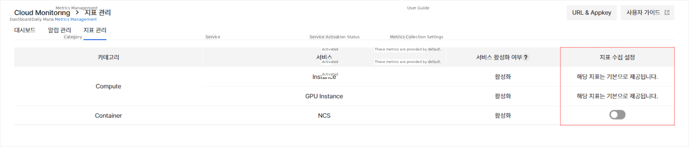

- Instance and GPU Instance services are metrics provided by default.
- Metrics are collected only for activated services. Check whether the service is activated.
- If you click the **Metric Collection Settings** toggle to deactivate it, collection of those metrics will stop and they will not be displayed on the dashboard.

## Dashboard Configuration
Now you're ready to configure a dashboard. 
Let's create a dashboard and add widgets.

### Create Dashboard
1. Click **+Create Dashboard**.
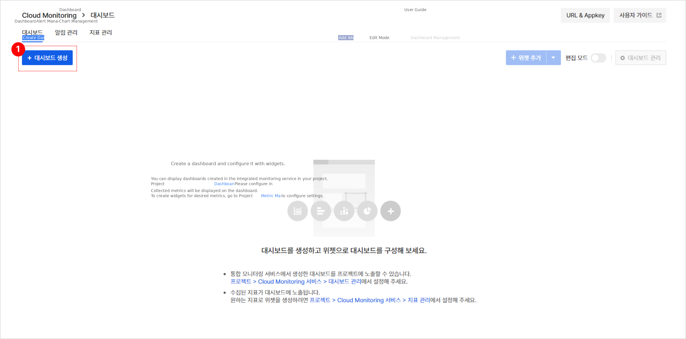
2. Enter the **Dashboard Name** and **Description**, then click **OK**.
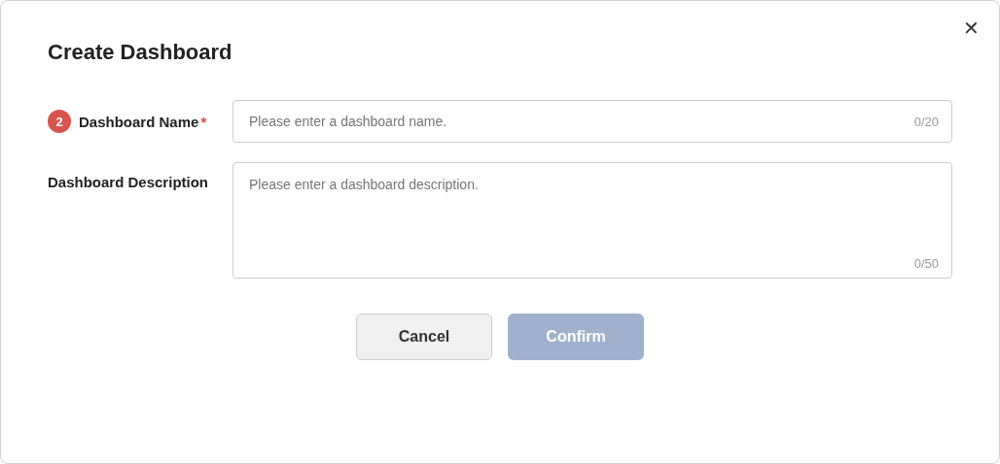
3. Check the created dashboard.

### Add Widget
1. Click **Add Widget** to go to the widget addition page.
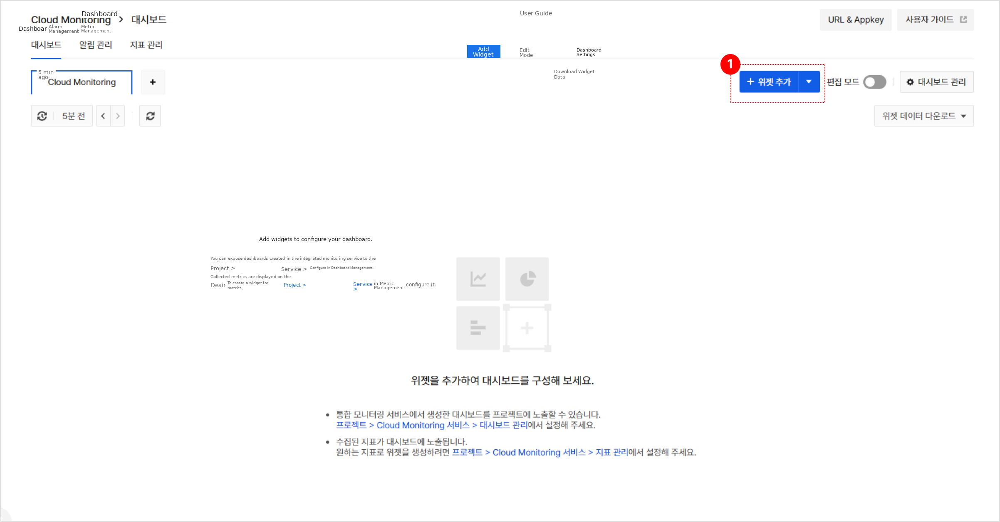
2. Enter the **Widget Name** and select the **Graph Type** and **Service**.
   - You can only select services that have collection settings enabled in **Metric Management**.
3. Select the **Resource Type** and **Metric Item** corresponding to the selected service.
   - A box where you can set filters and legends for each selected metric item is displayed.
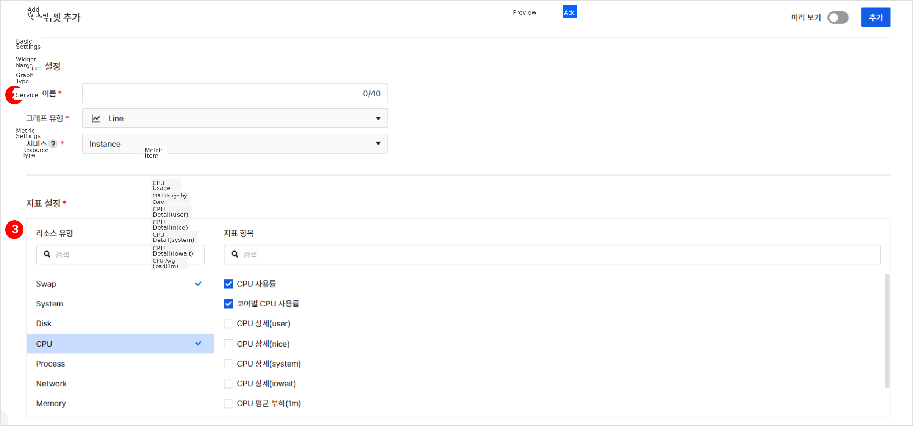

4. You can set filters to selectively check only the desired metrics.
   - For example, to monitor only specific instances in the Korea (Pangyo) region, set it up as follows:
     - Click **+Add** to add a filter.
     - Set the filter in the order of label, operator, condition as `Region` `=` `kr1` (Korea (Pangyo)).
     - Add a filter to select `Instance` `=` `{Instance Name}` in the order of label, operator, condition.
     - This will display specific instance metrics for the kr1 (Korea (Pangyo)) region on the graph.
5. You can set the legend name, unit, and Y-axis position as needed.
   - If metrics have the same unit, they are displayed with one Y-axis.
   - In Y-axis position settings, automatic automatically places Y-axes in left and right order when metric units differ.
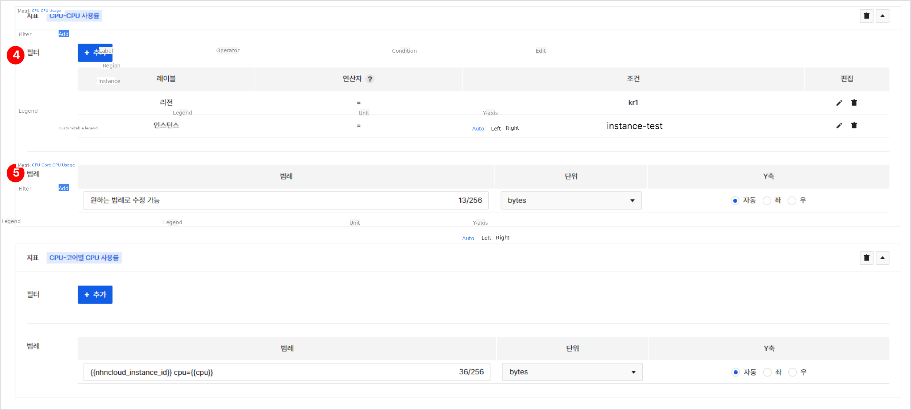

6. Use the **Preview** feature to check if the desired graph is drawn.
7. Once confirmed, click **Add** to add the widget to the dashboard.
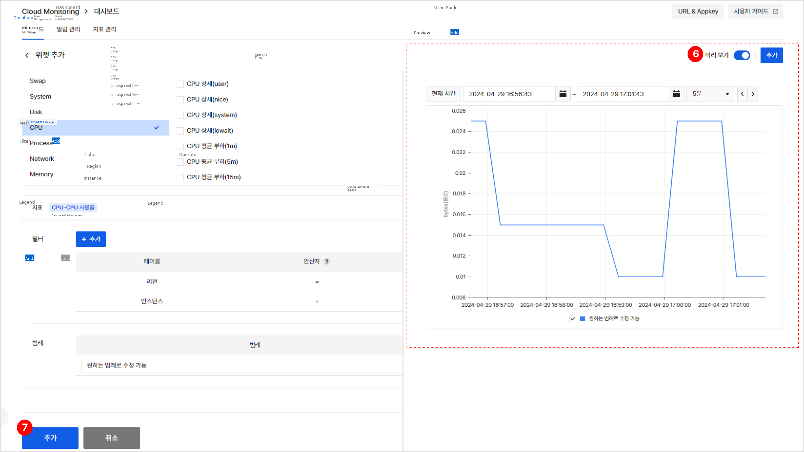

### Edit Dashboard
Check the widgets added to the dashboard and edit them to the desired form.

1. Click the toggle in the upper right corner of the dashboard to change from **View Mode** to **Edit Mode**.
2. Drag and drop widgets to change their position or add widget groups to organize the dashboard.
   - Clicking **Add Widget Group** adds a group at the bottom. Drag and drop widgets to the group to arrange them.
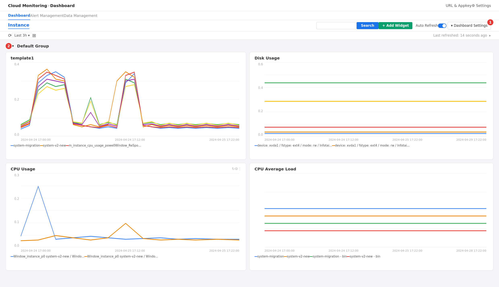

## Notification Settings
For more efficient monitoring, set up to receive notifications when events occur.

### Create Notification
1. Select **Cloud Monitoring > Notification Management > Notification Settings**.
2. Click **Create Notification** to go to the creation page.
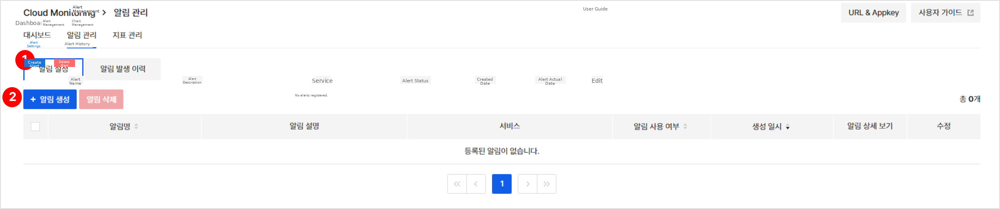

3. In **Basic Information**, enter the notification **Name** and **Description** and select the **Service**.
4. Select the **Resource Type** and **Metric** corresponding to the selected service.
   - A box where you can set filters and notification conditions for each selected metric is displayed.
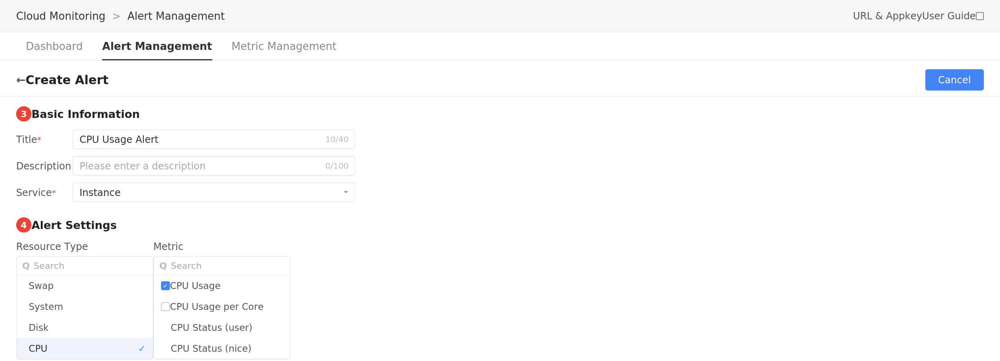

5. Set filters to configure notifications for the desired metrics.
6. Enter the **Threshold** and **Duration** that are the conditions for generating notifications.
   - For example, to receive notifications when CPU usage is 30% or higher and this state persists for 3 minutes or more, set it up as follows:
     - Select **CPU Usage Rate** as the **Metric** and set filters as needed.
     - Select `>=` (greater than or equal to) as the **Comparison Method**.
     - Enter `30` for **Threshold** and `3` for **Duration**.
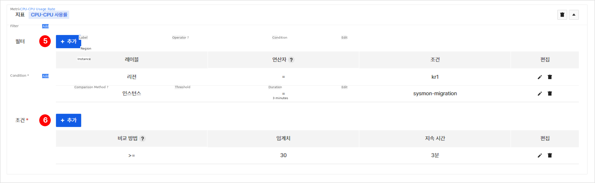

7. Select **Notification Recipients**.
   - You can select notification recipient groups created in the project as recipients.
   - Create project notification recipient groups first.
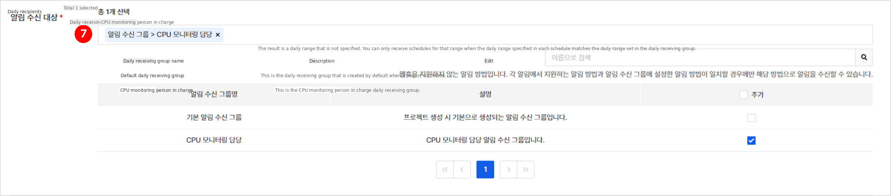

You can also quickly set up notifications from dashboard widgets.

1. Click the more options icon in the upper right corner of the widget, then click **Create Notification** from the dropdown menu.
2. Navigate to the **Create Notification** page, where filters for each metric selected when creating the widget are applied as is.
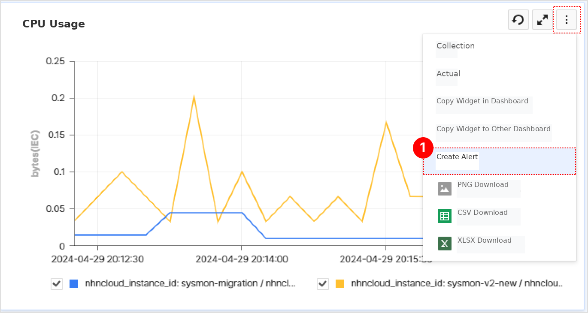

Now notifications will be generated when the set threshold is reached, and the occurrence history can be checked in **Notification Management > Notification Occurrence History**.

## Project Dashboard Display Settings
You can check dashboards created in the Cloud Monitoring service from the project main screen.

1. Click **Cloud Monitoring > Dashboard > Dashboard Management**.
2. Click the **Project Dashboard Display Settings** toggle for the dashboard you want to display on the project main screen to enable it.
   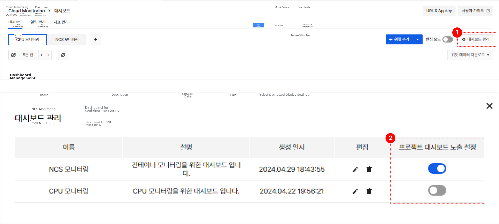

You can also check the configured dashboard in the project's **Custom Dashboard** for quick monitoring.