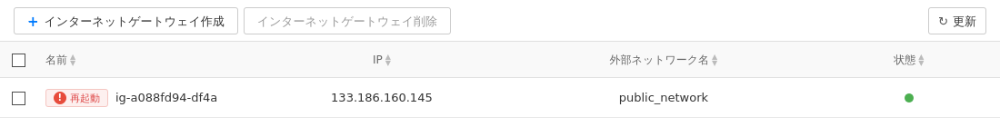
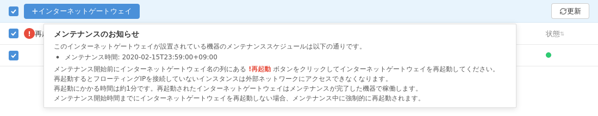
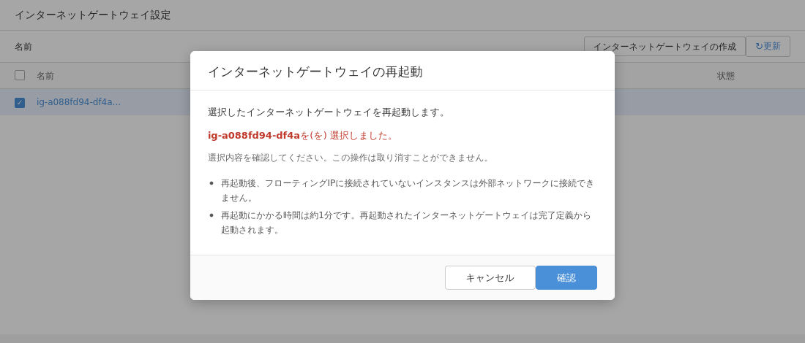

## Network > VPC > コンソール使用ガイド

本文書では、コンソールでVPCを扱う際に必要な内容を記述します。

## 動画ガイド
<iframe width="560" height="315" src="https://www.youtube.com/embed/faX5L2XA_78" frameborder="0" allow="accelerometer; autoplay; encrypted-media; gyroscope; picture-in-picture" allowfullscreen></iframe>

<iframe width="560" height="315" src="https://www.youtube.com/embed/qLjzBebDaqE" frameborder="0" allow="accelerometer; autoplay; encrypted-media; gyroscope; picture-in-picture" allowfullscreen></iframe>

## VPC

VPCは複数のサブネットを持つことができるため、サブネットを分割して使用する場合は十分に大きなネットワークを設定する必要があります。VPCネットワークを記述する方法は[CIDR Notation](https://en.wikipedia.org/wiki/Classless_Inter-Domain_Routing)を使用して記述することができます。すべてのVPCは[プライベートネットワーク](https://en.wikipedia.org/wiki/Private_network)を構成できる以下3つのアドレス領域にある必要があり、リンクローカルアドレスは使用できません。また、少なくとも24bit-256個よりも大きなネットワーク領域を指定する必要があります。

### プライベートネットワーク

RFC1918 | IPアドレス領域 | 使用可能なアドレス数
-------- | ---------- | -----------------
24bit block | 10.0.0.0/8 | 16,777,216
20bit block | 172.16.0.0/12 | 1,047,576
16bit block | 192.168.0.0/16 | 65,536

### リンクローカルアドレス

169.254.0.0/16に含まれる65,536個のIPアドレスは使用できません。

### 例

例 | 使用可否
-------- | ---------- 
10.0.0.0/8 | 使用できます。
10.0.0.0/16 | 使用できます。
10.0.0.0/24 | 使用できます。
10.0.0.0/28 | 使用できません。範囲が小さすぎます。
172.16.0.0/16 | 使用できます。
172.16.0.0/8 | 使用できません。使用可能範囲を超えています。
192.168.0.0/16 | 使用できます。デフォルト使用範囲として指定されます。
192.168.0.0/24 | 使用できます。
192.253.0.0/24 | 使用できません。使用可能範囲を超えています。

<br>


最初にComputeとNetworkサービスを使用すると以下のような項目が自動的に構成されます。

項目 | 名前 | 要約
-------- | ---------- | --------------
VPC | Default Network | 192.168.0.0/16範囲のVPCが1つ作成されます。
サブネット | Default Network | 192.168.0.0/24範囲のサブネットが1つ作成されます。
ルーティングテーブル | vpc-[id] | VPC IDの一部を名前として持つルーティングテーブルが1つ作成されます。
インターネットゲートウェイ | ig-[id] | ルーティングテーブルIDの一部を名前として持つインターネットゲートウェイが1つ作成されます。
セキュリティグループ | default | defaultという名前を持つセキュリティグループが1つ作成されます。

初期構成ではなくVPCを追加する場合は以下の項目を構成します。

項目 | 名前 | 要約
-------- | ---------- | --------------
VPC | 指定した名前 | 指定した範囲のVPCが1つ作成されます。
サブネット | - | 作成されません
ルーティングテーブル | vpc-[id] | VPC IDの一部を名前として持つルーティングテーブルが1つ作成されます。
インターネットゲートウェイ | - | 作成されないため、別途作成後に接続する必要があります。
セキュリティグループ | - | 追加で作成されません。

VPCと各項目のQuotaは以下のとおりです。

項目 | 最大値
-------- | ---------- 
VPC | 3
サブネット | VPC当たり10 
インターネットゲートウェイ | 3 
フローティングIP | 制限なし
ルーティングテーブル | VPC当たり10 
ルート | ルーティングテーブル当たり10
ピアリング | 制限なし


> [参考]
VPCを削除するためには、サブネットをすべて削除できる状態である場合のみ可能であり、その場合はサブネット、ルーティングテーブル、インターネットゲートウェイと一緒に削除します。

* VPCは他のVPCと完全に隔離され、トラフィックから安全です。

* VPCはプライベートネットワークであるため、インターネットから直接アクセスすることはできません。

* VPC内のすべての要素はVLANを使用できません。

* リージョンを超えるトラフィックについてはローカル通信を提供しません。

* インターネットゲートウェイなしではVPC内のすべてのインスタンスがインターネットに接続されません。

* 過度に送信される「Broadcast、Multicast、Unknown Unicast」は予告なしにブロックされる場合があります。


## サブネット

VPCはサブネットに分割して小さなネットワークを複数構成することができます。ただし、サブネットの場合はVPCアドレス範囲に含まれている必要があり、アドレス長は同じかそれより小さくする必要があります。例えば、192.168.0.0/16の場合、192.168.0.0～192.168.255.255まで総65,536個のIPアドレスを使用することができます。また、最も小さなサブネットは28bitであり、これより小さく構成することはできません。サブネットもVPCと同じくCIDR表記法を使用します。

サブネットが作成されるとゲートウェイIPアドレスは自動的に指定され、これを変更することはできません。また、VPCに含まれるルーティングテーブルに自動的に登録されます。

> [参考]
サブネットの削除は、インスタンスやロードバランサーなどが含まれていない空のサブネットの場合のみ可能です。また、サブネットが接続されているルーティングテーブルに該当サブネットに向かうルートがない必要があります。

* インスタンスが作成されると、指定されたサブネットから1つのIPアドレスが割り当てられます（Fixed IPと呼びます）。

* インスタンスが起動すると、DHCPを通じてIPアドレスがインスタンスに適用されます。

* サブネットのアドレス範囲は修正できません。

* 同じVPC内で異なるサブネットの範囲が重複したり重なったりして作成することはできません。

* 異なるVPCでは、サブネットの範囲が重複したり重なったりすることができます。

* インスタンスに割り当てられたMACアドレス以外の場合、ネットワーク上でブロックされる場合があります。したがって、VPNサービスをインスタンスで実行する場合、動作しない可能性があります。

* インスタンスに複数のサブネットを接続する場合、インスタンス内のOSで適切なルーティング設定が必要です。

* 同じVPC内の2つのサブネットは完全に隔離されていません。セキュリティグループを使用してインスタンスを保護してください。

* サブネットは異なるアベイラビリティゾーンにまたがってローカル通信をサポートします。ローカル通信は課金されません。


## インターネットゲートウェイ

インターネットゲートウェイはルーティングテーブルと接続することができます。プライベートネットワークで作成されたVPCは外部接続が不可能ですが、インターネットゲートウェイを利用してインターネットにアクセスすることができます。インターネットに接続するため、各インスタンスは「デフォルトゲートウェイ」をサブネットのゲートウェイアドレスに設定する必要がありますが、TOASTではこれを自動的に処理します。インターネットゲートウェイを作成する場合、外部ネットワークを選択する必要がありますが、TOASTでは現在「public_network」を1つだけ運営しています。

* インターネットゲートウェイアドレスは、インスタンスが作成されるかVPCがインターネット接続が必要な状態で自動割り当てされ、任意に変更することはできません。

* インターネットゲートウェイアドレスでインスタンスにアクセスすることはできません。

* インターネットゲートウェイアドレスに流入するトラフィックはすべてブロックされます。

* インターネットに接続されたインスタンスがインターネット方向にトラフィックを発生させると、使用した分だけ課金されます。

* インスタンス間のローカル通信については課金されません。

### サーバーメンテナンスのためのインターネットゲートウェイ再起動ガイド

TOASTは定期的にインターネットゲートウェイサーバーのソフトウェアをアップデートして、基本インフラサービスのセキュリティと安定性を向上させています。
インターネットゲートウェイサーバーメンテナンスのため、メンテナンス対象サーバーで稼働中のインターネットゲートウェイは再起動を通じてメンテナンスが完了したインターネットゲートウェイサーバーに移動する必要があります。

再起動が必要なインターネットゲートウェイは名前の横に**！再起動**ボタンが表示され、このボタンを使用して再起動することができます。

メンテナンス対象に指定されたインターネットゲートウェイがあるプロジェクトに移動して次の手順で再起動を実行します。

1. メンテナンス対象インターネットゲートウェイを確認します。
   名前の横に**！再起動**ボタンがあるインターネットゲートウェイがメンテナンス対象インターネットゲートウェイです。
   
   **！再起動**ボタンにマウスカーソルを合わせると詳細なメンテナンススケジュールを確認できます。
   
2. メンテナンス対象インターネットゲートウェイを選択し、名前の横にある**！再起動**ボタンをクリックします。
   再起動が完了するまで、メンテナンス対象インターネットゲートウェイを使用するインスタンスのインターネット接続がブロックされるため、サービスに影響を与えない時間に実行してください。
   ただし、フローティングIPを接続したインスタンスはインターネットゲートウェイの再起動に影響を受けません。
3. インターネットゲートウェイの再起動を確認するウィンドウが表示されたら**確認**ボタンをクリックします。
   
4. ステータス表示灯が緑色に変わり、**！再起動**ボタンが消えるまで待機します。
   インターネットゲートウェイのステータス表示灯が変わらないか、**！再起動**ボタンが消えない場合は「更新」をしてください。
   

インターネットゲートウェイが再起動している間は、該当インターネットゲートウェイを操作することはできません。
インターネットゲートウェイが正常に再起動されない場合は自動的に管理者に報告され、TOASTから別途連絡いたします。

## フローティングIP

インスタンスが作成されると、指定されたサブネットから1つのIPアドレスが割り当てられます。該当するIPアドレスはサブネットのアドレスであるため、当然VPCに含まれます。これをFixed IPと呼びます。このアドレスはプライベートネットワークのアドレスであるため、インターネットからアクセスすることはできません。したがって、外部から直接インスタンスにアクセスしたい場合は、外部からアクセス可能なIPアドレスを使用する必要があります。フローティングIPは、インターネットからインスタンスに直接アクセスするために必要な機能です。フローティングIPを使用すると、該当アドレスとインスタンスが1:1で接続され、インターネットから直接アクセスが可能になります。詳細については[概要]を参照してください。フローティングIPを作成するためには外部ネットワークを選択する必要がありますが、TOASTでは現在「Public Network」を1つだけ運営しています。

> [参考] インスタンスにフローティングIPを接続するためには、インスタンスが含まれているサブネットがルーティングテーブルと接続されており、<br>
> 該当ルーティングテーブルがインターネットゲートウェイを通じてインターネットに接続されている場合のみ「接続」動作を実行できます。

* フローティングIPは作成と同時に課金されます。削除するまで継続的に課金されます（インスタンス接続とは無関係）。

* フローティングIPが接続されてもFixed IPがフローティングIPに変更されるわけではありません。

* インターネット方向にトラフィックが発生すると課金されます。

* 同じVPC内の2つのインスタンスがフローティングIPを使用して通信する場合、使用量に応じて課金されます。

> [参考] 同じVPC内の2つのインスタンスがFixed IPを使用してローカル通信を行う場合は課金されません。

### 複数のネットワークインターフェイスを持つインスタンスにフローティングIPを接続

複数のネットワークインターフェイスを持つインスタンスは、各ネットワークインターフェイスごとにフローティングIPを接続することができます。ただし、最初を除く残りのネットワークインターフェイスに接続されたフローティングIPでインスタンスに接続するためには、インスタンスのRouting Ruleの設定が必要です。

**TOASTで提供する公式Linuxイメージ配布バージョン`2018.12.27`以上**で作成したインスタンスは、起動時にRouting Ruleを自動的に設定して、それぞれのネットワークインターフェイスに接続されたすべてのフローティングIPを通じてアクセスが可能です。

インスタンスに接続後、次のようにRouting Ruleの設定状況を確認することができます。
```
$ ip rule
0:      from all lookup local
100:    from { eth0のIPアドレス } lookup 1
200:    from { eth1のIPアドレス } lookup 2
300:    from { eth2のIPアドレス } lookup 3
...
32766:  from all lookup main
32767:  from all lookup default
```
上記のようにip ruleコマンドを実行した時、各ネットワークインターフェイス別Routing Rule設定がされている場合、すべてのフローティングIPを通じてインスタンスにアクセスが可能です。

それ以外のイメージで作成したインスタンスは、次のようにインスタンス内にRouting Ruleを設定して、インスタンスに接続されたすべてのフローティングIPを通じてアクセスできるようにすることができます。

最初のネットワークインターフェイス（eth0）に接続されたフローティングIPを通じてインスタンスに接続した後、フローティングIPを接続して接続しようとする残りのネットワークインターフェイスに対して次のようなコマンドを実行します。
```
ip rule add from {ネットワークインターフェイスIPアドレス}/32 table {テーブル番号} priority {優先順位}
ip route add default via {ネットワークインターフェイスのデフォルトゲートウェイアドレス} table {テーブル番号}
ip route add {ネットワークインターフェイスのサブネットCIDR} dev {ネットワークインターフェイス名} table {テーブル番号}
```

例えば、インスタンスが持つネットワークインターフェイス情報が次のようである場合
```
1: lo: <LOOPBACK,UP,LOWER_UP> mtu 65536 qdisc noqueue state UNKNOWN
    link/loopback 00:00:00:00:00:00 brd 00:00:00:00:00:00
    inet 127.0.0.1/8 scope host lo
       valid_lft forever preferred_lft forever
    inet6 ::1/128 scope host
       valid_lft forever preferred_lft forever
2: eth0: <BROADCAST,MULTICAST,UP,LOWER_UP> mtu 1454 qdisc pfifo_fast state UP qlen 1000
    link/ether fa:16:3e:8d:71:d6 brd ff:ff:ff:ff:ff:ff
    inet 192.168.100.132/24 brd 192.168.100.255 scope global dynamic eth0
       valid_lft 86379sec preferred_lft 86379sec
    inet6 fe80::f816:3eff:fe8d:71d6/64 scope link
       valid_lft forever preferred_lft forever
3: eth1: <BROADCAST,MULTICAST,UP,LOWER_UP> mtu 1454 qdisc pfifo_fast state UP qlen 1000
    link/ether fa:16:3e:06:96:2f brd ff:ff:ff:ff:ff:ff
    inet 172.16.0.37/24 brd 172.16.0.255 scope global dynamic eth1
       valid_lft 86381sec preferred_lft 86381sec
    inet6 fe80::f816:3eff:fe06:962f/64 scope link
       valid_lft forever preferred_lft forever
4: eth2: <BROADCAST,MULTICAST,UP,LOWER_UP> mtu 1454 qdisc pfifo_fast state UP qlen 1000
    link/ether fa:16:3e:06:ac:10 brd ff:ff:ff:ff:ff:ff
    inet 10.254.0.90/24 brd 10.254.0.255 scope global dynamic eth2
       valid_lft 86386sec preferred_lft 86386sec
    inet6 fe80::f816:3eff:fe06:ac10/64 scope link
       valid_lft forever preferred_lft forever
```
`eth1`、`eth2`についてフローティングIPで接続するため、以下のようなコマンドでRouting Ruleを設定します。

```
# eth1のフローティングIP接続のためのRouting Rule設定
ip rule add from 172.16.0.37/32 table 2 priority 200
ip route add default via 172.16.0.1 table 2
ip route add 172.16.0.0/24 dev eth1 table 2

# eth2のフローティングIP接続のためのRouting Rule設定
ip rule add from 10.254.0.90/32 table 3 priority 300
ip route add default via 10.254.0.1 table 3
ip route add 10.254.0.0/24 dev eth2 table 3
```
コマンド実行後、次のように設定されたRouting Ruleを確認することができます。

```
$ ip rule													
0:	from all lookup local
200:	from 172.16.0.37 lookup 2 	
300:	from 10.254.0.90 lookup 3 	
32766:	from all lookup main
32767:	from all lookup default

$ ip route show table 2					
default via 172.16.0.1 dev eth1
172.16.0.0/24 dev eth1  scope link

$ ip route show table 3
default via 10.254.0.1 dev eth2
10.254.0.0/24 dev eth2  scope link
```

上記Routing Rule設定は、インスタンスを再起動すると初期化されるため、インスタンス再起動時にRouting Ruleが自動的に設定されるよう設定することをお勧めします。

## セキュリティグループ

セキュリティグループは、インスタンスを他のトラフィックから保護する目的で使用します。指定したトラフィックは許可し、残りのトラフィックはブロックする「ポジティブセキュリティモデル（positive security model）」を使用します。

サービスを最初に開始すると、デフォルトセキュリティグループが1つ作成され、流入するすべてのトラフィックをブロックします。したがって、「ping」、「ssh」などのサービスも使用できず、必要なルールを設定してから使用できます。フローティングIPを使用した外部アクセスとプライベートIPを使用した内部アクセスの両方に同じように適用されます。

インスタンスには複数のセキュリティグループを設定することができます。追加でセキュリティグループを作成して複数のルールを追加し、これをインスタンスに設定すると、設定されたすべてのセキュリティグループのルールがインスタンスに適用されます。

例えば、「CONN」というセキュリティグループに「受信TCP PORT 22」、「受信TCP PORT 23」というルールがあり、「WEB」というセキュリティグループに「受信TCP PORT 80」、「受信TCP PORT 8080」のようなルールがある時、1つのインスタンスに「CONN」、「WEB」の2つのセキュリティグループを設定すると、4つのルールが一緒に適用されて該当サービスをすべて使用することができます。


| 項目        | 説明                                                         |
| ----------- | ------------------------------------------------------------ |
| 方向        | 受信はインスタンスに流入する方向を意味します。送信はインスタンスから出ていく方向を意味します。 |
| Ether Type  | EtherType IPのバージョンを意味します。IPv4、IPv6を指定できます。 |
| IPプロトコル | 特定のプロトコルを指定するか、全体を指定できます。その他プロトコル0は「任意」と同じ意味で、すべてのIPプロトコルを許可します。       |
| ポート範囲   | L4プロトコルの場合、ポートの範囲を指定できます。         |
| 原格        | セキュリティグループまたはIPアドレス範囲を指定できます。ルールの方向が「送信」であれば宛先がリモートであり、「受信」であれば送信元がリモートです。<br>ルールの方向によってトラフィックの送信元と宛先を比較しますが、セキュリティグループを指定すると指定されたセキュリティグループに属するインスタンスのIPかを比較し、<br>CIDRを選択してIPアドレスや範囲を指定する場合は設定されたIPアドレスや範囲かを比較します。 |
| 説明        | セキュリティグループルールの説明を追加できます。         |

セキュリティグループは「stateful」で動作するため、ルールで一度接続されたセッションは反対方向のルールがなくても許可されます。

例えば、インスタンスに向かうTCP 80の最初のパケットが「受信TCP PORT 80」ルールに従って通過された場合、インスタンスからTCP 80ポートを送信元として送信されるパケットはブロックされません。

ただし、一定時間ルールに適合するパケットが入らずセッションが期限切れになると、反対方向のパケットもブロックされます。

デフォルトセキュリティグループには、インスタンスから出ていくすべてのトラフィックのルールが設定されています。このルールを削除しなければ、インスタンスから始まるセッションはすべて許可されます。

* ルールは1つずつ追加するよりも範囲を指定する方が効率の面で有利です。

* ルールが増えるとパフォーマンスの低下が発生する可能性があります。

* セッションの状態が合わないトラフィックはブロックされる場合があります。

* 流入経路と流出経路が異なる非対称トラフィックはブロックされます。

* リストにないルールは定義して使用できます。[Well-known port](https://en.wikipedia.org/wiki/List_of_TCP_and_UDP_port_numbers)

## セキュリティグループロギング
セキュリティグループロギングは、セキュリティグループによって許可またはブロックされたパケットを確認する目的で使用されます。
セキュリティグループロギングを設定すると、現在のプロジェクトでセキュリティグループを使用するすべてのインスタンスを対象に適用されます。
ロギング作成のアクションをDROPに設定する場合、セキュリティグループによってブロックされるすべてのパケットがロギングされます。ロギング作成のアクションをACCEPTに設定する場合は、セキュリティグループによって許可されたパケットがロギングされます。この時、双方向通信が行われる場合は許可されたパケットのうちセッションの最初のパケットのみロギングされ、双方向通信が行われない場合は許可されたすべてのパケットがロギングされます。ロギング作成のアクションALLに設定する場合は、上記の2つの条件がすべて適用されます。
ストレージタイプをオブジェクトストレージに設定する場合、ストレージの場所はオブジェクトストレージサービスページの**APIエンドポイント設定**ボタンをクリックしてObject Store値で指定します。他のプロジェクトにあるオブジェクトストレージサービスのObject Storeを指定することも可能です。保存パスとして指定するコンテナは必ず事前に作成されている必要がありますが、そのサブフォルダは事前に作成しておく必要はありません。例えば、保存パスを/mycon/sglog/に指定する場合、myconというコンテナは事前に作成されている必要がありますが、sglogフォルダは作成