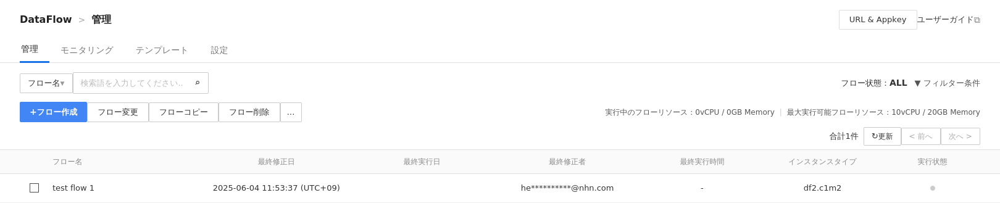

## Data & Analytics > DataFlow > コンソール使用ガイド

DataFlowは次の順序で使用できます。

* サービス有効化
    1. プロジェクトを作成します。
    2. 任意のプロジェクトを選択します。
    3. DataFlowサービスを有効化します。
* フロー実行
    1. フローを作成します。
    2. 必要なノードを追加し、設定値を入力して各ノードの動作方式を定義します。
    3. ノード接続を通じてノードの動作順序を決定し、フローを完成します。
    4. フローを実行します。
    5. ログ情報を確認してフローが正常に実行されたかを確認します。

## 管理

フローメタデータ情報を照会し管理するページです。
**Data & Analytics > DataFlow > 管理**をクリックします。

### 検索

指定された基準でフローを検索します。

* フロー名を基準に検索すると、名前に検索語が含まれるフローを検索します。

### フィルター

指定された条件でフローを検索します。

* フローステータス値に基づくフィルタリングオプションを提供します。

### フロー一覧

照会結果のフローをテーブル形式で表示します。

* 簡単なフローメタデータと現在のフロー実行ステータスを表示します。
* 最終更新日を基準にソートします。
* フローを選択して、フロー変更、フロー詳細表示、フロー開始などの管理機能を使用できます。
* フィルター条件機能を使って、特定ステータスのフローのみ照会できます。
* 一度照会されたフローは**更新**を押して照会結果を更新する必要があります。
* 1ページあたり12個のフローを照会し、**前へ**および**次へ**をクリックしてページを移動できます。

#### フローステータス情報

| フロー実行ステータス                                         | 説明 |
|---------------------------------------------------| --- |
| START\_FAILED  | フロー実行リクエストに失敗しました。 |
| QUOTA\_EXCEEDED | フロー実行のためのリソースが不足し、実行に失敗しました。 |
| STARTING       | フロー実行のためのリソースを確保中です。 |
| PREPARING      | フロー実行準備が完了しました。 |
| RUNNING        | フローが実行中です。 |
| ERROR              | フロー実行過程で通信障害や認証不可などによりエラーが発生しました。継続的に<b>ERROR</b>が発生する場合は**カスタマーサポート > お問い合わせ**からお問い合わせください。 |
| STOP\_FAILED   | フロー終了リクエストに失敗しました。 |
| STOPPED        | フローが終了しました。 |
| DRAINING       | フローがドレイニング中です。 |
| UNKNOWN            | フロー実行過程で不明な原因によりエラーが発生しました。継続的に<b>UNKNOWN</b>が発生する場合は**カスタマーサポート > お問い合わせ**からお問い合わせください。 |

#### フローステータス変更通知メール
* 通知対象フローステータスに変更された際に通知メールを受信できます。
* 通知対象フローステータス
    * RUNNING
    * ERROR
    * STOPPED
* デフォルト受信対象
    * 使用中のDataFlowサービスが有効化されたプロジェクトの**DataFlow ADMIN**ロールを持つメンバー

### フロー作成

フローを定義するメタデータを作成します。

* フロー識別のために名前と説明を追加してフローメタデータを作成します。
* フロー名は他のフローと重複可能です。
* フローの目的に応じた実行モードを選択します。
* フローテンプレートを指定して、ユーザーが希望する機能のフローを簡単に読み込むことができます。
* フローを実行するためのインスタンスタイプを設定できます。

### フロー変更

フローのメタデータを変更します。

* 既存のフロー名と説明を変更してフローメタデータに反映します。
* フローテンプレートは指定できません。
* フロー実行中でもフロー変更が可能です。
* フローを実行するためのインスタンスタイプを変更できます。
    * ただし、変更されたインスタンスタイプは次のフロー実行から適用されます。

### フローコピー

既存のフロー定義を基に新しいメタデータを作成します。

* 既存フローの名前に`_copy`が追加された新しいメタデータを作成します。
* 既存フローが持つフローロジックをそのままコピーします。
* 実行中のフローもコピーが可能です。
* 実行中のフローは停止状態でコピーします。
* フローの現在の保存状態が一時保存の場合、既存フローの最終保存バージョンはコピーしません。
* スケジューラーが登録されたフローをコピーしても、コピーしたフローにはスケジューラーが登録されません。
* コピーしたフローは既存フローとは完全に別のフローです。

### フロー削除

フローメタデータを削除します。

* フローメタデータを完全に削除します。
* 削除したフローは復元できません。
* 実行中のフローは削除できません。

### その他 - フロー開始
停止状態のフローを開始します。

* 各フローは同時に1つのみ実行できます。
* 一時保存したフローは最後に保存したバージョンで開始します。
* 一度も保存せず一時保存のみしたフローは開始できません。
* フローは必ず1回以上保存してから開始できます。
* フローがスケジューラーにより実行中であっても、ユーザーが開始したフローと同様にフローを開始できません。

### その他 - フロー終了
* 実行準備中、実行中、またはドレイニング中のフローを終了できます。
* 残余イベントは処理せずに終了します。

### その他 - フロードレイニング後に終了
* 実行中のフローをドレイニング後に終了できます。
* ドレイニングとは、フローの残余イベントを処理することを意味します。
* タイムアウト時間を超過した場合、ドレイニングが終わっていなくても終了します。
* タイムアウト時間が残っている状態でドレイニングが終了した場合、即座に終了します。
* ドレイニング中のフローは、フロー終了により即座に終了できます。