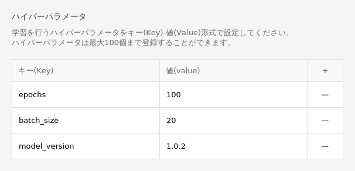
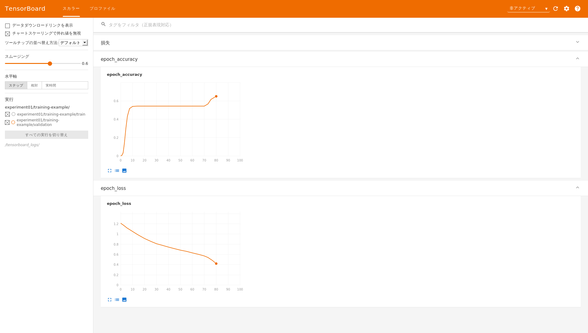

<a id="ai.easymaker.console.guide"></a>

## Machine Learning > AI EasyMaker > コンソール使用ガイド

<a id="dashboard"></a>

## ダッシュボード

ダッシュボードで全体AI EasyMakerリソースの利用状況を確認できます。

<a id="dashboard.service.usage.status"></a>

### サービス利用状況

リソース別に利用中のリソース数を表示します。

- ノートブック：利用中のACTIVE(HEALTHY)状態のノートブック数
- 学習：完了(COMPLETE)した学習数
- ハイパーパラメータチューニング：完了(COMPLETE)したハイパーパラメータチューニング数
- エンドポイント：ACTIVE状態のエンドポイント数

<a id="dashboard.service.monitoring"></a>

### サービスモニタリング

- API呼び出しが最も多いTop 3エンドポイントを表示します。
- エンドポイントを選択すると下位エンドポイントステージのAPI成功/失敗合計指標を確認できます。

<a id="dashboard.resource.usage"></a>

### リソース使用率

- CPU、GPUコアタイプ別に最も使用量が多いリソースを確認できます。
- 指標にマウスポインタを合わせるとリソース情報が表示されます。

<a id="notebook"></a>

## ノートブック

機械学習開発のための必須パッケージがインストールされているJupyterノートブックを作成し管理します。

<a id="notebook.create"></a>

### ノートブック作成

Jupyterノートブックを作成します。

- **イメージ**: ノートブックインスタンスにインストールされるOSイメージを選択します。
    - **コアタイプ**: イメージのCPU、GPUコアタイプが表示されます。
    - **フレームワーク**: イメージにインストールされたフレームワークが表示されます。
        - TENSORFLOW: TensorFlowディープラーニングフレームワークがインストールされたイメージです。
        - PYTORCH: PyTorchディープラーニングフレームワークがインストールされたイメージです。
        - PYTHON: ディープラーニングフレームワークがインストールされておらず、Python言語のみがインストールされたイメージです。
    - **フレームワークバージョン**: イメージにインストールされたフレームワークのバージョンが表示されます。
    - **Pythonバージョン**: イメージにインストールされたPythonバージョンが表示されます。

- **ノートブック情報**
    - ノートブックの名前、説明を入力します。
    - ノートブックのインスタンスタイプを選択します。選択したタイプに応じてインスタンスの仕様が選択されます。

- **ストレージ**
    - ノートブックのブートストレージとデータストレージサイズを指定します。
        - ブートストレージはJupyterノートブックおよび基本仮想環境がインストールされるストレージです。このストレージはノートブックを再起動すると初期化されます。
        - データストレージは`/root/easymaker`ディレクトリパスにマウントされるブロックストレージです。このストレージのデータはノートブックを再起動しても保持されます。
    - 作成されたノートブックのストレージサイズは変更できないため、作成時に十分なストレージサイズで指定する必要があります。
    - 必要に応じてノートブックに接続する**NHN Cloud NAS**を接続できます。
        - マウントディレクトリ名: ノートブックにマウントするディレクトリ名を入力します。
        - NHN Cloud NASパス: `nas://{NAS ID}:/{path}`形式のディレクトリパスを入力します。

!!! tip "ご参考"
    ノートブック作成は数分の時間がかかる場合があります。
    リソースを初回作成時は、サービス環境構成のため追加で数分の時間がさらにかかります。

!!! danger "注意"
    AI EasyMakerと同一のプロジェクトで作成されたNHN Cloud NASのみ使用可能です。

<a id="notebook.list"></a>

### ノートブック一覧

ノートブック一覧が表示されます。一覧のノートブックを選択すると詳細情報を確認し情報を変更できます。

- **名前**: ノートブック名が表示されます。詳細画面で**変更**をクリックすると名前を変更できます。
- **ステータス**: ノートブックのステータスが表示されます。主なステータスは以下の表を参照してください。

    | ステータス         | 説明                                                                                                                                    |
    | ------------------ | --------------------------------------------------------------------------------------------------------------------------------------- |
    | CREATE REQUESTED   | ノートブック作成がリクエストされたステータスです。                                                                                      |
    | CREATE IN PROGRESS | ノートブックインスタンスを作成中のステータスです。                                                                                      |
    | ACTIVE (HEALTHY)   | ノートブックアプリケーションが正常に稼働中のステータスです。                                                                            |
    | ACTIVE (UNHEALTHY) | ノートブックアプリケーションが正常に稼働していないステータスです。ノートブックを再起動した後もこのステータスが続く場合はカスタマーサポートにお問い合わせください。 |
    | STOP IN PROGRESS   | ノートブックを停止中のステータスです。                                                                                                  |
    | STOPPED            | ノートブックを停止したステータスです。                                                                                                  |
    | START IN PROGRESS  | ノートブックを開始中のステータスです。                                                                                                  |
    | REBOOT IN PROGRESS | ノートブックを再起動中のステータスです。                                                                                                |
    | DELETE IN PROGRESS | ノートブックを削除中のステータスです。                                                                                                  |
    | CREATE FAILED      | ノートブック作成中に失敗したステータスです。作成が継続的に失敗する場合はカスタマーサポートにお問い合わせください。                      |
    | STOP FAILED        | ノートブック停止に失敗したステータスです。再試行してください。                                                                        |
    | START FAILED       | ノートブック開始に失敗したステータスです。再試行してください。                                                                        |
    | REBOOT FAILED      | ノートブック再起動に失敗したステータスです。再試行してください。                                                                      |
    | DELETE FAILED      | ノートブック削除に失敗したステータスです。再試行してください。                                                                        |

- **作業 > Jupyterノートブックを開く**: **Jupyterノートブックを開く**ボタンをクリックするとブラウザの新しいウィンドウでノートブックを開きます。ノートブックはコンソールにログインしたユーザーのみアクセス可能です。

- **モニタリング**: ノートブックを選択すると表示される詳細画面の**モニタリング**タブでモニタリング対象インスタンス一覧と基本指標チャートを確認できます。
    - **モニタリング**タブはノートブックが作成中であるか進行中の作業がある時に無効化されます。

<a id="notebook.user.virtual.run.environment.configuration"></a>

### ユーザー仮想実行環境構成

AI EasyMakerノートブックインスタンスは、機械学習に必要な様々なライブラリとカーネルがインストールされた基本Conda仮想環境を提供します。
基本Conda仮想環境はノートブックを停止して開始する時に初期化されて稼働しますが、ユーザーが任意のパスにインストールした仮想環境と外部ライブラリは自動で初期化されないため、ノートブックを停止して開始した時に維持されません。
この問題を解決するには、`/root/easymaker/custom-conda-envs`ディレクトリパスに仮想環境を作成し、作成された仮想環境で外部ライブラリをインストールする必要があります。
AI EasyMakerノートブックインスタンスは`/root/easymaker/custom-conda-envs`ディレクトリパスに作成された仮想環境について、ノートブックを停止して開始する時に初期化されて稼働するようにサポートします。

次のガイドを参考してユーザー仮想環境を構成してください。

1. コンソールノートブックメニューの**Jupyterノートブックを開く** > **Jupyterノートブック > Launcher > Terminal**をクリックします。
2. `/root/easymaker/custom-conda-envs`パスに移動します。

        cd /root/easymaker/custom-conda-envs

3. Python 3.8バージョンの`easymaker_env`という仮想環境を作成するには、次のように`conda create`コマンドを実行します。

        conda create --prefix ./easymaker_env python=3.8

4. 作成された仮想環境は`conda env list`コマンドで確認できます。

        (base) root@nb-xxxxxx-0:~# conda env list
        # conda environments:
        #
                                /opt/intel/oneapi/intelpython/latest
                                /opt/intel/oneapi/intelpython/latest/envs/2022.2.1
        base                *   /opt/miniconda3
        easymaker_env           /root/easymaker/custom-conda-envs/easymaker_env

<a id="notebook.user.script"></a>

### ユーザースクリプト

ノートブックを停止して開始する時に自動で実行されるべきスクリプトを`/root/easymaker/cont-init.d`パスに登録できます。
アルファベット数字（alphanumeric）順序に従って昇順で実行されます。

- スクリプトの場所と権限
    - `/root/easymaker/cont-init.d`パスに位置するファイルのみ実行されます。
    - 実行権限があるスクリプトのみ実行されます。
- スクリプトの内容
    - スクリプトの最初の行は必ず`#!`で開始する必要があります。
    - スクリプトはroot権限で実行されます。
- スクリプトの実行記録は以下の場所に保存されます。
    - スクリプト終了コード: `/root/easymaker/cont-init.d/{SCRIPT}.exitcode`
    - スクリプト標準出力と標準エラーストリーム: `/root/easymaker/cont-init.d/{SCRIPT}.output`
    - 全体実行ログ: `/root/easymaker/cont-init.output`

<a id="notebook.stop"></a>

### ノートブック停止

稼働中のノートブックを停止するか、停止したノートブックを開始します。

1. ノートブック一覧で開始または停止したいノートブックを選択します。
2. **ノートブック開始**または**ノートブック停止**をクリックします。
3. リクエストされた作業はキャンセルできません。続行するには**確認**をクリックします。

!!! tip "ご参考"
    ノートブックの開始と停止は数分の時間がかかる場合があります。

!!! danger "注意"
    ノートブックを停止して開始する時、ユーザーが作成した仮想環境と外部ライブラリが初期化される場合があります。
    ノートブック停止後開始時に仮想環境と外部ライブラリを維持するには[ユーザー仮想実行環境構成](#notebook.user.virtual.run.environment.configuration)を参考してユーザー仮想環境を構成してください。

<a id="notebook.instance.type.change"></a>

### ノートブックインスタンスタイプ変更

作成されたノートブックのインスタンスタイプを変更します。
変更したいインスタンスタイプは、既存インスタンスと同一のコアタイプのインスタンスタイプのみ変更可能です。

1. インスタンスタイプを変更したいノートブックを選択します。
2. ノートブックが稼働中のステータス（ACTIVE）の場合、**ノートブック停止**をクリックしてノートブックを停止します。
3. **インスタンスタイプ変更**をクリックします。
4. 変更したいインスタンスタイプを選択し確認をクリックします。

!!! tip "ご参考"
    インスタンスタイプ変更は数分の時間がかかる場合があります。

<a id="notebook.reboot"></a>

### ノートブック再起動

ノートブック利用中に問題が発生したり、ステータスは正常（ACTIVE）だがノートブックにアクセスできない場合、
ノートブックを再起動できます。

1. 再起動したいノートブックを選択します。
2. **ノートブック再起動**をクリックします。
3. リクエストされた削除作業はキャンセルできません。続行するには**確認**をクリックします。

!!! danger "注意"
    ノートブックを再起動する時、ユーザーが作成した仮想環境と外部ライブラリが初期化される場合があります。
    ノートブック再起動時に仮想環境と外部ライブラリを維持するには[ユーザー仮想実行環境構成](#notebook.user.virtual.run.environment.configuration)を参考してユーザー仮想環境を構成してください。

<a id="notebook.delete"></a>

### ノートブック削除

作成されたノートブックを削除します。

1. 一覧で削除したいノートブックを選択します。
2. **ノートブック削除**をクリックします。
3. リクエストされた削除作業はキャンセルできません。続行するには**確認**をクリックします。

!!! tip "ご参考"
    ノートブックを削除する場合、ブートストレージとデータストレージが削除されます。
    接続したNHN Cloud NASは削除されず、**NHN Cloud NAS**で個別削除する必要があります。

<a id="experiment"></a>

## 実験

実験は関連する学習を実験としてグループ化して管理します。

<a id="experiment.create"></a>

### 実験作成

1. **実験作成**をクリックします。
2. 実験名と説明を入力し、**確認**をクリックします。

!!! tip "参考"
    実験作成には数分の時間がかかる場合があります。
    リソースを初回作成時は、サービス環境構成のため追加で数分の時間がかかります。

<a id="experiment.list"></a>

### 実験一覧

実験一覧が表示されます。一覧の実験を選択すると詳細情報を確認し、情報を変更できます。

- **ステータス**: 実験のステータスが表示されます。主要なステータスは下表を参照してください。

    | ステータス          | 説明                                               |
    | ------------------ | -------------------------------------------------- |
    | CREATE REQUESTED   | 実験作成がリクエストされた状態です。                |
    | CREATE IN PROGRESS | 実験が作成中の状態です。                           |
    | CREATE FAILED      | 実験作成が失敗した状態です。再度お試しください。    |
    | ACTIVE             | 実験が正常に作成された状態です。                   |

- **タスク**
    - **TensorBoardへ移動**をクリックすると、実験に含まれる学習の統計情報を確認できるTensorBoardがブラウザの新しいウィンドウで開きます。TensorBoardはコンソールにログインしたユーザーのみアクセスできます。
    - **リトライ**: 実験ステータスが失敗の場合、**リトライ**をクリックして実験を復旧できます。
- **学習**: 学習を選択すると表示される詳細画面の**学習**タブには、実験に含まれる学習の一覧が表示されます。

<a id="experiment.delete"></a>

### 実験削除

実験を削除します。

1. 削除する実験を選択します。
2. **実験削除**をクリックします。実験が作成中の状態の場合、実験を削除できません。
3. リクエストされた削除作業は取り消すことができません。続行するには**確認**をクリックします。

!!! tip "参考"
    実験と関連するパイプラインスケジュールが存在するか、作成中の学習、ハイパーパラメータチューニング、パイプライン実行が存在する場合、実験を削除できません。
    実験と関連するリソースを削除してから実験を削除してください。
    関連するリソースは、削除する実験をクリックすると表示される下部の詳細画面で確認できます。

<a id="training"></a>

## 学習

機械学習アルゴリズムを学習し、学習結果を統計で確認できる環境を提供します。

<a id="training.create"></a>

### 学習作成

学習が実行されるインスタンスとOSイメージを選択して学習環境を設定し、学習するアルゴリズム情報と入力/出力データパスを入力して学習を進行します。

- **学習テンプレート**: 学習テンプレートを読み込んで学習情報を設定する場合は「使用」を選択した後、読み込む学習テンプレートを選択します。
- **基本情報**: 学習に関する基本情報と学習が含まれる実験を選択します。
    - **学習名**: 学習名を入力します。
    - **学習説明**: 説明を入力します。
    - **実験**: 学習が含まれる実験を選択します。実験は関連する学習をグループ化します。作成された実験がない場合は**追加**をクリックして実験を作成します。
- **アルゴリズム情報**: 学習するアルゴリズムに関する情報を入力します。
    - **アルゴリズムタイプ**: アルゴリズムタイプを選択します。
        - **NHN Cloud提供アルゴリズム**: AI EasyMakerで提供するアルゴリズムを使用します。提供するアルゴリズムの詳細情報は[NHN Cloud提供アルゴリズムガイド](./algorithm-guide/#)文書を参照してください。
            - **アルゴリズム**: アルゴリズムを選択します。
            - **ハイパーパラメーター**: 学習に必要なハイパーパラメーター値を入力します。アルゴリズム別ハイパーパラメーターの詳細情報は[NHN Cloud提供アルゴリズムガイド](./algorithm-guide/#)文書を参照してください。
            - **アルゴリズム指標**: アルゴリズムで生成される指標に関する情報が表示されます。
        - **独自アルゴリズム**: ユーザーが作成したアルゴリズムを使用します。
            - **アルゴリズムパス**
                - **NHN Cloud Object Storage**: アルゴリズムが保存されているNHN Cloud Object Storageのパスを入力します。<br>
                    - obs://{Object Storage APIエンドポイント}/{containerName}/{path} 形式でディレクトリパスを入力します。
                    - NHN Cloud Object Storageを利用する場合は[付録 > 1. NHN Cloud Object StorageにAI EasyMakerシステムアカウント権限追加](#appendix.1.object.storage.account.permission)を参照して権限を設定してください。必要な権限を設定しないとモデル作成に失敗します。
                - **NHN Cloud NAS**: アルゴリズムが保存されているNHN Cloud NASパスを入力します。<br>
                    nas://{NAS ID}:/{path} 形式でディレクトリパスを入力します。

            - **エントリーポイント**
                - エントリーポイントは学習が開始されるアルゴリズム実行の入力点です。エントリーポイントファイル名を作成します。
                - エントリーポイントファイルはアルゴリズムパスに存在する必要があります。
                - 同じパスに**requirements.txt**を作成すると、スクリプトで必要なPythonパッケージがインストールされます。
            - **ハイパーパラメーター**
                - 学習用パラメーターを追加する場合は**+ ボタン**をクリックしてKey-Value形式でパラメーターを入力します。パラメーターは最大100個まで入力できます。
                - 入力されたハイパーパラメーターは、エントリーポイントが実行される時に実行引数として入力されます。詳細な活用方法は[付録 > 3. ハイパーパラメーター](#appendix.3.hyperparameter)を参照してください。

- **イメージ**: 学習を実行する環境に合わせてインスタンスのイメージを選択します。

- **学習リソース情報**
    - **学習インスタンスタイプ**: 学習を実行するインスタンスタイプを選択します。
    - **分散ノード数**: 分散学習を実行するノード数を入力します。アルゴリズムコードで設定により分散学習を可能にできます。詳細は[付録 > 6. フレームワーク別分散学習設定](#appendix.6.framework.training.settings)を参照してください。
    - **torchrun使用有無**: Pytorchフレームワークでサポートするtorchrunの使用有無を選択してください。詳細は[付録 > 8. torchrun使用方法](#appendix.8.torchrun.usage)を参照してください。
    - **ノード当たりプロセス数**: torchrunを使用する場合、ノード当たりのプロセス数を入力します。torchrunを使用すると、1つのノードで複数のプロセスを実行して分散学習が可能です。プロセス数によってメモリ使用量に影響があります。
- **入力データ**
    - **データセット**: 学習を実行するデータセットを入力します。データセットは最大10個まで設定できます。
        - データセット名: データセット名を入力します。
        - データパス: NHN Cloud Object StorageまたはNHN Cloud NASパスを入力します。
    - **チェックポイント**: 保存されたチェックポイントから学習を進行する場合は、チェックポイントの保存パスを入力します。
        - NHN Cloud Object StorageまたはNHN Cloud NASパスを入力します。
- **出力データ**
    - **出力データ**: 学習の実行結果を保存するデータ保存パスを入力します。
        - NHN Cloud Object StorageまたはNHN Cloud NASパスを入力します。
    - **チェックポイント**: アルゴリズムがチェックポイントを提供する場合、チェックポイントの保存パスを入力します。
        - 生成されたチェックポイントは、前回の学習から再度学習を再開する時に利用できます。
        - NHN Cloud Object StorageまたはNHN Cloud NASパスを入力します。
- **追加設定**
    - **データストレージサイズ**: 学習を実行するインスタンスのデータストレージサイズを入力します。
        - NHN Cloud Object Storageを使用する場合のみ使用されます。学習に必要なデータがすべて保存できる十分なサイズに指定する必要があります。
    - **最大学習時間**: 学習が完了するまでの最大待機時間を指定します。最大待機時間を超過した学習は終了処理されます。
    - **ログ管理**: 学習進行中に発生するログをNHN Cloud Log & Crashサービスに保存できます。
        - 詳細は[付録 > 2. NHN Cloud Log & Crash Searchサービス利用案内およびログ確認](#appendix.2.lncs.service.usage.guide.and.log.inquiry.guide)を参照してください。

!!! danger "注意"
    - AI EasyMakerと同じプロジェクトで作成されたNHN Cloud NASのみ使用可能です。
    - 学習が完了する前に入力データを削除すると学習に失敗する可能性があります。

<a id="training.list"></a>

### 学習一覧

学習一覧が表示されます。一覧の学習を選択すると詳細情報を確認し、情報を変更できます。

- **学習時間**: 学習が進行された時間が表示されます。
- **ステータス**: 学習のステータスが表示されます。主要なステータスは下記の表を参照してください。

    | ステータス                                   | 説明                                                                                                                     |
    | -------------------------------------------- | ------------------------------------------------------------------------------------------------------------------------ |
    | CREATE REQUESTED                             | 学習作成をリクエストした状態です。                                                                                       |
    | CREATE IN PROGRESS                           | 学習に必要なリソースを作成中の状態です。                                                                                 |
    | RUNNING                                      | 学習が進行中の状態です。                                                                                                 |
    | STOPPED                                      | 学習がユーザーのリクエストにより停止した状態です。                                                                       |
    | COMPLETE                                     | 学習が正常に完了した状態です。                                                                                           |
    | STOP IN PROGRESS                             | 学習が停止中の状態です。                                                                                                 |
    | FAIL TRAIN                                   | 学習進行中に失敗した状態です。詳細な失敗情報は、ログ管理が有効化された場合、Log & Crash Searchログで確認できます。 |
    | CREATE FAILED                                | 学習作成に失敗した状態です。作成が継続的に失敗する場合はカスタマーサポートにお問い合わせください。                     |
    | FAIL TRAIN IN PROGRESS, COMPLETE IN PROGRESS | 学習に使用されたリソースを整理中の状態です。                                                                             |

- **作業**
    - **TensorBoardショートカット**: 学習の統計情報を確認できるTensorBoardがブラウザの新しいウィンドウで開きます。<br/>
        TensorBoardログを残す方法は[付録 > 5. TensorBoard活用のための指標ログ保存](#appendix.5.tensorboard.store.metric.log)を参照してください。TensorBoardはコンソールにログインしたユーザーのみアクセス可能です。
    - **学習停止**: 進行中の学習を停止できます。

- **ハイパーパラメーター**: 学習を選択すると表示される詳細画面の**ハイパーパラメーター**タブで、学習に設定したハイパーパラメーター値を確認できます。

- **モニタリング**: 学習を選択すると表示される詳細画面の**モニタリング**タブで、モニタリング対象インスタンス一覧と基本指標チャートを確認できます。
    - **モニタリング**タブは学習が作成中の状態では無効化されます。

<a id="training.copy"></a>

### 学習コピー

既存の学習と同じ設定で新しい学習を作成します。

1. コピーする学習を選択します。
2. **学習コピー**をクリックします。
3. 既存の学習と同じ設定で学習作成画面が表示されます。
4. 設定を変更する情報がある場合は変更してから**学習作成**をクリックして学習を作成します。

<a id="training.model.create"></a>

### 学習からモデル作成

完了状態の学習からモデルを作成します。

1. モデルとして作成する学習を選択します。
2. **モデル作成**をクリックします。完了（COMPLETE）状態の学習のみモデルとして作成できます。
3. モデル作成ページに移動されます。内容を確認後、**モデル作成**をクリックしてモデルを作成します。モデル作成の詳細については[モデル](#model)文書を参照してください。

<a id="training.delete"></a>

### 学習削除

学習を削除します。

1. 削除する学習を選択します。
2. **学習削除**をクリックします。進行中の学習は停止後に削除できます。
3. リクエストされた削除作業は取り消すことができません。続行する場合は**確認**をクリックします。

!!! tip "お知らせ"
    削除する学習で作成されたモデルが存在する場合、学習を削除できません。モデルを先に削除してから学習を削除してください。

<a id="hyperparameter.tuning"></a>

## ハイパーパラメータチューニング

ハイパーパラメータチューニングは、モデルの予測精度を最大化するためにハイパーパラメーター値を最適化するプロセスです。この機能を使用しない場合、多くの学習作業を直接実行しながらハイパーパラメーターを手動で調整して最適な値を見つける必要があります。

<a id="hyperparameter.tuning.create"></a>

### ハイパーパラメータチューニング作成

ハイパーパラメータチューニング作業を構成する方法です。

- **学習テンプレート**
    - **使用**: 学習テンプレート使用有無を選択します。学習テンプレートを使用すると、ハイパーパラメータチューニングの一部構成値が事前に指定した値で入力されます。
    - **学習テンプレート**: ハイパーパラメータチューニングの一部構成値を自動入力するために使用する学習テンプレートを選択します。
- **基本情報**
    - **ハイパーパラメータチューニング名**: ハイパーパラメータチューニング作業の名前を入力します。
    - **説明**: ハイパーパラメータチューニング作業に対する説明が必要な場合に入力します。
    - **実験**: ハイパーパラメータチューニングが含まれる実験を選択します。実験は関連するハイパーパラメータチューニングをグループ化します。作成された実験がない場合は**追加**をクリックして実験を作成します。
- **チューニング戦略**
    - **戦略名**: どの戦略を使用して最適なハイパーパラメータを見つけるかを選択します。
    - **乱数シード**: 乱数生成を決定します。再現可能な結果のために固定値として指定します。
- **アルゴリズム情報**: 学習しようとするアルゴリズムに関する情報を入力します。
    - **アルゴリズムタイプ**: アルゴリズムタイプを選択します。
        - **NHN Cloud提供アルゴリズム**: AI EasyMakerで提供するアルゴリズムを使用します。提供するアルゴリズムに関する詳細情報は[NHN Cloud提供アルゴリズムガイド](./algorithm-guide/#)ドキュメントを参照します。
            - **アルゴリズム**: アルゴリズムを選択します。
            - **ハイパーパラメータスペック**: ハイパーパラメータチューニングに使用するハイパーパラメータ値範囲を入力します。アルゴリズム別ハイパーパラメータに関する詳細情報は[NHN Cloud提供アルゴリズムガイド](./algorithm-guide/#)ドキュメントを参照します。
                - **名前**: どのハイパーパラメータをチューニングするかを定義します。アルゴリズム別に決められています。
                - **タイプ**: ハイパーパラメータのデータタイプを選択します。アルゴリズム別に決められています。
                - **値/範囲**
                    - **Min**: 最小値を定義します。
                    - **Max**: 最大値を定義します。
                    - **Step**: "Grid"チューニング戦略を使用する時、ハイパーパラメータ値の変化サイズを決定します。
            - **アルゴリズム指標**: アルゴリズムで生成される指標に関する情報が表示されます。
        - **独自アルゴリズム**: ユーザーが作成したアルゴリズムを使用します。
            - **アルゴリズムパス**
                - **NHN Cloud Object Storage**: アルゴリズムが保存されたNHN Cloud Object Storageのパスを入力します。
                    - obs://{Object Storage APIエンドポイント}/{containerName}/{path}形式でディレクトリパスを入力します。
                    - NHN Cloud Object Storageを利用する場合は[付録 > 1. NHN Cloud Object StorageにAI EasyMakerシステムアカウント権限追加](#appendix.1.object.storage.account.permission)を参照して権限を設定してください。必要な権限を設定しないとモデル作成に失敗します。
                - **NHN Cloud NAS**: アルゴリズムが保存されたNHN Cloud NASパスを入力します。
                    - nas://{NAS ID}:/{path}形式でディレクトリパスを入力します。
            - **エントリーポイント**
                - エントリーポイントは学習が開始されるアルゴリズム実行の入力点です。エントリーポイントファイル名を作成します。
                - エントリーポイントファイルはアルゴリズムパスに存在する必要があります。
                - 同じパスに**requirements.txt**を作成すると、スクリプトで必要なPythonパッケージがインストールされます。
            - **ハイパーパラメータスペック**
                - **名前**: どのハイパーパラメータをチューニングするかを定義します。
                - **タイプ**: ハイパーパラメータのデータタイプを選択します。
                - **値/範囲**
                    - **Min**: 最小値を定義します。
                    - **Max**: 最大値を定義します。
                    - **Step**: "Grid"チューニング戦略を使用する時、ハイパーパラメータ値の変化サイズを決定します。
                    - **Comma-separated values**: 静的値を使用してハイパーパラメータをチューニングします（例：sgd、adam）。
- **イメージ**: 学習を実行すべき環境に合わせてインスタンスのイメージを選択します。
- **学習リソース情報**
    - **学習インスタンスタイプ**: 学習を実行するインスタンスタイプを選択します。
    - **学習インスタンス数**: 学習を実行するインスタンス数です。学習インスタンス数は「分散ノード数×並列学習数」です。
    - **分散ノード数**: 分散学習を実行するノード数を入力します。アルゴリズムコードで設定により分散学習を可能にできます。詳細については[付録 > 6. フレームワーク別分散学習設定](#appendix.6.framework.training.settings)を参照してください。
    - **並列学習数**: 同時に並列で実行する学習数を入力します。
    - **torchrun使用有無**: Pytorchフレームワークでサポートするtorchrunの使用有無を選択してください。詳細については[付録 > 8. torchrun使用方法](#appendix.8.torchrun.usage)を参照してください。
    - **ノード当たりプロセス数**: torchrunを使用する場合、ノード当たりプロセス数を入力します。torchrunを使用すると、1つのノードで複数のプロセスを実行して分散学習が可能です。プロセス数によりメモリ使用量に影響があります。
- **入力データ**
    - **データセット**: 学習を実行するデータセットを入力します。データセットは最大10個まで設定できます。
        - データセット名: データセット名を入力します。
        - データパス: NHN Cloud Object StorageまたはNHN Cloud NASパスを入力します。
    - **チェックポイント**: 保存されたチェックポイントから学習を進めようとする場合、チェックポイントの保存パスを入力します。
        - NHN Cloud Object StorageまたはNHN Cloud NASパスを入力します。
- **出力データ**
    - **出力データ**: 学習の実行結果を保存するデータ保存パスを入力します。
        - NHN Cloud Object StorageまたはNHN Cloud NASパスを入力します。
    - **チェックポイント**: アルゴリズムがチェックポイントを提供する場合、チェックポイントの保存パスを入力します。
        - 作成されたチェックポイントは、以前の学習から再び学習を再開する時に利用できます。
        - NHN Cloud Object StorageまたはNHN Cloud NASパスを入力します。
- **指標**
    - **指標名**: 学習コードが出力するログの中でどの指標を収集するかを定義します。
    - **指標形式**: 指標を収集するために使用する正規表現を入力します。学習アルゴリズムが正規表現に合わせて指標を出力する必要があります。
- **目標指標**
    - **指標名**: どの指標を最適化することが目標かを選択します。
    - **目標指標タイプ**: 最適化タイプを選択します。
    - **目標値**: 目標指標がこの値に到達するとチューニング作業が終了されます。
- **チューニングリソース構成**
    - **最大失敗学習数**: 失敗した学習の最大個数を定義します。失敗した学習の個数がこの値に到達すると、チューニングが失敗として終了されます。
    - **最大学習数**: 最大学習数を定義します。自動実行された学習の個数がこの値に到達するまでチューニングが実行されます。
- **学習早期停止**
    - **名前**: 学習が継続されても、モデルがこれ以上良くならない場合、学習を早期終了します。
    - **最小学習数**: 中間値を計算する時、いくつの学習から目標指標値を取得するかを定義します。
    - **開始段階**: 何番目の学習段階から早期停止を適用するかを設定します。
- **追加設定**
    - **データストレージサイズ**: 学習を実行するインスタンスのデータストレージサイズを入力します。
        - NHN Cloud Object Storageを使用する場合にのみ使用されます。学習に必要なデータがすべて保存できるよう十分なサイズで指定する必要があります。
    - **最大進行時間**: 学習が完了するまでの最大進行時間を指定します。最大進行時間を超過した学習は終了処理されます。
    - **ログ管理**: 学習進行中に発生するログをNHN Cloud Log & Crashサービスに保存できます。
        - 詳細については[付録 > 2. NHN Cloud Log & Crash Searchサービス利用案内およびログ確認](#appendix.2.lncs.service.usage.guide.and.log.inquiry.guide)を参照してください。

!!! danger "注意"
    - AI EasyMakerと同じプロジェクトで作成されたNHN Cloud NASのみ使用可能です。
    - 学習が完了する前に入力データを削除すると、学習に失敗する可能性があります。

<a id="hyperparameter.tuning.list"></a>

### ハイパーパラメータチューニング一覧

ハイパーパラメータチューニング一覧が表示されます。一覧のハイパーパラメータチューニングを選択すると詳細情報を確認し、情報を変更できます。

- **所要時間**: ハイパーパラメータチューニングにかかった時間を表示します。
- **完了したトレーニング**: ハイパーパラメータチューニングによって自動生成されたトレーニングの中で完了したトレーニング数を表示します。
- **進行中のトレーニング**: 進行中のトレーニング数を表示します。
- **失敗したトレーニング**: 失敗したトレーニング数を表示します。
- **最高のトレーニング**: ハイパーパラメータチューニングによって自動生成されたトレーニングの中で最高の目標指標値を記録したトレーニングの目標指標情報を表示します。
- **ステータス**: ハイパーパラメータチューニングのステータスが表示されます。主なステータスは以下の表を参照してください。

    | ステータス                                                                     | 説明                                                                                                                                                     |
    | ------------------------------------------------------------------------------ | -------------------------------------------------------------------------------------------------------------------------------------------------------- |
    | CREATE REQUESTED                                                               | ハイパーパラメータチューニング作成をリクエストした状態です。                                                                                             |
    | CREATE IN PROGRESS                                                             | ハイパーパラメータチューニングに必要なリソースを作成中の状態です。                                                                                       |
    | RUNNING                                                                        | ハイパーパラメータチューニングが進行中の状態です。                                                                                                       |
    | STOPPED                                                                        | ハイパーパラメータチューニングがユーザーのリクエストにより停止された状態です。                                                                           |
    | COMPLETE                                                                       | ハイパーパラメータチューニングが正常に完了した状態です。                                                                                                 |
    | STOP IN PROGRESS                                                               | ハイパーパラメータチューニングが停止中の状態です。                                                                                                       |
    | FAIL HYPERPARAMETER TUNING                                                     | ハイパーパラメータチューニング進行中に失敗した状態です。詳細な失敗情報はログ管理が有効化されている場合、Log & Crash Searchログで確認できます。        |
    | CREATE FAILED                                                                  | ハイパーパラメータチューニング作成に失敗した状態です。作成が継続的に失敗する場合は、カスタマーサポートにお問い合わせください。                         |
    | FAIL HYPERPARAMETER TUNING IN PROGRESS, COMPLETE IN PROGRESS, STOP IN PROGRESS | ハイパーパラメータチューニングに使用されたリソースをクリーンアップ中の状態です。                                                                         |

- **ステータス詳細情報**: `COMPLETE`ステータスの括弧内の内容はステータスの詳細情報です。主な詳細情報は以下の表を参照してください。

    | 詳細情報             | 説明                                                                                             |
    | -------------------- | ------------------------------------------------------------------------------------------------ |
    | GoalReached          | ハイパーパラメータチューニングのトレーニングが目標値に到達して完了したときの詳細情報です。       |
    | MaxTrialsReached     | ハイパーパラメータチューニングが最大トレーニング数に到達して完了したときの詳細情報です。         |
    | SuggestionEndReached | ハイパーパラメータチューニングの探索アルゴリズムがすべてのハイパーパラメータを探索したときの詳細情報です。 |

- **操作**
    - **TensorBoardショートカット**: トレーニングの統計情報を確認できるTensorBoardがブラウザの新しいウィンドウで開きます。<br/>
        TensorBoardログを記録する方法は[付録 > 5. TensorBoard活用のための指標ログ保存](#appendix.5.tensorboard.store.metric.log)を参照してください。TensorBoardはコンソールにログインしたユーザーのみアクセスできます。
    - **ハイパーパラメータチューニング停止**: 進行中のハイパーパラメータチューニングを停止できます。

- **モニタリング**: ハイパーパラメータチューニングを選択すると表示される詳細画面の**モニタリング**タブで、モニタリング対象インスタンス一覧と基本指標チャートを確認できます。
    - **モニタリング**タブは、ハイパーパラメータチューニングが作成中の状態では無効化されます。

<a id="hyperparameter.tuning.training.list"></a>

### ハイパーパラメータチューニングの学習一覧

ハイパーパラメータチューニングによって自動生成された学習一覧が表示されます。一覧の学習を選択すると詳細情報を確認できます。

- **目標指標値**: 目標指標値を表します。
- **ステータス**: ハイパーパラメータチューニングによって自動生成された学習のステータスが表示されます。主なステータスは下記の表を参照してください。

    | ステータス          | 説明                                                                                                                         |
    | ------------------- | ---------------------------------------------------------------------------------------------------------------------------- |
    | CREATED             | 学習が作成された状態です。                                                                                                   |
    | RUNNING             | 学習が進行中の状態です。                                                                                                     |
    | SUCCEEDED           | 学習が正常に完了した状態です。                                                                                               |
    | KILLED              | 学習がシステムによって停止された状態です。                                                                                   |
    | FAILED              | 学習進行中に失敗した状態です。詳細な失敗情報はログ管理が有効化された場合、Log & Crash Searchログを通じて確認できます。 |
    | METRICS_UNAVAILABLE | 目標指標を収集できない状態です。                                                                                             |
    | EARLY_STOPPED       | 学習進行中にパフォーマンス（目標指標）がこれ以上良くならないため早期停止された状態です。                                   |

<a id="hyperparameter.tuning.copy"></a>

### ハイパーパラメータチューニング複製

既存のハイパーパラメータチューニングと同じ設定で新しいハイパーパラメータチューニングを作成します。

1. 複製したいハイパーパラメータチューニングを選択します。
2. **ハイパーパラメータチューニング複製**をクリックします。
3. 既存のハイパーパラメータチューニングと同じ設定でハイパーパラメータチューニング作成画面が表示されます。
4. 変更したい設定がある場合は変更した後、**ハイパーパラメータチューニング作成**をクリックしてハイパーパラメータチューニングを作成します。

<a id="hyperparameter.tuning.model.create"></a>

### ハイパーパラメータチューニングからモデル作成

完了状態のハイパーパラメータチューニングの最高学習でモデルを作成します。

1. モデルとして作成したいハイパーパラメータチューニングを選択します。
2. **モデル作成**をクリックします。完了（COMPLETE）状態のハイパーパラメータチューニングのみモデルとして作成できます。
3. モデル作成ページに移動されます。内容を確認後、**モデル作成**をクリックしてモデルを作成します。
   モデル作成の詳細については[モデル](#model)文書を参照してください。

<a id="hyperparameter.tuning.delete"></a>

### ハイパーパラメータチューニング削除

ハイパーパラメータチューニングを削除します。

1. 削除したいハイパーパラメータチューニングを選択します。
2. **ハイパーパラメータチューニング削除**をクリックします。進行中のハイパーパラメータチューニングは停止後に削除できます。
3. 要求された削除作業は取り消すことができません。続行するには**確認**をクリックします。

!!! tip "ご参考"
    削除するハイパーパラメータチューニングで作成されたモデルが存在する場合、ハイパーパラメータチューニングを削除できません。モデルを先に削除した後、ハイパーパラメータチューニングを削除してください。

<a id="training.template"></a>

## 学習テンプレート

学習テンプレートを事前に作成しておけば、学習やハイパーパラメーターチューニングを作成する際にテンプレートに入力しておいた値を取得できます。

<a id="training.template.create"></a>

### 学習テンプレート作成

学習テンプレートに設定できる情報は[学習作成](#training.create)を参照してください。

<a id="training.template.list"></a>

### 学習テンプレート一覧

学習テンプレート一覧が表示されます。一覧の学習テンプレートを選択すると詳細情報を確認し、情報を変更できます。

- **作業**
    - **変更**: 学習テンプレート情報を変更できます。
- **ハイパーパラメーター**: 学習テンプレートを選択すると表示される詳細画面の**ハイパーパラメーター**タブで学習テンプレートに設定したハイパーパラメーター名を確認できます。

<a id="training.template.copy"></a>

### 学習テンプレートコピー

既存の学習テンプレートと同じ設定で新しい学習テンプレートを作成します。

1. コピーする学習テンプレートを選択します。
2. **学習テンプレートコピー**をクリックします。
3. 既存の学習テンプレートと同じ設定で学習テンプレート作成画面が表示されます。
4. 変更したい設定情報がある場合は変更してから**学習テンプレート作成**をクリックして学習テンプレートを作成します。

<a id="training.template.delete"></a>

### 学習テンプレート削除

学習テンプレートを削除します。

1. 削除する学習テンプレートを選択します。
2. **学習テンプレート削除**をクリックします。
3. 要求された削除作業は取り消すことができません。続行するには**確認**をクリックします。

<a id="model"></a>

## モデル

AI EasyMakerの学習結果のモデルまたは外部のモデルをアーティファクトとして管理できます。

<a id="model.create"></a>

### モデル作成

- **基本情報**: モデルの基本情報を入力します。
    - **名前**: モデル名を入力します。
        - モデルのフレームワークの種類がPyTorchの場合、PyTorchモデル名と同じモデル名を入力する必要があります。
    - **説明**: モデル説明を入力します。
- **フレームワーク情報**: モデルのフレームワーク情報を入力します。
    - **フレームワーク**: モデルのフレームワークを選択します。
    - **フレームワークバージョン**: モデルフレームワークのバージョンを入力します。
- **モデル情報**: モデルのアーティファクトが保存されたストレージを入力します。
    - **モデルアーティファクト**: モデルアーティファクトが保存されたストレージを選択します。
        - **NHN Cloud Object Storage**: モデルアーティファクトが保存されたObject Storageパスを入力します。
            - `obs://{Object Storage APIエンドポイント}/{containerName}/{path}` 形式でディレクトリパスを入力します。
            - NHN Cloud Object Storageを利用する場合は [付録 > 1. NHN Cloud Object StorageにAI EasyMakerシステムアカウント権限追加](#appendix.1.object.storage.account.permission)を参照して権限を設定してください。権限を設定しないと、モデルのアーティファクトにアクセスできず、モデル作成に失敗します。
        - **NHN Cloud NAS**: モデルアーティファクトが保存されたNHN Cloud NASパスを入力します。
            - `nas://{NAS ID}:/{path}` 形式でディレクトリパスを入力します。
    - **パラメーター**: モデルのパラメーター情報を入力します。
        - **パラメーター名**: モデルのパラメーター名を入力します。
        - **パラメーター値**: モデルのパラメーター値を入力します。

!!! tip "参考"
    モデルパラメーターとして入力された値は、モデルをサービングする際に使用されます。パラメーターは引数と環境変数として使用できます。
    引数は入力されたパラメーター名そのまま使用され、環境変数はパラメーター名がスクリーミングスネークケース（screaming snake case）に変換されて使用されます。

!!! tip "参考"
    HuggingFaceモデルを作成する際、HuggingFaceモデルのIDをパラメーターとして入力すると、モデルを作成できます。
    HuggingFaceモデルのIDは、HuggingFaceモデルページのURLで確認できます。
    詳細については、[付録 > 11. フレームワーク別サービング注意事項](#appendix.11.framework.note)を参照してください。

!!! danger "注意"
    AI EasyMakerと同じプロジェクトで作成されたNHN Cloud NASのみ使用可能です。

!!! danger "注意"
    HuggingFaceモデルのファイルタイプはsafetensorsに制限しています。
    safetensorsは、HuggingFaceで開発された安全で効率的な機械学習モデルファイル形式です。
    それ以外のファイル形式はサポートしません。

!!! danger "注意"
    TensorFlow (Triton)、PyTorch (Triton)、ONNX (Triton) モデルを作成する場合、入力するモデルアーティファクトパスにTritonでモデルを実行できる構造でモデルファイルと`config.pbtxt`ファイルが保存されている必要があります。
    以下の例を参考してください。
    <details>
    <summary><strong>例</strong></summary>

        model_name/
        ├── config.pbtxt                              # モデル設定ファイル
        └── 1/                                        # バージョン1ディレクトリ
            └── model.savedmodel/                     # TensorFlow SavedModelディレクトリ
                ├── saved_model.pb                    # メタグラフとチェックポイントデータ
                └── variables/                        # モデル重みディレクトリ
                    ├── variables.data-00000-of-00001
                    └── variables.index

    </details>

<a id="model.list"></a>

### モデル一覧

モデル一覧が表示されます。一覧のモデルを選択すると詳細情報を確認し、情報を変更できます。

- **名前**: モデル名と説明が表示されます。モデル名と説明は**変更**をクリックして変更できます。
- **モデルアーティファクトパス**: モデルのアーティファクトが保存されたストレージが表示されます。
- **ステータス**: モデルのステータスが表示されます。主なステータスは以下の表を参照してください。

    | ステータス         | 説明                                                                          |
    | ------------------ | ----------------------------------------------------------------------------- |
    | CREATE REQUESTED   | モデル作成を要求した状態です。                                                |
    | CREATE IN PROGRESS | モデルに必要なリソースを作成中の状態です。                                    |
    | DELETE IN PROGRESS | モデルを削除中の状態です。                                                    |
    | ACTIVE             | モデルが正常に作成された状態です。                                            |
    | CREATE FAILED      | モデル作成に失敗した状態です。作成が継続的に失敗する場合は、サポートまでお問い合わせください。 |
    | DELETE FAILED      | モデル削除に失敗した状態です。再度お試しください。                             |

- **学習名**: 学習で作成されたモデルの場合、ベースとなる学習の名前が表示されます。
- **学習ID**: 学習で作成されたモデルの場合、ベースとなる学習のIDが表示されます。
- **フレームワーク**: モデルのフレームワーク情報が表示されます。
- **パラメーター**: モデルのパラメーターが表示されます。パラメーターは推論に使用されます。

<a id="model.endpoint.create"></a>

### モデルからエンドポイント作成

選択したモデルをサービングできるエンドポイントを作成します。

1. エンドポイントとして作成したいモデルを一覧から選択します。
2. **エンドポイント作成**をクリックします。
3. **エンドポイント作成**ページに移動します。内容を確認後、**エンドポイント作成**をクリックします。
   エンドポイント作成の詳細については、[エンドポイント](#endpoint)ドキュメントを参照してください。

<a id="model.batch.inference.create"></a>

### モデルからバッチ推論作成

選択したモデルでバッチ推論を行い、推論結果を統計で確認できるバッチ推論を作成します。

1. バッチ推論として作成したいモデルを一覧から選択します。
2. **バッチ推論作成**をクリックします。
3. **バッチ推論作成**ページに移動します。内容を確認後、**バッチ推論作成**をクリックします。
   バッチ推論作成の詳細については、[バッチ推論](#batch.inference)ドキュメントを参照してください。

<a id="model.delete"></a>

### モデル削除

モデルを削除します。

1. 一覧から削除したいモデルを選択します。
2. **モデル削除**をクリックします。
3. 要求された削除作業は取り消すことができません。続行するには**確認**をクリックします。

!!! tip "参考"
    削除したいモデルで作成されたエンドポイントが存在する場合、モデルを削除できません。
    削除するには、まず該当モデルで作成されたエンドポイントを削除してからモデルを削除してください。

<a id="model.evaluation"></a>

## モデル評価

モデルの性能を測定し、複数モデル間の性能を比較します。

<a id="model.evaluation.create"></a>

### モデル評価作成

モデル評価過程でバッチ推論が自動的に生成されます。

- **基本情報**: モデル評価の基本情報を入力します。
    - **名前**: モデル評価名を入力します。
    - **説明**: モデル評価の説明を入力します。
- **モデル情報**: 評価するモデルの情報を入力します。
    - **モデル**: 評価するモデルを選択します。分類モデルと回帰モデルのみサポートします。
    - **クラス名**: モデルのクラス名を入力します。
- **モデル評価インスタンス情報**
    - **インスタンスタイプ**: モデル評価を実行するインスタンスタイプを選択します。データ前処理および評価計算作業に使用されます。
- **入力データ**: 入力データはバッチ推論を通じて生成された予測値（prediction）と正解（ground truth）を比較するために使用されます。推論に使用されるフィールドと正解フィールドが必要です。
    - **データパス**: 入力データがあるパスを入力します。
        - **入力データ形式**: 入力データの形式を選択します。CSVとJSONL形式をサポートし、ファイル拡張子はそれぞれ.csv、.jsonlである必要があります。
        - **評価対象フィールド**: 正解（ground truth）ラベルのフィールド名を入力します。
- **バッチ推論出力データ**
    - **データパス**: バッチ推論の結果が保存されるパスを入力します。
- **バッチ推論情報**
    - **インスタンスタイプ**: バッチ推論を実行するインスタンスタイプを選択します。
    - **インスタンス数**: バッチ推論を実行するインスタンス数を入力します。
    - **ポッド数**: バッチ推論のポッド数を入力します。
    - **バッチサイズ**: 1回の推論作業で同時に処理されるデータサンプルの数を入力します。
    - **推論制限時間（秒）**: バッチ推論の制限時間を入力します。単一推論リクエストが処理されて結果が返されるまでの最大許可時間を設定します。
- **追加設定**
    - **最大進行時間**: モデル評価が完了するまでの最大進行時間を指定します。最大進行時間を超過したモデル評価は終了処理されます。
    - **ログ管理**: モデル評価進行中に発生するログをNHN Cloud Log & Crashサービスに保存できます。
        - 詳細については、[付録 > 2. NHN Cloud Log & Crash Searchサービス利用案内およびログ確認](#appendix.2.lncs.service.usage.guide.and.log.inquiry.guide)を参照してください。

!!! danger "注意"
    - AI EasyMakerと同じプロジェクトで作成されたNHN Cloud NASのみ使用可能です。
    - モデル評価に使用される入力データのサイズは20GB以下である必要があります。
    - 分類モデル評価のクラス数は50個以下である必要があります。

<a id="model.evaluation.list"></a>

### モデル評価一覧

モデル評価一覧が表示されます。一覧のモデル評価を選択すると詳細情報を確認し、情報を変更できます。

- **名前**: モデル評価の名前が表示されます。
- **モデル**: モデル評価に使用されたモデルの名前が表示されます。
- **ステータス**: モデル評価のステータスが表示されます。主要ステータスは下表を参照してください。

    | ステータス                                                      | 説明                                                                                 |
    |----------------------------------------------------------|------------------------------------------------------------------------------------|
    | CREATE REQUESTED                                         | モデル評価作成がリクエストされた状態です。                                                               |
    | CREATE IN PROGRESS                                       | モデル評価を作成中の状態です。                                                                |
    | CREATE FAILED                                            | モデル評価作成に失敗した状態です。再試行してください。                                                     |
    | RUNNING                                                  | モデル評価が進行中の状態です。                                                                |
    | COMPLETE IN PROGRESS, FAIL MODEL EVALUATION IN PROGRESS  | モデル評価に使用されたリソースを整理中の状態です。                                                       |
    | COMPLETE                                                 | モデル評価が正常に完了した状態です。                                                            |
    | STOP IN PROGRESS                                         | モデル評価が停止中の状態です。                                                                |
    | STOPPED                                                  | モデル評価がユーザーのリクエストで停止された状態です。                                                        |
    | FAIL MODEL EVALUATION                                    | モデル評価に失敗した状態です。詳細な失敗情報はログ管理が有効化されている場合、Log & Crash Searchログで確認できます。 |
    | DELETE IN PROGRESS                                       | モデル評価を削除中の状態です。                                                                |

- **作業**
    - **停止**: 進行中のモデル評価を停止できます。

<a id="model.evaluation.classification.metric"></a>

### 分類モデル評価指標

- **PR AUC**: 適合率-再現率（PR）曲線の下の面積です。不均衡なデータセットでモデルの分類性能を測定するのに効果的です。
- **ROC AUC**: ROC曲線（再現率-偽陽性率）の下の面積です。1に近いほど優秀な性能を示します。
- **ログ損失**: 予測確率と実際の正解間の差をログ関数で計算した損失値です。値が低いほどモデルの予測が信頼できることを意味します。
- **F1スコア**: 適合率と再現率の調和平均です。クラス間の不均衡がある時に有用で、1に近いほど良いです。
- **適合率（precision）**: 陽性として予測したもののうち実際に陽性である比率です。偽陽性を減らすことに焦点を置きます。
- **再現率（recall）**: 実際の陽性のうちモデルが陽性としてうまく予測した比率です。偽陰性を減らすのに重要です。
- **適合率-再現率曲線**: 様々な閾値での適合率と再現率の関係を可視化した曲線です。モデルの閾値調整時に参考にします。
- **ROC曲線**: 様々な閾値での再現率と偽陽性率の関係を表します。分類閾値設定やモデル比較に活用されます。
- **閾値別適合率-再現率曲線**: 特定の閾値で適合率と再現率がどのように変化するかを示すグラフです。実際の運用基準を決める際に参考になります。
- **混同行列（confusion matrix）**: 予測結果をTP、FP、FN、TNの4つに区分した行列です。クラス別誤差タイプを簡単に把握できます。

<a id="model.evaluation.regression.metric"></a>

### 回帰モデル評価指標

- **MAE（mean absolute error）**: 実際の値と予測値の差の絶対値平均です。予測誤差の大きさを直感的に示します。
- **MAPE（mean absolute percentage error）**: 予測誤差を実際の値で割った比率の平均です。比率ベースのため、値が0に近いデータには不適合な場合があります。
- **R-squared（coefficient of determination）**: モデルが実際のデータをどれだけうまく説明するかを表し、1に近いほど説明力が高いです。
- **RMSE（root mean squared error）**: 平均平方誤差の平方根です。大きな誤差により敏感で、実際の単位と同じスケールで結果を解釈できます。
- **RMSLE（root mean squared logarithmic error）**: ログ変換された実際の値と予測値間の差で計算されます。値の大きさの差に敏感でなく、指数的成長データを評価する際に有用です。

<a id="model.evaluation.compare"></a>

### モデル評価比較

複数モデルの評価指標を比較します。

1. 一覧から比較するモデル評価を選択します。
2. **比較**をクリックします。

<a id="model.evaluation.delete"></a>

### モデル評価削除

モデル評価を削除します。

1. 削除するモデル評価を選択します。
2. **削除**をクリックします。進行中のモデル評価は停止後に削除できます。
3. リクエストされた削除作業はキャンセルできません。続行するには**確認**をクリックします。

<a id="endpoint"></a>

## エンドポイント

モデルをサービングできるエンドポイントを作成し管理します。

<a id="endpoint.create"></a>

### エンドポイント作成

- **API Gateway サービス有効化**
    - AI EasyMaker エンドポイントは、NHN Cloud API Gateway サービスを通じて API エンドポイントを作成し、API を管理します。エンドポイント機能を利用するには、API Gateway サービスを必ず有効化する必要があります。
    - API Gateway サービスの詳細内容と料金については、次で確認できます。
        - [API Gateway サービス案内](https://docs.nhncloud.com/ja/Application%20Service/API%20Gateway/ko/overview/)
        - [API Gateway 利用料金](https://www.nhncloud.com/kr/pricing/by-service?c=Application%20Service&s=API%20Gateway)
- **エンドポイント**: 新規または既存エンドポイントにステージを追加するかを選択します。
    - **新規エンドポイントで作成**: 新規エンドポイントを作成します。API Gateway に新規サービスとデフォルトステージでエンドポイントが作成されます。
    - **既存エンドポイントで新規ステージ追加**: 既存エンドポイントの API Gateway のサービスに新規ステージでエンドポイントが作成されます。ステージを追加する既存エンドポイントを選択します。
- **エンドポイント名**: エンドポイント名を入力します。エンドポイント名は重複できません。
- **ステージ名**: 既存エンドポイントで新規ステージを追加する場合、新規ステージ名を入力します。ステージ名は重複できません。
- **説明**: エンドポイントステージ説明を入力します。
- **インスタンス情報**: モデルがサービングされるインスタンス情報を入力します。
    - **インスタンスタイプ**: インスタンスタイプを選択します。
    - **インスタンス数**: インスタンスの稼働数を入力します。
    - **オートスケーラー**: オートスケーラーは、リソース使用量ポリシーに従ってノード数を自動で調整する機能です。オートスケーラーはステージ単位で設定されます。
        - **使用/使用しない**: オートスケーラー使用有無を選択します。使用する場合、インスタンス負荷に応じてインスタンス数がスケールインまたはアウトされます。
        - **最小ノード数**: スケールイン可能な最小ノード数
        - **最大ノード数**: スケールアウト可能な最大ノード数
        - **スケールイン**: ノードスケールイン有効有無設定
        - **リソース使用量しきい値**: スケールインの基準であるリソース使用量しきい領域の基準値
        - **しきい領域維持時間（分）**: スケールイン対象となるノードのしきい値以下のリソース使用量維持時間
        - **スケールアウト後スケールイン遅延時間（分）**: ノードスケールアウト後、スケールイン対象ノードとしてモニタリングを開始するまでの遅延時間
- **ステージ情報**: エンドポイントにデプロイするモデルアーティファクトの情報を入力します。同じモデルを複数のステージリソースでデプロイすると、リクエストが分散されて処理されます。
    - **モデル**: エンドポイントにデプロイするモデルを選択します。モデルを作成していない場合、モデルを先に作成します。モデルフレームワーク別サービング参考事項は、[付録 > 11. フレームワーク別サービング参考事項](#appendix.11.framework.note)を参照してください。
    - **リソース割り当て（%）**: モデルに割り当てるリソースを入力します。インスタンスのリソース実使用量を固定比率で割り当てます。
        - **cpu**: CPU 割り当て量を入力します。割り当て比率（%）を使用せずに直接割り当てる場合は入力します。
        - **memory**: Memory 割り当て量を入力します。割り当て比率（%）を使用せずに直接割り当てる場合は入力します。
        - **gpu**: GPU 割り当て量を入力します。割り当て比率（%）を使用せずに直接割り当てる場合は入力します。
    - **説明**: ステージリソース説明を入力します。
    - **ポッドオートスケーラー**: モデルのリクエスト量に応じてポッド数を自動で調整する機能です。オートスケーラーはモデル単位で設定されます。
        - **使用/使用しない**: オートスケーラー使用有無を選択します。使用する場合、モデル負荷に応じてポッド数がスケールインまたはアウトされます。
        - **スケールアウト単位**: ポッドスケールアウト単位を入力します。
            - **CPU**: CPU 使用量に応じてポッド数が調節されます。
            - **Memory**: Memory 使用量に応じてポッド数が調節されます。
        - **しきい値**: ポッドがスケールアウトされるスケールアウト単位別しきい値です。
    - **リソース情報**: 実際に使用するリソースを確認できます。入力したモデルの割り当て量に応じて、リソース実使用量を各モデルに割り当てます。詳細については、[付録 > 9. リソース情報](#appendix.9.resource.info)を参照してください。

!!! tip "参考"
    AI EasyMaker サービスは、OIP（open inference protocol）仕様を基盤としたエンドポイントを提供します。エンドポイント API 仕様明細は、[付録 > 10. エンドポイント API 仕様明細](#appendix.10.endpoint.api.specification)を参照してください。
    別途のエンドポイントを使用するには、API Gateway サービスに作成されたリソースを参考して新しいリソースを作成して使用します。
    OIP 仕様の詳細については、[OIP 仕様](https://github.com/kserve/open-inference-protocol)を参照してください。

!!! tip "参考"
    エンドポイント作成は数分の時間が必要な場合があります。
    リソースを初回作成時、サービス環境構成のために追加で数分の時間がさらに必要です。

!!! tip "参考"
    新規エンドポイント作成をすると、API Gateway サービスを新規作成します。
    既存エンドポイントで新規ステージ追加をすると、API Gateway サービスに新規ステージを作成します。
    [API Gateway サービスリソース提供ポリシー](https://docs.nhncloud.com/ja/nhncloud/ko/resource-policy/#api-gateway)のデフォルト提供量を超過した場合、AI EasyMaker でエンドポイント作成ができない場合があります。この場合、API Gateway サービスリソースクォータを調整して解決できます。

<a id="endpoint.list"></a>

### エンドポイント一覧

エンドポイント一覧が表示されます。一覧のエンドポイントを選択すると詳細情報を確認し、情報を変更できます。

- **基本ステージURL**: エンドポイントのステージの中で基本ステージのURLが表示されます。
- **ステータス**: エンドポイントのステータスです。主要ステータスは下記の表を参照してください。

    | ステータス         | 説明                                                                                                                               |
    | ------------------ | ---------------------------------------------------------------------------------------------------------------------------------- |
    | CREATE REQUESTED   | エンドポイント作成が要求された状態です。                                                                                           |
    | CREATE IN PROGRESS | エンドポイントを作成中の状態です。                                                                                                 |
    | UPDATE IN PROGRESS | エンドポイントのステージ一部が処理中の作業がある状態です。<br/>エンドポイントステージ一覧でステージ別作業ステータスを確認できます。 |
    | DELETE IN PROGRESS | エンドポイントを削除中の状態です。                                                                                                 |
    | ACTIVE             | エンドポイントが正常に稼働中の状態です。                                                                                           |
    | CREATE FAILED      | エンドポイント作成に失敗した状態です。<br/>エンドポイントを削除後、再作成する必要があります。作成失敗状態が繰り返される場合はカスタマーサポートにお問い合わせください。   |
    | UPDATE FAILED      | エンドポイントのステージ一部が正常にサービスされていない状態です。問題となるステージを削除後、再作成する必要があります。                   |

- **API Gatewayステータス**: エンドポイント基本ステージのAPI Gatewayステータス情報が表示されます。主要ステータスは下記の表を参照してください。

    | ステータス                     | 説明                                                                                                                                                                                                                                        |
    | ------------------------------ | ------------------------------------------------------------------------------------------------------------------------------------------------------------------------------------------------------------------------------------------- |
    | CREATE IN PROGRESS             | API Gatewayリソースを作成中の状態です。                                                                                                                                                                                                  |
    | STAGE DEPLOYING                | API Gateway基本ステージがデプロイ中の状態です。                                                                                                                                                                                           |
    | ACTIVE                         | API Gateway基本ステージが正常にデプロイされて有効化された状態です。                                                                                                                                                                        |
    | NOT FOUND: STAGE               | エンドポイントの基本ステージを見つけることができない状態です。<br/>API Gatewayコンソールでステージが存在するか確認してください。<br/>ステージが削除された場合、削除されたAPI Gatewayステージは復旧できず、エンドポイントを削除後、再作成する必要があります。 |
    | NOT FOUND: STAGE DEPLOY RESULT | エンドポイント基本ステージのデプロイステータスを見つけることができない状態です。<br/>API Gatewayコンソールで基本ステージがデプロイされた状態か確認してください。                                                                                                   |
    | STAGE DEPLOY FAIL              | API Gateway基本ステージがデプロイ失敗した状態です。                                                                 |

<a id="endpoint.stage.create"></a>

### エンドポイントステージ作成

既存エンドポイントに新規ステージを追加します。新規ステージを作成して基本ステージの影響なしに新規ステージをテストできます。

1. エンドポイント一覧で**エンドポイント名**をクリックします。
2. **+ ステージ作成**をクリックします。
3. 既存エンドポイントで新規ステージ追加が自動選択され、設定方法はエンドポイント作成内容と同一です。
4. 要求された削除作業はキャンセルできません。続行するには**確認**をクリックします。

<a id="endpoint.stage.list"></a>

### エンドポイントステージ一覧

エンドポイント配下に作成されたステージ一覧が表示されます。一覧のステージを選択すると詳細情報を確認できます。

- **ステータス**: エンドポイントステージのステータスが表示されます。主なステータスは以下の表を参照してください。

    | ステータス | 説明 |
    | ------------------ | ------------------------------------------------------------------------ |
    | CREATE REQUESTED   | エンドポイントステージ作成が要求された状態です。 |
    | CREATE IN PROGRESS | エンドポイントステージを作成中の状態です。 |
    | DEPLOY IN PROGRESS | エンドポイントステージにモデルをデプロイ中の状態です。 |
    | DELETE IN PROGRESS | エンドポイントステージを削除中の状態です。 |
    | ACTIVE             | エンドポイントステージが正常に稼働中の状態です。 |
    | CREATE FAILED      | エンドポイントステージ作成に失敗した状態です。再度試行してください。 |
    | DEPLOY FAILED      | エンドポイントステージデプロイに失敗した状態です。再度作成を試行してください。 |

- **API Gatewayステータス**: エンドポイントステージがデプロイされたAPI Gatewayのステージステータスが表示されます。
- **ステージデフォルトステージ有無**: デフォルトステージかどうかが表示されます。
- **ステージURL**: モデルがサービングされたAPI GatewayのステージURLが表示されます。
- **API Gateway設定表示**: AI EasyMakerがAPI Gatewayステージにデプロイした設定を確認するには、**設定表示**をクリックします。
- **API Gateway統計表示**: エンドポイントのAPI統計を見るには**統計表示**をクリックします。
- **フレーバー**: モデルがサービングされるエンドポイントフレーバーが表示されます。
- **稼働中ワーカーノード/Pod数**: エンドポイントで使用中のノードとPod数が表示されます。
- **ステージリソース**: ステージにデプロイされたモデルアーティファクト情報が表示されます。
- **モニタリング**: エンドポイントステージを選択すると表示される詳細画面の**モニタリング**タブで、モニタリング対象インスタンス一覧と基本指標チャートを確認できます。
    - **モニタリング**タブはエンドポイントステージが作成中の状態では無効化されます。
- **API統計**: エンドポイントステージを選択すると表示される詳細画面の**API統計**タブで、エンドポイントステージのAPI統計情報を確認できます。
    - **API統計**タブはエンドポイントステージが作成中の状態では無効化されます。

!!! danger "注意"
    AI EasyMakerは、エンドポイント作成またはエンドポイントステージ作成を行うと、エンドポイントに対するAPI Gatewayのサービスとステージを作成します。
    AI EasyMakerによって作成されたAPI GatewayサービスとステージをAPI Gatewayサービスコンソールで直接変更作業を行う場合、以下の注意事項を必ず参考してください。

    1. AI EasyMakerが作成したAPI Gatewayサービスとステージを削除しないようにします。削除すると、エンドポイントにAPI Gateway情報が正常に表示されず、エンドポイントの変更事項がAPI Gatewayに適用されない場合があります。
    2. エンドポイント作成時に入力したAPI Gatewayリソースパスのリソースを変更または削除しないようにします。削除すると、エンドポイントの推論API呼び出しが失敗する場合があります。
    3. エンドポイント作成時に入力したAPI Gatewayリソースパス配下にリソースを追加しないようにします。追加したリソースは、エンドポイントステージ追加/変更作業時に削除される場合があります。
    4. API Gatewayのステージ設定で、API Gatewayリソースパスに設定された**バックエンドエンドポイントURL再定義**を無効化したり、URLを変更したりしないようにします。変更すると、エンドポイントの推論API呼び出しが失敗する場合があります。
       上記の注意事項以外の設定は、必要に応じてAPI Gatewayで提供される機能を利用できます。
       詳細なAPI Gatewayの使用については、[API Gatewayコンソールガイド](https://docs.nhncloud.com/ko/Application%20Service/API%20Gateway/ko/console-guide/)を参照してください。

!!! tip "参考"
    一時的な問題でAI EasyMakerエンドポイントのステージ設定がAPI Gatewayステージにデプロイされなかった場合、「デプロイ失敗」状態で表示されます。
    この場合、ステージ一覧でステージ選択 > 下部詳細画面の**API Gateway設定表示** > **ステージデプロイ**をクリックして、API Gatewayステージを手動でデプロイできます。
    上記のガイドでもデプロイ状態が復旧しない場合は、カスタマーサポートにお問い合わせください。

<a id="endpoint.stage.resource.create"></a>

### ステージリソース作成

既存エンドポイントステージに新規リソースを追加します。

- **モデル**: エンドポイントにデプロイするモデルを選択します。モデルを作成していない場合、モデルを先に作成します。
- **リソース割り当て(%)**: モデルに割り当てるリソースを入力します。インスタンスのリソース実使用量を固定比率で割り当てます。
    - **CPU**: CPU割当量を入力します。割り当て比率(%)を使用せずに直接割り当てる場合に入力します。
    - **Memory**: Memory割当量を入力します。割り当て比率(%)を使用せずに直接割り当てる場合に入力します。
- **ポッド数**: ステージリソースのポッド数を入力します。
- **説明**: ステージリソース説明を入力します。
- **ポッドオートスケーラー**: モデルのリクエスト量に応じてポッド数を自動調整する機能です。オートスケーラーはモデル単位で設定されます。
    - **使用/使用しない**: オートスケーラーの使用有無を選択します。使用する場合、モデル負荷に応じてポッド数がスケールインまたはアウトされます。
    - **拡張単位**: ポッド拡張単位を入力します。
        - **CPU**: CPU使用量に応じてポッド数が調整されます。
        - **Memory**: Memory使用量に応じてポッド数が調整されます。
    - **しきい値**: ポッドが拡張される拡張単位別しきい値です。

<a id="endpoint.stage.resource.list"></a>

### ステージリソース一覧

エンドポイントステージ配下に作成されたリソース一覧が表示されます。

- **ステータス**: ステージリソースのステータスが表示されます。主要なステータスは以下の表を参照してください。

    | ステータス         | 説明                                                        |
    | ------------------ | ----------------------------------------------------------- |
    | CREATE REQUESTED   | ステージリソース作成がリクエストされた状態です。            |
    | CREATE IN PROGRESS | ステージリソースを作成中の状態です。                        |
    | DELETE IN PROGRESS | ステージリソースを削除中の状態です。                        |
    | ACTIVE             | ステージリソースが正常にデプロイされた状態です。            |
    | CREATE FAILED      | ステージリソース作成に失敗した状態です。再試行してください。 |

- **モデル名**: ステージにデプロイされたモデルの名前です。
- **API Gateway リソースパス**: ステージにデプロイされたモデルの推論URLです。表示されたURLで推論をリクエストできます。詳細については[付録 > 10. エンドポイントAPI仕様](#appendix.10.endpoint.api.specification)を確認してください。
- **ポッド数**: リソースで使用中の正常ポッドと全体ポッド数が表示されます。

<a id="endpoint.inference.call"></a>

### エンドポイント推論呼び出し

1. **エンドポイント** > **エンドポイントステージ**でステージをクリックすると下部にステージ詳細画面が表示されます。
2. 詳細画面のステージリソースタブでAPI Gatewayリソースパスを確認します。
3. HTTP POST MethodでAPI Gatewayリソースパスを呼び出すと推論APIが呼び出されます。
    - ユーザーが作成したアルゴリズムによって推論APIのリクエスト、レスポンス仕様は異なります。

            // 推論API例：リクエスト
            curl --location --request POST '{API Gatewayリソースパス}' \
            --header 'Content-Type: application/json' \
            --data-raw '{
                "instances": [
                    [6.8,  2.8,  4.8,  1.4],
                    [6.0,  3.4,  4.5,  1.6]
                ]
            }'

            // 推論API例：レスポンス
            {
                "predictions" : [
                    [
                        0.337502569,
                        0.332836747,
                        0.329660654
                    ],
                    [
                        0.337530434,
                        0.332806051,
                        0.329663515
                    ]
                ]
            }

<a id="endpoint.stage.resource.delete"></a>

### ステージリソース削除

1. エンドポイント一覧で**エンドポイント名**をクリックしてエンドポイントステージ一覧に移動します。
2. エンドポイントステージ一覧で削除するステージリソースがデプロイされたエンドポイントステージをクリックします。クリックすると下部にステージ詳細画面が表示されます。
3. 詳細画面の**ステージリソース**タブで削除するステージリソースを選択します。
4. **ステージリソース削除**をクリックします。
5. 要求された削除作業はキャンセルできません。続行するには**確認**をクリックします。

<a id="endpoint.default.stage.change"></a>

### エンドポイントデフォルトステージ変更

エンドポイントのデフォルトステージを他のステージに変更します。
サービスの瞬断なしにエンドポイントのモデルを変更するには、AI EasyMakerはステージ機能を活用してモデルをデプロイすることを推奨します。

1. 実際のサービスとして運営中のステージはデフォルトステージで運営します。
2. 新規モデルに交換する場合、既存エンドポイントに新規ステージを追加します。
3. 新規ステージで交換されたモデルによるエンドポイントサービスに問題がないか確認します。
4. **デフォルトステージ変更**をクリックします。
5. デフォルトステージに変更する新規ステージを、変更するステージで選択します。
6. 変更要求作業はキャンセルできません。続行するには**確認**をクリックします。
7. 変更するステージがデフォルトステージに変更され、既存デフォルトステージのリソースは自動的に削除されます。

<a id="endpoint.stage.delete"></a>

### エンドポイントステージ削除

1. エンドポイント一覧で**エンドポイント名**をクリックしてエンドポイントステージ一覧に移動します。
2. エンドポイントステージ一覧で削除するエンドポイントステージを選択します。デフォルトステージは削除できません。
3. **ステージ削除**をクリックします。
4. 要求された削除作業はキャンセルできません。続行するには**確認**をクリックします。

!!! danger "注意"
    AI EasyMakerのエンドポイントステージを削除すると、エンドポイントのステージがデプロイされたAPI Gatewayサービスのステージも削除されます。
    削除されるAPI Gatewayステージに運営中のAPIが存在する場合、API呼び出しができなくなりますので注意してください。

<a id="endpoint.delete"></a>

### エンドポイント削除

エンドポイントを削除します。

1. エンドポイント一覧で削除するエンドポイントを選択します。
2. エンドポイント下位にデフォルトステージを除くステージが存在する場合、エンドポイントを削除できません。まず他のステージを削除してからエンドポイントを削除してください。
3. **エンドポイント削除**をクリックします。
4. 要求された削除作業はキャンセルできません。続行するには**確認**をクリックします。

!!! danger "注意"
    AI EasyMakerのエンドポイントを削除すると、エンドポイントがデプロイされたAPI Gatewayサービスも削除されます。
    削除されるAPI Gatewayサービスに運営中のAPIが存在する場合、API呼び出しができなくなりますので注意してください。

<a id="batch.inference"></a>

## バッチ推論

AI EasyMakerのモデルでバッチ推論を実行し、推論結果を統計で確認できる環境を提供します。

<a id="batch.inference.create"></a>

### バッチ推論作成

インスタンスとOSイメージを選択してバッチ推論が実行される環境を設定し、推論する入力/出力データのパスを入力してバッチ推論を実行します。

- **基本情報**: バッチ推論に関する基本情報を入力します。
    - **バッチ推論名**: バッチ推論名を入力します。
    - **バッチ推論説明**: 説明を入力します。
- **インスタンス情報**
    - **フレーバー**: バッチ推論を実行するフレーバーを選択します。
    - **インスタンス数**: バッチ推論を実行するインスタンス数です。
- **モデル情報**
    - **モデル**: バッチ推論するモデルを選択します。モデルを作成していない場合は、まずモデルを作成します。
    - **Pod数**: モデルのPod数を入力します。
    - **リソース情報**: モデルで実際に使用するリソースを確認できます。入力したPod数に応じて実使用量を分割して各Podに割り当てます。詳細については、[付録 > 9. リソース情報](#appendix.9.resource.info)を参照してください。
- **入力データ**
    - **データパス**: バッチ推論を実行するデータのパスを入力します。
        - NHN Cloud Object StorageまたはNHN Cloud NASパスを入力します。
    - **入力データ区分**: バッチ推論を実行するデータのタイプを選択します。
        - **JSON**: ファイルの有効なJSONデータを入力値として使用します。
        - **JSONL**: 各行が有効なJSONで構成されたJSON Linesファイルを入力値として使用します。
            - 参考: [https://jsonlines.org/](https://jsonlines.org/)
    - **Globパターン**
        - **含有ファイル指定**: 入力データに含めるファイル集合をGlobパターンで入力します。
        - **除外ファイル指定**: 入力データから除外するファイル集合をGlobパターンで入力します。
- **出力データ**
    - **出力データ**: バッチ推論の実行結果を保存するデータ保存パスを入力します。
        - NHN Cloud Object StorageまたはNHN Cloud NASパスを入力します。
- **追加設定**
    - **バッチオプション**
        - **バッチサイズ**: 1回の推論作業で同時に処理されるデータサンプルの数を入力します。
        - **推論タイムアウト（秒）**: バッチ推論のタイムアウト時間を入力します。単一推論リクエストが処理され、結果が返されるまでの最大許容時間を設定できます。
    - **データストレージサイズ**: バッチ推論を実行するインスタンスのデータストレージサイズを入力します。
        - NHN Cloud Object Storageを利用する場合にのみ使用されます。バッチ推論に必要なデータがすべて保存できるよう、十分なサイズを指定する必要があります。
    - **最大バッチ推論時間**: バッチ推論が完了するまでの最大待機時間を指定します。最大待機時間を超過したバッチ推論は終了処理されます。
    - **ログ管理**: バッチ推論実行中に発生するログをNHN Cloud Log \& Crash Searchサービスに保存できます。
        - 詳細については、[付録 > 2. NHN Cloud Log & Crash Searchサービス利用案内およびログ確認](#appendix.2.lncs.service.usage.guide.and.log.inquiry.guide)を参照してください。

!!! tip "参考"
    - Globパターンを使用する場合、**除外Globパターン**が優先的に適用されます。
    - バッチ推論するモデルの性能に応じて**バッチサイズ**と**推論タイムアウト時間**を適切に設定する必要があります。入力した設定値が正しくない場合、バッチ推論が十分な性能を発揮できない可能性があります。

!!! danger "注意"
    - AI EasyMakerと同じプロジェクトで作成されたNHN Cloud NASのみ使用可能です。
    - バッチ推論が完了する前に入力データを削除すると、バッチ推論に失敗する可能性があります。
    - Globパターンを使用する場合、値を適切に入力しないと入力データが見つからず、バッチ推論が正常に動作しない可能性があります。

!!! danger "注意"
    GPUインスタンスを使用するバッチ推論は、Pod数に応じてGPUインスタンスを割り当てます。
    `Pod数 / GPU数`が整数で割り切れない場合、割り当てられないGPUが発生する可能性があります。
    割り当てられないGPUはバッチ推論に使用されないため、GPUインスタンスを効率的に使用するためにPod数を適切に設定してください。

<a id="batch.inference.list"></a>

### バッチ推論一覧

バッチ推論一覧が表示されます。一覧のバッチ推論を選択すると詳細情報を確認し、情報を変更できます。

- **推論所要時間**: バッチ推論が実行された時間が表示されます。
- **ステータス**: バッチ推論のステータスが表示されます。主なステータスは下記の表を参照してください。

    | ステータス                                                   | 説明                                                                                                                                   |
    | ------------------------------------------------------ | -------------------------------------------------------------------------------------------------------------------------------------- |
    | CREATE REQUESTED                                       | バッチ推論作成をリクエストした状態です。                                                                                                    |
    | CREATE IN PROGRESS                                     | バッチ推論に必要なリソースを作成中の状態です。                                                                                        |
    | RUNNING                                                | バッチ推論が実行中の状態です。                                                                                                      |
    | STOPPED                                                | バッチ推論がユーザーのリクエストにより停止された状態です。                                                                                       |
    | COMPLETE                                               | バッチ推論が正常に完了した状態です。                                                                                              |
    | STOP IN PROGRESS                                       | バッチ推論が停止中の状態です。                                                                                                      |
    | FAIL BATCH INFERENCE                                   | バッチ推論実行中に失敗した状態です。詳細な失敗情報は、ログ管理が有効化されている場合、Log \& Crash Searchログで確認できます。 |
    | CREATE FAILED                                          | バッチ推論作成に失敗した状態です。作成が継続的に失敗する場合は、カスタマーサポートにお問い合わせください。                                              |
    | FAIL BATCH INFERENCE IN PROGRESS, COMPLETE IN PROGRESS | バッチ推論に使用されたリソースを整理中の状態です。                                                                                      |

- **作業**
    - **停止**: 実行中のバッチ推論を停止できます。
- **モニタリング**: バッチ推論を選択すると表示される詳細画面の**モニタリング**タブで、モニタリング対象インスタンス一覧と基本指標チャートを確認できます。
    - **モニタリング**タブは、バッチ推論が作成中の状態では無効化されます。

<a id="batch.inference.copy"></a>

### バッチ推論コピー

既存のバッチ推論と同じ設定で新しいバッチ推論を作成します。

1. コピーしたいバッチ推論を選択します。
2. **バッチ推論コピー**をクリックします。
3. 既存のバッチ推論と同じ設定でバッチ推論作成画面が表示されます。
4. 変更したい設定がある場合は変更後、**バッチ推論作成**をクリックしてバッチ推論を作成します。

<a id="batch.inference.delete"></a>

### バッチ推論削除

バッチ推論を削除します。

1. 削除したいバッチ推論を選択します。
2. **バッチ推論削除**をクリックします。実行中のバッチ推論は停止後に削除できます。
3. リクエストされた削除作業はキャンセルできません。継続する場合は**確認**をクリックします。

<a id="personal.image"></a>

## 個人イメージ

ユーザーがパーソナライズしたコンテナイメージを利用してノートブック、学習、ハイパーパラメータチューニングを実行できます。
AI EasyMakerで提供するノートブック/ディープラーニングイメージをベースとして派生した個人イメージのみ、AI EasyMakerでリソース作成時に利用できます。
AI EasyMakerの基盤イメージは以下の表を確認してください。

<a id="personal.image.notebook.image"></a>

#### ノートブックイメージ

| イメージ名                          | コアタイプ | フレームワーク | フレームワークバージョン | Pythonバージョン | イメージアドレス                                                                                            |
| ------------------------------------ | -------- | ---------- | --------------- | ----------- | ------------------------------------------------------------------------------------------------------ |
| Ubuntu 22.04 CPU Python Notebook     | CPU      | Python     | 3.10.12         | 3.10        | fb34a0a4-kr1-registry.container.nhncloud.com/easymaker/python-notebook:3.10.12-cpu-py310-ubuntu2204    |
| Ubuntu 22.04 GPU Python Notebook     | GPU      | Python     | 3.10.12         | 3.10        | fb34a0a4-kr1-registry.container.nhncloud.com/easymaker/python-notebook:3.10.12-gpu-py310-ubuntu2204    |
| Ubuntu 22.04 CPU PyTorch Notebook    | CPU      | PyTorch    | 2.0.1           | 3.10        | fb34a0a4-kr1-registry.container.nhncloud.com/easymaker/pytorch-notebook:2.0.1-cpu-py310-ubuntu2204     |
| Ubuntu 22.04 GPU PyTorch Notebook    | GPU      | PyTorch    | 2.0.1           | 3.10        | fb34a0a4-kr1-registry.container.nhncloud.com/easymaker/pytorch-notebook:2.0.1-gpu-py310-ubuntu2204     |
| Ubuntu 22.04 CPU TensorFlow Notebook | CPU      | TensorFlow | 2.12.0          | 3.10        | fb34a0a4-kr1-registry.container.nhncloud.com/easymaker/tensorflow-notebook:2.12.0-cpu-py310-ubuntu2204 |
| Ubuntu 22.04 GPU TensorFlow Notebook | GPU      | TensorFlow | 2.12.0          | 3.10        | fb34a0a4-kr1-registry.container.nhncloud.com/easymaker/tensorflow-notebook:2.12.0-gpu-py310-ubuntu2204 |

<a id="personal.image.deep.learning.image"></a>

#### ディープラーニングイメージ

| イメージ名                          | コアタイプ | フレームワーク | フレームワークバージョン | Pythonバージョン | イメージアドレス                                                                                         |
| ------------------------------------ | -------- | ---------- | --------------- | ----------- | --------------------------------------------------------------------------------------------------- |
| Ubuntu 22.04 CPU PyTorch Training    | CPU      | PyTorch    | 2.0.1           | 3.10        | fb34a0a4-kr1-registry.container.nhncloud.com/easymaker/pytorch-train:2.0.1-cpu-py310-ubuntu2204     |
| Ubuntu 22.04 GPU PyTorch Training    | GPU      | PyTorch    | 2.0.1           | 3.10        | fb34a0a4-kr1-registry.container.nhncloud.com/easymaker/pytorch-train:2.0.1-gpu-py310-ubuntu2204     |
| Ubuntu 22.04 CPU TensorFlow Training | CPU      | TensorFlow | 2.12.0          | 3.10        | fb34a0a4-kr1-registry.container.nhncloud.com/easymaker/tensorflow-train:2.12.0-cpu-py310-ubuntu2204 |
| Ubuntu 22.04 GPU TensorFlow Training | GPU      | TensorFlow | 2.12.0          | 3.10        | fb34a0a4-kr1-registry.container.nhncloud.com/easymaker/tensorflow-train:2.12.0-gpu-py310-ubuntu2204 |

!!! tip "お知らせ"
    個人イメージが保存されるコンテナレジストリサービスはNHN Container Registry（NCR）のみ連携可能です（2023年12月基準）。

!!! danger "注意"
    AI EasyMakerで提供する基盤イメージから派生した個人イメージのみ使用できます。

<a id="personal.image.create"></a>

### 個人イメージ作成

以下の文書はDocker（Docker）を活用してAI EasyMaker基盤イメージでコンテナイメージを作成し、AI EasyMakerでノートブック用個人イメージを使用する方法をご案内します。

1. 個人イメージのDockerFileを作成します。

        FROM fb34a0a4-kr1-registry.container.nhncloud.com/easymaker/python-notebook:3.10.12-cpu-py310-ubuntu2204 as easymaker-notebook
        RUN conda create -n example python=3.10
        RUN conda activate example
        RUN pip install torch torchvision

2. 個人イメージビルドとコンテナレジストリPush
    Dockerfileでイメージをビルドし、NCRレジストリにイメージを保存（Push）します。

        docker build -t {イメージ名}:{タグ} .
        docker tag {イメージ名}:{タグ} {NCRレジストリアドレス}/{イメージ名}:{タグ}
        docker push {NCRレジストリアドレス}/{イメージ名}:{タグ}

        （例）
        docker build -t custom-training:v1 .
        docker tag custom-training:v1 example-kr1-registry.container.nhncloud.com/registry/custom-training:v1
        docker push example-kr1-registry.container.nhncloud.com/registry/custom-training:v1

3. NCRに保存（Push）したイメージをAI EasyMakerの個人イメージとして作成します。

    1. AI EasyMakerコンソールの**イメージ**メニューに移動します。
    2. **イメージ作成**ボタンをクリックして、作成したイメージの情報を入力します。
        - 名前、説明：イメージに関する名前と説明を入力します。
        - アドレス：レジストリイメージアドレスを入力します。
        - タイプ：コンテナイメージのタイプを入力します。**ノートブック**または**学習**を選択します。
        - アカウント：AI EasyMakerノートブック/学習ノードがユーザーのレジストリ保存場所にアクセスするためのアカウントを選択します。
            - 新規使用：新規レジストリアカウントを登録します。
                - 名前、説明：レジストリアカウントに関する名前と説明を入力します。
                - 分類：コンテナレジストリサービスを選択します。
                - ID：レジストリ保存場所のIDを入力します。
                - パスワード：レジストリ保存場所のパスワードを入力します。
            - 既存アカウント使用：すでに登録されたレジストリアカウントを選択します。

4. 作成した個人イメージでノートブックを作成します。
    1. **ノートブック**メニューに移動します。**ノートブック作成**ボタンをクリックしてノートブック作成ページに移動します。
    2. イメージ情報で**個人イメージ**タブをクリックします。
    3. ノートブックコンテナイメージとして使用する個人イメージを選択します。
    4. その他のノートブック情報を入力して作成すると、個人イメージでノートブックが実行されます。

!!! tip "お知らせ"
    個人イメージはノートブック、学習、ハイパーパラメータチューニングで使用してリソースを作成できます。

!!! tip "お知らせ"
    コンテナレジストリサービスはNHN Container Registry（NCR）サービスのみ連携可能です（2023年12月基準）。
    NCRサービスのアカウントIDとパスワードは以下の値を入力します。
    ID：NHN CloudユーザーアカウントのUser Access Key
    パスワード：NHN CloudユーザーアカウントのUser Secret Key

<a id="registry.account"></a>

## レジストリアカウント

AI EasyMakerが個人イメージが保存されたユーザーのレジストリからイメージを取得（Pull）してコンテナを起動するには、ユーザーのレジストリにログインする必要があります。
レジストリアカウントでログイン情報を保存しておけば、該当レジストリアカウントと連携されたイメージで再利用できます。
レジストリアカウントを管理するには、AI EasyMakerコンソールの**イメージ**メニューに移動した後、**レジストリアカウント**タブを選択します。

<a id="registry.account.create"></a>

### レジストリアカウント作成

新規レジストリアカウントを作成します。

- 名前：レジストリアカウントの名前を入力します。
- 説明：レジストリアカウントの説明を入力します。
- 分類：コンテナレジストリサービスを選択します。
- ID：レジストリアカウントのIDを入力します。
- パスワード：レジストリアカウントのパスワードを入力します。

<a id="registry.account.modify"></a>

### レジストリアカウント変更

<a id="registry.account.modify.account.modify"></a>

#### レジストリID、パスワード変更

- **レジストリアカウント変更**ボタンをクリックします。
- IDとパスワードを新しく入力した後、**確認**ボタンをクリックします。

!!! tip "参考"
    レジストリアカウントを変更すると、該当アカウントと連携されたイメージを使用する際に変更されたIDとパスワードでレジストリサービスを使用します。
    間違ったレジストリID、パスワードを入力すると、個人イメージPull進行中に認証に失敗してリソース作成が失敗します。

!!! danger "注意"
    レジストリアカウントが連携された個人イメージで作成中のリソースがあったり、実行中の学習およびハイパーパラメータチューニングがある場合にIDとパスワードを変更すると問題が発生する可能性があります。
    IDとパスワードの変更には注意してください。

<a id="registry.account.modify.account.info.modify"></a>

#### レジストリアカウント > 名前、説明変更

1. レジストリアカウント一覧で変更するアカウントを選択します。
2. 下部画面の**変更**ボタンをクリックします。
3. 名前と説明を変更した後、**確認**ボタンをクリックします。

<a id="registry.account.delete"></a>

### レジストリアカウント削除

削除するレジストリアカウントを一覧から選択し、**レジストリアカウント削除**ボタンをクリックします。

!!! tip "参考"
    イメージと連携されたレジストリアカウントは削除できません。削除するには、連携されたイメージを先に削除した後、レジストリアカウントを削除する必要があります。

<a id="pipeline"></a>

## パイプライン

MLパイプラインは、移植可能で拡張可能な機械学習ワークフローを管理および実行するための機能です。
Kubeflow Pipelines（KFP）Python SDKを使用してコンポーネントおよびパイプラインを作成し、パイプラインを中間表現YAMLにコンパイルし、これをAI EasyMakerで実行できます。
ほとんどのパイプラインは、データセット、モデル、評価メトリクスなどの1つ以上のMLアーティファクトを生成することを目標とします。

!!! tip "参考"
    **パイプライン**は、1つ以上のコンポーネントを組み合わせて有向非循環グラフ（directed acyclic graph、DAG）を形成する作業フローの定義です。
    - 各コンポーネントは実行中に単一のコンテナを実行し、これによりMLアーティファクトを生成できます。
    - コンポーネントは入力を受け取り出力を生成できます。2種類のI/Oタイプがあります。パラメーター（parameters）とアーティファクト（artifacts）です。
    - パラメーターはコンポーネント間で少量のデータを渡すのに有用です。
    - アーティファクトタイプは、データセット、モデル、メトリクスなどのMLアーティファクト出力のためのものです。オブジェクトストレージに保存するための便利なメカニズムを提供します。

!!! tip "参考"
    パイプラインを実行する際に発生するコンソール出力を照会する機能は提供されません。
    パイプラインコードのログは[SDKのLog送信機能](./sdk-guide/#feature.lncs.log.send)を利用してLog & Crash Searchに送信して確認してください。

!!! tip "参考"
    Kubeflow Pipelines（KFP）公式ドキュメント
    - [KFPユーザーガイド](https://www.kubeflow.org/docs/components/pipelines/user-guides/)
    - [KFP SDKリファレンス](https://kubeflow-pipelines.readthedocs.io/en/stable/)

<a id="pipeline.upload"></a>

### パイプラインアップロード

パイプラインをアップロードします。

- **名前**：パイプライン名を入力します。
- **説明**：説明を入力します。
- **ファイル登録**：アップロードするYAMLファイルを選択します。

!!! tip "参考"
    パイプラインアップロードには数分の時間がかかる場合があります。
    リソースを初回作成時はサービス環境構成のため追加で数分の時間がさらにかかります。

<a id="pipeline.list"></a>

### パイプライン一覧

パイプライン一覧が表示されます。一覧のパイプラインを選択すると詳細情報を確認し、情報を変更できます。

- **ステータス**：パイプラインのステータスが表示されます。主要なステータスは下記の表を参照してください。

    | ステータス              | 説明                              |
    |----------------------|----------------------------------|
    | CREATE REQUESTED     | パイプライン作成が要求された状態です。            |
    | CREATE IN PROGRESS   | パイプライン作成が進行中の状態です。             |
    | CREATE FAILED        | パイプライン作成に失敗した状態です。再試行してください。 |
    | ACTIVE               | パイプラインが正常に作成された状態です。           |

<a id="pipeline.graph"></a>

### パイプライングラフ

パイプライングラフが表示されます。グラフのノードを選択すると詳細情報を確認できます。

グラフはパイプラインを図で表したものです。グラフ内の各ノードはパイプラインの段階を表し、各段階で表示されたパイプライン構成要素間の親/子関係を矢印で示します。

<a id="pipeline.delete"></a>

### パイプライン削除

パイプラインを削除します。

1. 削除するパイプラインを選択します。
2. **パイプライン削除**をクリックします。作成中のパイプラインは削除できません。
3. 要求された削除作業はキャンセルできません。続行するには**削除**をクリックします。

!!! tip "参考"
    削除しようとするパイプラインで作成されたスケジュールが存在する場合、パイプラインを削除できません。パイプラインスケジュールを先に削除してからパイプラインを削除してください。

<a id="pipeline.run"></a>

## パイプライン実行

アップロードしたパイプラインをAI EasyMakerで実行・管理できます。

<a id="pipeline.run.create"></a>

### パイプライン実行作成

パイプラインを実行します。

- **基本情報**
    - **名前**: パイプライン実行名を入力します。
    - **説明**: 説明を入力します。
    - **パイプライン**: 実行するパイプラインを選択します。
    - **実験**: パイプライン実行が含まれる実験を選択します。実験は関連するパイプライン実行をグループ化します。作成された実験がない場合は**追加**をクリックして実験を作成します。
- **実行情報**
    - **実行パラメーター**: パイプラインに定義された入力パラメーターがある場合に値を入力します。
    - **実行タイプ**: パイプライン実行タイプを選択します。**一回限り**を選択した場合、パイプラインを一度だけ実行します。パイプラインを定期的に繰り返し実行するには**スケジュール設定**を選択した後、[パイプラインスケジュール作成](#pipeline.recurring.run.create)を参考にしてスケジュールを構成してください。
- **インスタンス情報**
    - **インスタンスタイプ**: パイプラインを実行するインスタンスタイプを選択します。
    - **インスタンス数**: パイプライン実行に使用するインスタンス数を入力します。
- **追加設定**
    - **ブートストレージサイズ**: パイプラインを実行するインスタンスのブートストレージサイズを入力します。
    - **NHN Cloud NAS**: パイプラインを実行するインスタンスに**NHN Cloud NAS**を接続できます。
        - **マウントディレクトリ名**: インスタンスにマウントするディレクトリ名を入力します。
        - **NASパス**: `nas://{NAS ID}:/{path}`形式のパスを入力します。
    - **ログ管理**: パイプライン実行進行中に発生するログをNHN Cloud Log & Crash Searchサービスに保存できます。
        - 詳細については、[付録 > 2. NHN Cloud Log & Crash Searchサービス利用案内およびログ確認](#appendix.2.lncs.service.usage.guide.and.log.inquiry.guide)を参照してください。

!!! tip "参考"
    パイプライン実行作成は数分の時間がかかる場合があります。
    リソースを初めて作成する際は、サービス環境構成のためにさらに数分の時間がかかります。

!!! danger "注意"
    AI EasyMakerと同一のプロジェクトで作成されたNHN Cloud NASのみ使用可能です。

<a id="pipeline.run.list"></a>

### パイプライン実行一覧

パイプライン実行一覧が表示されます。一覧のパイプライン実行を選択すると詳細情報を確認し、情報を変更できます。

- **ステータス**: パイプライン実行のステータスが表示されます。主要なステータスは以下の表を参照してください。

    | ステータス                       | 説明                                                                        |
    |------------------------------|---------------------------------------------------------------------------|
    | CREATE REQUESTED              | パイプライン実行作成がリクエストされた状態です。                                                   |
    | CREATE IN PROGRESS            | パイプライン実行作成が進行中の状態です。                                                       |
    | CREATE FAILED                 | パイプライン実行作成に失敗した状態です。再度お試しください。                                           |
    | RUNNING                       | パイプライン実行が進行中の状態です。                                                        |
    | COMPLETE IN PROGRESS          | パイプライン実行に使用されたリソースを整理中の状態です。                                             |
    | COMPLETE                      | パイプライン実行が正常に完了した状態です。                                                    |
    | STOP IN PROGRESS              | パイプライン実行が停止中の状態です。                                                        |
    | STOPPED                       | パイプライン実行がユーザーのリクエストで停止された状態です。                                          |
    | FAIL PIPELINE RUN IN PROGRESS | パイプライン実行に使用されたリソースを整理中の状態です。                                             |
    | FAIL PIPELINE RUN             | パイプライン実行が失敗した状態です。詳細な失敗情報は、ログ管理が有効化されている場合、Log & Crash Searchログで確認できます。 |

- **操作**
    - **停止**: 進行中のパイプライン実行を停止できます。
- **モニタリング**: 一覧のパイプライン実行を選択すると表示される詳細画面の**モニタリング**タブで、モニタリング対象インスタンス一覧と基本指標チャートを確認できます。
    - **モニタリング**タブは、パイプライン実行が作成中の状態では無効化されます。

<a id="pipeline.run.graph"></a>

### パイプライン実行グラフ

パイプライン実行グラフが表示されます。グラフのノードを選択すると詳細情報を確認できます。

グラフはパイプライン実行を図で表したものです。このグラフはパイプライン実行中にすでに実行されたステップと現在実行中のステップを表示し、各ステップで表示されたパイプライン構成要素間の親/子関係を矢印で表します。グラフ内の各ノードはパイプラインのステップを表します。

ノード別詳細情報を通じて、作成されたアーティファクトをダウンロードできます。

!!! danger "注意"
    パイプラインアーティファクトは120日間保管されます。120日が経過したアーティファクトは自動削除されます。

<a id="pipeline.run.stop"></a>

### パイプライン実行停止

進行中のパイプライン実行を停止します。

1. 一覧から停止したいパイプライン実行を選択します。
2. **実行停止**をクリックします。
3. リクエストされた操作はキャンセルできません。続行するには**確認**をクリックします。

!!! tip "参考"
    パイプライン実行停止は数分の時間がかかる場合があります。

<a id="pipeline.run.copy"></a>

### パイプライン実行コピー

既存のパイプライン実行と同じ設定で新しいパイプライン実行を作成します。

1. コピーしたいパイプライン実行を選択します。
2. **パイプライン実行コピー**をクリックします。
3. 既存のパイプライン実行と同じ設定でパイプライン実行作成画面が表示されます。
4. 変更したい設定があれば変更した後、**パイプライン実行作成**をクリックします。

<a id="pipeline.run.delete"></a>

### パイプライン実行削除

パイプライン実行を削除します。

1. 削除するパイプライン実行を選択します。
2. **パイプライン実行削除**をクリックします。進行中のパイプライン実行は削除できません。
3. リクエストされた削除操作はキャンセルできません。続行するには**削除**をクリックします。

<a id="pipeline.schedule"></a>

## パイプラインスケジュール

アップロードしたパイプラインをAI EasyMakerで定期的に反復実行するスケジュールを作成し、管理できます。

<a id="pipeline.recurring.run.create"></a>

### パイプラインスケジュール作成

パイプラインを定期的に反復実行するためのスケジュールを作成します。

パイプラインスケジュール作成に設定できる情報のうち、以下の項目以外の情報は[パイプライン実行作成](#pipeline.run.create)を参照してください。

- **実行情報**
    - **実行タイプ**: パイプライン実行タイプを選択します。**スケジュール設定**を選択した場合、パイプラインを定期的に反復実行します。パイプラインを一度だけ実行する場合は**一回限り**を選択してください。
    - **トリガータイプ**: パイプライン実行トリガータイプを選択します。**時間周期**または**Cron表現式**を選択できます。
        - 時間周期設定でパイプラインを反復実行する場合は**時間周期**を選択し、数字と時間単位を入力します。
        - Cron表現式設定でパイプラインを反復実行する場合は**Cron表現式**を選択し、Cron表現式を入力します。
    - **並行実行設定**: トリガー周期（**時間周期**または**Cron表現式**）に従って、先に作成されたパイプライン実行が終了する前に新しいパイプライン実行が作成される可能性があります。並行実行の最大数を指定して、並列で実行される数に制限を設けることができます。
    - **開始時刻**: パイプラインスケジュールの開始時刻を設定できます。未入力の場合、設定した周期に合わせてパイプライン実行を作成します。
    - **終了時刻**: パイプラインスケジュールの終了時刻を設定できます。未入力の場合、停止するまでパイプライン実行を作成します。
    - **欠落実行キャッチアップ**: パイプライン実行がスケジュールに遅れた場合、これを追い付かせるかを決定します。
        - 例えば、パイプラインスケジュールが一時停止した後、再度開始される場合を想定して**使用**に設定すると、欠落したパイプライン実行を追い付かせます。
        - パイプラインが内部的にバックフィル（backfill）を処理する場合、重複バックフィル作業を防ぐために**未使用**に設定する必要があります。

!!! tip "参考"
    パイプラインスケジュール作成は数分の時間がかかる場合があります。
    リソースを初めて作成する際は、サービス環境構成のために追加で数分の時間がかかります。

!!! tip "参考"
    Cron表現式は6つの空白で区切られたフィールドを使用して時刻を表現します。
    詳細については、[Cron表現式形式](https://pkg.go.dev/github.com/robfig/cron#hdr-CRON_Expression_Format)ドキュメントを参照してください。

<a id="pipeline.recurring.run.list"></a>

### パイプラインスケジュール一覧

パイプラインスケジュール一覧が表示されます。一覧のパイプラインスケジュールを選択すると詳細情報を確認し、情報を変更できます。

- **ステータス**: パイプラインスケジュールのステータスが表示されます。主要なステータスは以下の表を参照してください。

    | ステータス                        | 説明                                          |
    |-------------------------------|---------------------------------------------|
    | CREATE REQUESTED              | パイプラインスケジュール作成が要求された状態です。                     |
    | CREATE FAILED                 | パイプラインスケジュール作成に失敗した状態です。再度お試しください。           |
    | ENABLED                       | パイプラインスケジュールが正常に開始された状態です。                  |
    | ENABLED(EXPIRED)              | パイプラインスケジュールが正常に開始されたが、設定した終了時刻を経過した状態です。 |
    | DISABLED                      | パイプラインスケジュールがユーザーの要求により停止された状態です。              |

- **実行管理**: 一覧のパイプラインスケジュールを選択すると表示される詳細画面の**実行管理**タブで、パイプラインスケジュールによって作成された実行一覧を確認できます。

<a id="pipeline.recurring.run.start.stop"></a>

### パイプラインスケジュール開始および停止

開始されたパイプラインスケジュールを停止したり、停止されたパイプラインスケジュールを開始します。

1. 一覧から開始または停止するパイプラインスケジュールを選択します。
2. **スケジュール開始**または**スケジュール停止**をクリックします。

<a id="pipeline.recurring.run.copy"></a>

### パイプラインスケジュールコピー

既存のパイプラインスケジュールと同じ設定で新しいパイプラインスケジュールを作成します。

1. コピーするパイプラインスケジュールを選択します。
2. **パイプラインスケジュールコピー**をクリックします。
3. 既存のパイプラインスケジュールと同じ設定でパイプラインスケジュール作成画面が表示されます。
4. 設定を変更する情報がある場合は変更後、**パイプラインスケジュール作成**をクリックします。

<a id="pipeline.recurring.run.delete"></a>

### パイプラインスケジュール削除

パイプラインスケジュールを削除します。

1. 削除するパイプラインスケジュールを選択します。
2. **パイプラインスケジュール削除**をクリックします。
3. 要求された削除作業はキャンセルできません。続行するには**削除**をクリックします。

!!! tip "参考"
    削除するパイプラインスケジュールによって作成された実行が進行中の場合は削除できません。パイプライン実行が完了後、パイプラインスケジュールを削除してください。

<a id="rag"></a>

## RAG

RAG（Retrieval-Augmented Generation、検索拡張生成）は、ユーザーの文書をベクトル化して保存し、質問に関連する内容を検索してLLM（Large Language Model、大規模言語モデル）レスポンスの精度を高める技術です。AI EasyMakerは、ベクターストア、埋め込みモデル、LLMを統合してRAGシステムを作成・管理できます。

<a id="rag.create"></a>

### RAG作成

新しいRAGを作成します。

- **API Gatewayサービス有効化**
    - AI EasyMaker RAGは、NHN Cloud API Gatewayサービスを利用してAPIエンドポイントを作成・管理します。RAG機能を使用するには、API Gatewayサービスを必ず有効化する必要があります。
    - API Gatewayサービスの詳細と料金については、以下で確認できます。
        - [API Gatewayサービス案内](https://docs.nhncloud.com/ko/Application%20Service/API%20Gateway/ko/overview/)
        - [API Gateway利用料金](https://www.nhncloud.com/kr/pricing/by-service?c=Application%20Service&s=API%20Gateway)
- **基本設定**
    - **名前**：RAG名前を入力します。RAG名前は重複できません。
    - **説明**：RAGについての説明を入力します。
    - **インスタンスタイプ**：RAGエンドポイントを実行するインスタンスタイプを選択します。
    - **インスタンス数**：RAGエンドポイントを実行するインスタンス数を入力します。
    - **プロンプト**：RAGエンドポイントで使用するプロンプトです。**内容表示**をクリックすると、プロンプトの全体内容を確認できます。
- **ベクターストア設定**
    - **ベクターストアタイプ**：ベクターストアタイプを選択します。
        - **RDS for PostgreSQL**
            - **RDS for PostgreSQL有効化**
                - AI EasyMaker RAGは、NHN Cloud RDS for PostgreSQLを利用してベクターストアを作成・管理します。このオプションを選択した場合、RDS for PostgreSQLを必ず有効化する必要があります。
                - RDS for PostgreSQLの詳細と料金については、以下で確認できます。
                    - [RDS for PostgreSQL案内](https://docs.nhncloud.com/ko/Database/RDS%20for%20PostgreSQL/ko/overview/)
                    - [RDS for PostgreSQL利用料金](https://www.nhncloud.com/kr/pricing/by-service?c=Database&s=RDS%20for%20PostgreSQL)
            - **インスタンスタイプ**：RDS for PostgreSQLで使用するインスタンスタイプを選択します。
            - **ストレージタイプ**：RDS for PostgreSQLで使用するストレージタイプを選択します。
            - **ストレージサイズ**：RDS for PostgreSQLで使用するストレージサイズです。
            - **ユーザーID**：PostgreSQL接続に使用するユーザーIDを入力します。
            - **パスワード**：PostgreSQL接続に使用するパスワードを入力します。
            - **パスワード確認**：パスワードを再入力して確認します。
            - **VPC ID**：RDS for PostgreSQLで使用するVPC IDを入力します。
            - **サブネットID**：RDS for PostgreSQLで使用するサブネットIDを入力します。
        - **PostgreSQL Instance**：ユーザーが作成したNHN Cloud PostgreSQL Instanceをベクターストアとして活用します。
            - **ユーザーID**：PostgreSQL InstanceにアクセスできるユーザーIDを入力します。
            - **パスワード**：PostgreSQL Instanceにアクセスできるパスワードを入力します。
            - **VPC ID**：PostgreSQL InstanceのVPC IDを入力します。
            - **サブネットID**：PostgreSQL InstanceのサブネットIDを入力します。
            - **PostgreSQLインスタンスIP**：PostgreSQL InstanceのIPアドレスを入力します。
    - **収集設定**
        - **データパス**：ベクターストアに収集する文書が保存されているデータパスを入力します。
    - **埋め込みモデル**
        - **モデル**：文書およびクエリをベクトル化する際に使用する埋め込みモデルを選択します。
        - **インスタンスタイプ**：埋め込みモデルを実行するインスタンスタイプです。
        - **インスタンス数**：埋め込みモデルを実行するインスタンス数を入力します。
- **LLM設定**
    - **モデル**：レスポンスを生成する際に使用するLLMを選択します。
    - **インスタンスタイプ**：LLMを実行するインスタンスタイプです。
    - **インスタンス数**：LLMを実行するインスタンス数です。
- **追加設定**
    - **ログ管理**：RAG実行中に発生するログをNHN Cloud Log & Crash Searchサービスに保存できます。
        - 詳細については、[付録 > 2. NHN Cloud Log & Crash Searchサービス利用案内およびログ確認](#appendix.2.lncs.service.usage.guide.and.log.inquiry.guide)を参照してください。

!!! tip "参考"
    収集で使用できるファイルの形式とサイズ、個数に制限があります。詳細については[収集同期化](#rag.ingestion.sync)を参照してください。

!!! danger "注意"
    PostgreSQL Instance使用時、ポートを`15432`に設定してください。
    インスタンスを作成する方法は[PostgreSQL Instance](https://docs.nhncloud.com/ko/Compute/Instance/ko/component-guide/#postgresql-instance)を参照してください。
    インスタンスのサブネット帯域から`15432`ポートでアクセスできるようにセキュリティグループを設定してください。

!!! danger "注意"
    AI EasyMakerと同じプロジェクトで作成されたNHN Cloud NASのみ使用できます。

<a id="rag.list"></a>

### RAG一覧

作成されたRAG一覧を確認・管理します。一覧でRAGを選択すると、詳細情報を確認できます。

- **ステータス**：RAGステータスです。主なステータスは以下の表を参照してください。

| ステータス | 説明 |
| --- | --- |
| CREATE REQUESTED | RAG作成がリクエストされた状態です。 |
| CREATE IN PROGRESS | RAG作成が進行中の状態です。 |
| ACTIVE | RAGが正常に動作中の状態です。 |
| UPDATE IN PROGRESS | RAGで収集が進行中の状態です。 |
| DELETE IN PROGRESS | RAG削除が進行中の状態です。 |
| CREATE FAILED | RAG作成に失敗した状態です。<br/>RAGを削除した後、再度作成してください。作成失敗が繰り返される場合は、カスタマーサポートにお問い合わせください。 |
| UPDATE FAILED | RAGで収集が失敗した状態です。<br/>**収集同期化**を再試行してください。アップデート失敗が繰り返される場合は、カスタマーサポートにお問い合わせください。 |
| DELETE FAILED | RAG削除に失敗した状態です。<br/>削除を再試行してください。削除失敗が繰り返される場合は、カスタマーサポートにお問い合わせください。 |

- **API Gatewayステータス**：API Gatewayデフォルトステージのデプロイステータス情報です。

| ステータス | 説明 |
| --- | --- |
| DEPLOYING | API Gatewayデフォルトステージがデプロイ中の状態です。 |
| COMPLETE | API Gatewayデフォルトステージが正常にデプロイされて有効化された状態です。 |
| FAILURE | API Gatewayデフォルトステージのデプロイに失敗した状態です。 |

- **収集履歴**：RAGを選択すると表示される詳細画面の**収集履歴**タブで文書収集作業の実行履歴を確認できます。
- **API統計**：RAGを選択すると表示される詳細画面の**API統計**タブでAPI統計情報を確認できます。
- **モニタリング**：RAGを選択すると表示される詳細画面の**モニタリング**タブでモニタリング対象インスタンス一覧と基本指標チャートを確認できます。

<a id="rag.ingestion.sync"></a>

### 収集同期化

- RAGを選択すると表示される詳細画面の**ベクターストア**タブで収集同期化機能を使用できます。
- 収集データパスに文書が追加、削除、変更された場合、**収集同期化**を実行して変更事項を反映できます。
- 収集で使用できるファイルの形式とサイズ、個数に制限があります。詳細については以下の表を参照してください。

| 項目 | 制限 |
|-----|------|
| 総ファイルサイズ | 100GB |
| 最大ファイル数 | 1,000,000個 |

| カテゴリ | サポート形式 | 最大ファイルサイズ |
|--------|---------|------------|
| テキスト文書 | `.txt`, `.text`, `.md` | 3MB |
| 文書 | `.doc`, `.docx`, `.pdf` | 50MB |
| スプレッドシート | `.csv`, `.xls`, `.xlsx` | 3MB |
| プレゼンテーション | `.ppt`, `.pptx` | 50MB |

<a id="rag.delete"></a>

### RAG削除

- 作成または削除が進行中のRAGは削除できません。
- リクエストされた削除作業はキャンセルできません。

<a id="rag.query.request.guide"></a>

### RAG質問リクエストガイド

- 質問をリクエストする際は、OpenAI Chat Completion APIのように`model`と`messages`をリクエストボディに含めてリクエストしてください。`model`はRAG名前を入れてリクエストしてください。
- 詳細なリクエスト例については、以下の内容を参照してください。

<details>
<summary><strong>呼び出し例（cURL）</strong></summary>

```bash
curl -X POST https://{APIエンドポイントアドレス}/rag/v1/query \
  -H "Content-Type: application/json" \
  -d '{
    "model": "{RAG名前}",
    "messages": [
      {
        "role": "user",
        "content": "{query_text}"
      }
    ]
  }'
```

</details>

<details>
<summary><strong>ストリーミング呼び出し例（cURL）</strong></summary>

```bash
#!/bin/bash
set -euo pipefail

DEFAULT_URL="https://{APIエンドポイントアドレス}/rag/v1/query"
DEFAULT_MODEL="{RAG名前}"
DEFAULT_PROMPT="AI EasyMakerサービスについて説明してください。"

usage() {
  cat <<'EOF'
使用法:
  <ファイル名> -k <API_KEY> [-u URL] [-m MODEL] [-p PROMPT]

オプション:
  -k   APIキー (x-nhn-apikey: <API_KEY> ヘッダーで送信)
  -u   呼び出しURL
  -m   モデル名
  -p   ユーザープロンプト
  -h   ヘルプ

説明:
  - OpenAI互換スペックでstream=true呼び出しを実行し、
    ストリーミングで渡される各chunkのchoices[].delta.contentのみを
    標準出力に順次記録します。

必要ツール:
  - curl, jq
EOF
}

API_KEY=""
URL="$DEFAULT_URL"
MODEL="$DEFAULT_MODEL"
PROMPT="$DEFAULT_PROMPT"

while getopts ":k:u:m:p:h" opt; do
  case "$opt" in
    k) API_KEY="$OPTARG" ;;
    u) URL="$OPTARG" ;;
    m) MODEL="$OPTARG" ;;
    p) PROMPT="$OPTARG" ;;
    h) usage; exit 0 ;;
    \?) echo "不明なオプション: -$OPTARG" >&2; usage; exit 2 ;;
    :) echo "オプション -$OPTARG に値が必要です。" >&2; usage; exit 2 ;;
  esac
done

if ! command -v curl >/dev/null 2>&1; then
  echo "エラー: curl が必要です。" >&2
  exit 1
fi
if ! command -v jq >/dev/null 2>&1; then
  echo "エラー: jq が必要です。" >&2
  exit 1
fi

# JSON Payload作成（OpenAI Chat Completions互換形式）
payload="$(jq -n \
  --arg model "$MODEL" \
  --arg prompt "$PROMPT" \
  '{
    model: $model,
    messages: [ { role: "user", content: $prompt } ],
    stream: true
  }'
)"

headers=( -H "Content-Type: application/json" )
if [[ -n "$API_KEY" ]]; then
  headers+=( -H "x-nhn-apikey: $API_KEY" )
fi

echo "リクエストURL: $URL" >&2
echo "モデル: $MODEL" >&2
echo "---------------- ストリーミング開始 ----------------" >&2

# ストリーミング処理: data: {json} 行からdelta.contentのみ抽出
curl -sS -N -X POST "$URL" "${headers[@]}" --data-raw "$payload" \
| while IFS= read -r line; do
    [[ -z "$line" ]] && continue
    if [[ "$line" == "data: [DONE]"* ]]; then
      break
    fi
    if [[ "$line" == data:* ]]; then
      json="${line#data: }"
      # 複数のchoiceがある可能性があるためすべて出力
      # delta.contentがない場合もあるためemptyで処理
      while IFS= read -r piece; do
        printf "%s" "$piece"
      done < <(printf '%s\n' "$json" | jq -r '.choices[]?.delta?.content // empty')
    fi
  done

echo
echo "---------------- ストリーミング終了 ----------------" >&2
```

</details>

<a id="appendix"></a>

## 付録

<a id="appendix.1.object.storage.account.permission"></a>

### 1. NHN Cloud Object StorageにAI EasyMakerシステムアカウント権限追加

AI EasyMakerの一部機能で入出力ストレージとしてユーザーのNHN Cloud Object Storageを使用する場合、
ユーザーのNHN Cloud Object StorageコンテナにAI EasyMakerシステムアカウントに対する読み取りまたは書き込み権限を許可する必要があります。

ユーザーのNHN Cloud Object StorageコンテナにAI EasyMakerシステムアカウントの読み取り/書き込み権限を許可することは、AI EasyMakerシステムアカウントがユーザーのNHN Cloud Object Storageコンテナのすべてのファイルに対して付与された権限に応じてファイルを読み取りまたは書き込みできることを意味します。

この内容を必ず確認して、必要なアカウントと権限のみユーザーObject Storageにアクセスポリシーを設定する必要があります。

アクセスポリシー設定過程でAI EasyMakerシステムアカウントではない他のアカウントに対してユーザーのObject Storageアクセスを許可して発生したすべての結果に対する責任は「ユーザー」にあり、AI EasyMakerはそれに対して責任を負いません。

!!! tip "お知らせ"
    機能によってAI EasyMakerがObject Storageにアクセスして読み取りまたは書き込みするファイルは以下のとおりです。

| 機能       | 権限 | アクセス対象                                            |
| ---------- | ---- | ---------------------------------------------------- |
| 学習、ハイパーパラメータチューニング       | 読み取り | ユーザーが入力したアルゴリズムパス、学習入力データパス |
| 学習、ハイパーパラメータチューニング       | 書き込み | ユーザーが入力した学習出力データ、チェックポイントパス   |
| モデル       | 読み取り | ユーザーが入力したモデルアーティファクトパス                   |
| モデル評価 | 読み取り | ユーザーが入力した入力データパス                   |
| モデル評価 | 書き込み | ユーザーが入力した出力データパス                   |
| バッチ推論 | 読み取り | ユーザーが入力した入力データパス                   |
| バッチ推論 | 書き込み | ユーザーが入力した出力データパス                   |
| RAG | 読み取り | ユーザーが入力した収集データパス                   |

NHN Cloud Object StorageにAI EasyMakerシステムアカウントの読み取り/書き込み権限を追加するには、次の内容を参照してください。

1. **[学習]**または**[モデル]**タブ > **AI EasyMakerシステムアカウント情報**をクリックします。
2. AI EasyMakerシステムアカウント情報である**AI EasyMakerテナントID**と**AI EasyMaker APIユーザーID**を保管します。
3. NHN Cloud Object Storageコンソールに移動します。
4. [特定プロジェクトまたは特定ユーザーに読み取り/書き込み許可](https://docs.nhncloud.com/ja/Storage/Object%20Storage/ko/acl-guide/#role-based-access-allow-rw-project-or-user)文書を参照して、NHN Cloud Object StorageコンソールでAI EasyMakerシステムアカウントに必要な読み取りおよび書き込み許可権限を追加します。

<a id="appendix.2.lncs.service.usage.guide.and.log.inquiry.guide"></a>

### 2. NHN Cloud Log & Crash Search サービス利用案内およびログ照会方法

<a id="appendix.2.lncs.service.usage.guide"></a>

#### NHN Cloud Log & Crash Search サービス利用案内

AI EasyMaker サービスで発生するログ、イベントをNHN Cloud Log & Crash Search サービスに保存できます。
Log & Crash Search サービスにログを保存するには、Log & Crash サービスを有効化する必要があり、別途利用料金が課金されます。

- **Log & Crash Search サービス利用および料金案内**
    - Log & Crash Search サービスの詳細と料金は以下で確認できます。
        - [Log & Crash Search サービス案内](https://docs.nhncloud.com/ja/Data%20&%20Analytics/Log%20&%20Crash%20Search/ko/Overview/)
        - [Log & Crash Search 利用料金](https://www.nhncloud.com/kr/pricing/by-service?c=Data%20%26%20Analytics&s=Log%20%26%20Crash%20Search)

<a id="appendix.2.lncs.service.log.inquiry.guide"></a>

#### ログ照会

1. Log & Crash Search サービスコンソールページに移動します。
2. Log & Crash Search サービスで検索条件を入力してログを照会します。
    - AI EasyMaker 学習ログクエリ: category フィールドが "easymaker.training" のログを照会します。
        - クエリ文: category:"easymaker.training"
    - AI EasyMaker エンドポイントログクエリ: category フィールドが "easymaker.inference" のログを照会します。
        - クエリ文: category:"easymaker.inference"
    - AI EasyMaker ログ全体照会クエリ: logType フィールドが "NHNCloud-AIEasyMaker" のログを照会します。
        - クエリ文: logType:"NHNCloud\-AIEasyMaker"
3. Log & Crash Search サービスの詳細な使用方法は、[Log & Crash Search サービスのコンソールガイド](https://docs.nhncloud.com/ja/Data%20&%20Analytics/Log%20&%20Crash%20Search/ko/console-guide/)を参照してください。

AI EasyMaker サービスは、Log & Crash Search サービスに以下のように定義されたフィールドでログを送信します。

- **共通ログフィールド**

    | 名前            | 説明                      | 有効範囲                                |
    | --------------- | ------------------------- | --------------------------------------- |
    | easymakerAppKey | AI EasyMaker アプリキー(AppKey) | -                                       |
    | category        | ログカテゴリー             | easymaker.training, easymaker.inference |
    | logLevel        | ログレベル                 | INFO, WARNING, ERROR                    |
    | body            | ログ内容                  | -                                       |
    | logType         | ログ提供サービス名        | NHNCloud-AIEasyMaker                    |
    | time            | ログ発生時刻（UTC時刻）    | -                                       |

- **学習ログフィールド**

    | 名前       | 説明                 |
    | ---------- | -------------------- |
    | trainingId | AI EasyMaker 学習 ID |

- **ハイパーパラメーターチューニングログフィールド**

    | 名前                   | 説明                                |
    | ---------------------- | ----------------------------------- |
    | hyperparameterTuningId | AI EasyMaker ハイパーパラメーターチューニング ID |

- **エンドポイントログフィールド**

    | 名前            | 説明                        |
    | --------------- | --------------------------- |
    | endpointId      | AI EasyMaker エンドポイント ID  |
    | endpointStageId | エンドポイントステージ ID      |
    | inferenceId     | 推論リクエスト固有 ID           |
    | action          | Action 区分(Endpoint.Model) |
    | modelName       | 推論対象モデル名         |

- **バッチ推論ログフィールド**

    | 名前             | 説明                      |
    | ---------------- | ------------------------- |
    | batchInferenceId | AI EasyMaker バッチ推論 ID |

<a id="appendix.3.hyperparameter"></a>

### 3. ハイパーパラメータ

- コンソールを通して入力されたKey-Value形式の値です。
- エントリポイント実行時、実行引数(--{Key})として渡されます。
- 環境変数値(EM*HP*{大文字に変換されたKey})としても保存されて活用できます。

以下の例のように、学習作成時に入力したハイパーパラメータ値を活用できます。<br>


```python
import argparse

model_version = os.environ.get("EM_HP_MODEL_VERSION")

def parse_hyperparameters():
    parser = argparse.ArgumentParser()

    # 入力したハイパーパラメータのパース
    parser.add_argument("--epochs", type=int, default=500)
    parser.add_argument("--batch_size", type=int, default=32)
    ...

    return parser.parse_known_args()
```

<a id="appendix.4.environment"></a>

### 4. 環境変数

- 学習に必要な情報は**環境変数**で学習コンテナに渡され、**学習スクリプト**で渡された環境変数を活用できます。
- ユーザー入力で作成される環境変数名は大文字に変換されます。
- コード上で学習が完了したモデルは必ずEM_MODEL_DIR パスに保存する必要があります。
- **主な環境変数**

    | 環境変数名                      | 説明                                                                        |
    |-----------------------------| --------------------------------------------------------------------------- |
    | EM_SOURCE_DIR               | 学習作成時に入力したアルゴリズムスクリプトがダウンロードされているフォルダーの絶対パス  |
    | EM_ENTRY_POINT              | 学習作成時に入力したアルゴリズムエントリーポイント名                             |
    | EM_DATASET_${データセット名}     | 学習作成時に入力した各データセットがダウンロードされているフォルダーの絶対パス |
    | EM_DATASETS                 | 全データセット一覧（JSON形式）                                            |
    | EM_MODEL_DIR                | モデル保存パス                                                              |
    | EM_CHECKPOINT_INPUT_DIR     | 入力チェックポイント保存パス                                                  |
    | EM_CHECKPOINT_DIR           | 出力チェックポイント保存パス                                                  |
    | EM_HP_${大文字に変換されたハイパーパラメーターキー} | ハイパーパラメーターキーに対応するハイパーパラメーター値                              |
    | EM_HPS                      | 全ハイパーパラメーター一覧（JSON形式）                                         |
    | EM_TENSORBOARD_LOG_DIR      | 学習結果確認用のTensorBoardログパス                                    |
    | EM_REGION                   | 現在のリージョン情報                                                              |
    | EM_APPKEY                   | 現在使用中のAI EasyMakerサービスのアプリキー                                   |

- **環境変数活用例**

```python
import os
import tensorflow

dataset_dir = os.environ.get("EM_DATASET_TRAIN")
train_data = read_data(dataset_dir, "train.csv")

model = ... # 入力されたデータを使ってモデル実装
model.load_weights(os.environ.get('EM_CHECKPOINT_INPUT_DIR', None))
callbacks = [
    tensorflow.keras.callbacks.ModelCheckpoint(filepath=f'{os.environ.get("EM_CHECKPOINT_DIR")}/cp-{{epoch:04d}}.ckpt', save_freq='epoch', period=50),
    tensorflow.keras.callbacks.TensorBoard(log_dir=f'{os.environ.get("EM_TENSORBOARD_LOG_DIR")}'),
]
model.fit(..., callbacks)

model_dir = os.environ.get("EM_MODEL_DIR")
model.save(model_dir)
```

<a id="appendix.5.tensorboard.store.metric.log"></a>

### 5. TensorBoard活用のための指標ログ保存

- 学習後にTensorBoard画面で結果指標を確認するため、学習スクリプト作成時にTensorBoardログ保存領域を指定された位置（`EM_TENSORBOARD_LOG_DIR`）に設定する必要があります。

<details>
<summary><strong>例</strong></summary>

```python
import tensorflow as tf

# TensorBoardログパス指定
tb_log = tf.keras.callbacks.TensorBoard(log_dir=os.environ.get("EM_TENSORBOARD_LOG_DIR"))

model = ... # モデル実装

model.fit(x_train, y_train, validation_data=(x_test, y_test),
        epochs=100, batch_size=20, callbacks=[tb_log])
```

</details>

<details>
<summary><strong>TensorBoardログ確認</strong></summary>



</details>

!!! danger "注意"
    TensorBoard指標ログは120日間保管されます。120日が経過した指標ログは自動的に削除されます。

<a id="appendix.6.framework.training.settings"></a>

### 6. フレームワーク別分散学習設定

- **Tensorflow**
    - 分散学習に必要な環境変数`TF_CONFIG`は自動的に設定されます。詳細については[Tensorflow公式ガイド文書](https://www.tensorflow.org/guide/distributed_training#multiworkermirroredstrategy)を参照してください。
- **Pytorch**
    - 分散学習を行うためには`Backends`設定が必要です。分散学習をCPUで進める場合はglooに、GPUで進める場合はncclに設定してください。詳細については[Pytorch公式ガイド文書](https://pytorch.org/docs/stable/distributed.html)を参照してください。

<a id="appendix.7.cluster.upgrade"></a>

### 7. クラスターバージョンアップグレード

AI EasyMakerサービスは安定的なサービスと新機能提供のため、定期的にクラスターバージョンをアップグレードします。
新しいクラスターバージョンがデプロイされると、旧バージョンのクラスターで稼働中のノートブックおよびエンドポイントを新しいクラスターに移行する必要があります。
リソース別の新しいクラスター移行方法をご案内します。

<a id="appendix.7.cluster.upgrade.notebook"></a>

#### ノートブッククラスターバージョンアップグレード

**ノートブック**一覧画面で新しいクラスターに移行する必要があるノートブックは、名前の左側に**再起動**ボタンが表示されます。
**再起動**ボタンにマウスポインターを置くと、再起動案内メッセージと有効期限日時が表示されます。

- 有効期限前に次の注意事項を必ず確認した後、**再起動**ボタンをクリックします。
    - 再起動時、データストレージ（/root/easymakディレクトリパス）に保存されたデータはそのまま維持されます。
    - 再起動を実行すると、ブートストレージに保存されたデータは初期化され、失われる可能性があります。データをデータストレージに移動してから再起動してください。

再起動は初回実行時は約25分かかり、その後は約10分かかります。
再起動に失敗した場合は、管理者に自動的に報告されます。

<a id="appendix.7.cluster.upgrade.endpoint"></a>

#### エンドポイントクラスターバージョンアップグレード

**エンドポイント一覧**画面で新しいクラスターに移行する必要があるエンドポイントは、名前の左側に**! 案内**メッセージが表示されます。
**! 案内**メッセージにマウスポインターを置くと、バージョンアップグレード案内メッセージと有効期限日時が表示されます。
有効期限までに次の案内に従って、旧バージョンクラスターで運営されているステージを新しいバージョンクラスターに移行する必要があります。

<a id="appendix.7.cluster.upgrade.endpoint.stage"></a>

##### 一般ステージのクラスターバージョンアップグレード

1. デフォルトステージではない一般ステージは削除します。削除前に該当ステージがサービス中かどうか先に確認します。
2. ステージを再作成します。
3. 新しいステージがACTIVE状態になったら、ステージエンドポイントでAPI呼び出しと推論レスポンスが正常に返ってくるかを確認します。

!!! danger "注意"
    ステージを削除するとエンドポイントが終了し、API呼び出しができなくなります。削除前にサービス中ではないステージかどうか確認します。

<a id="appendix.7.cluster.upgrade.endpoint.default.stage"></a>

##### デフォルトステージのクラスターバージョンアップグレード

デフォルトステージは実際のサービスが運営されているステージです。
サービスの瞬断なしにデフォルトステージのクラスターバージョンを移行するには、次のガイドに従って移行します。

1. 旧バージョンクラスターのデフォルトステージを代替する新しいステージを作成します。
2. 新しいステージエンドポイントで正常にAPI呼び出しと推論レスポンスが返ってくるかを確認します。
3. **デフォルトステージ変更**ボタンをクリックします。新しいステージを選択してデフォルトステージに変更します。
4. 変更が完了すると、新しいステージがデフォルトステージとして設定され、既存のデフォルトステージは削除されます。

<a id="appendix.8.torchrun.usage"></a>

### 8. torchrunの使用方法

- Pytorchで分散学習が可能になるようにコードを作成しており、分散ノード数とノードあたりのプロセス数を入力すると、torchrunを利用した分散ノードおよびマルチプロセスを活用した分散学習が行われます。
- 総プロセス数、モデルサイズ、入力データサイズ、バッチサイズなどの要素により、メモリ不足で学習およびハイパーパラメータチューニングが失敗する場合があります。メモリ不足で失敗する場合、以下のようなエラーメッセージが残る場合があります。ただし、以下のメッセージが残るからといって、すべてがメモリ不足による失敗ではありません。メモリ使用量に応じて適切なインスタンスタイプを設定してください。

```plaintext
exit code : -9 (pid: {pid})
```

- torchrunの詳細については、[Pytorch公式ガイド文書](https://pytorch.org/docs/stable/elastic/run.html)を参照してください。

<a id="appendix.9.resource.info"></a>

### 9. リソース情報

AI EasyMakerでバッチ推論とエンドポイントを作成する際、選択したインスタンスタイプで基本使用量を除いたリソースを割り当てます。
モデルのリクエスト量と複雑性により必要なリソースが異なるため、適切なインスタンスタイプとともにポッド数、リソース割り当て量を慎重に設定してください。

バッチ推論は実使用量をポッド数で割って各ポッドにリソースを割り当てます。エンドポイントは入力した割り当て量がインスタンスの実使用量を超過できないため、事前にリソース使用量を確認してください。
バッチ推論とエンドポイントの両方で、割り当てられたリソースが推論に必要な最小使用量より少ないと作成が失敗する場合があるので注意してください。

<a id="appendix.10.endpoint.api.specification"></a>

### 10. エンドポイントAPI仕様書

AI EasyMakerサービスは、OIP（open inference protocol）仕様に基づくエンドポイントを提供します。
OIP仕様の詳細については、[OIP仕様](https://github.com/kserve/open-inference-protocol)を参照してください。

| 名前                      | メソッド | APIパス                                                                 |
| ------------------------- | -------- | ----------------------------------------------------------------------- |
| モデル一覧                | GET      | /{model_name}/v1/models                                                 |
| モデルReady               | GET      | /{model_name}/v1/models/{model_name}                                    |
| 推論                      | POST     | /{model_name}/v1/models/{model_name}/predict                            |
| 説明                      | POST     | /{model_name}/v1/models/{model_name}/explain                            |
| サーバー情報              | GET      | /{model_name}/v2                                                        |
| サーバーLive              | GET      | /{model_name}/v2/health/live                                            |
| サーバーReady             | GET      | /{model_name}/v2/health/ready                                           |
| モデル情報                | GET      | /{model_name}/v2/models/{model_name}\[/versions/{model_version}\]       |
| モデルReady               | GET      | /{model_name}/v2/models/{model_name}\[/versions/{model_version}\]/ready |
| 推論                      | POST     | /{model_name}/v2/models/{model_name}\[/versions/{model_version}\]/infer |
| OpenAI生成型モデル推論    | POST     | /{model_name}/openai/v1/completions                                     |
| OpenAI生成型モデル推論    | POST     | /{model_name}/openai/v1/chat/completions                                |

!!! tip "参考"
    OpenAI生成型モデル推論は、OpenAIのGPT-4oのような生成型モデルを使用する場合に使用されます。
    推論に必要な入力値は、OpenAIのAPI仕様に従って入力する必要があります。詳細については、[OpenAI APIドキュメント](https://platform.openai.com/docs/api-reference/chat)を参照してください。
    AI EasyMakerで提供するCompletion、Chat Completion APIをサポートするモデルは、[Model endpoint compatibillity](https://platform.openai.com/docs/models/model-endpoint-compatibility)を確認してください。

<a id="appendix.11.framework.note"></a>

### 11. フレームワーク別サービング参考事項

<a id="appendix.11.framework.note.tensorflow.framework"></a>

#### TensorFlowフレームワーク

AI EasyMakerで提供するTensorFlowモデルサービングは、TensorFlowで推奨されるSavedModel(.pb)を使用しています。
チェックポイントを使用する場合は、SavedModelで保存されたチェックポイントvariablesディレクトリをモデルディレクトリに一緒に保存すると、モデルサービングで使用されます。
参考: [https://www.tensorflow.org/guide/saved_model](https://www.tensorflow.org/guide/saved_model)

<a id="appendix.11.framework.note.pytorch.framework"></a>

#### PyTorchフレームワーク

AI EasyMakerはTorchServeでPyTorchモデル(.mar)をサービングします。
model-archiverを使用して作成したMARファイルを使用することを推奨しており、weightファイルでもサービング可能ですが、weightファイルと一緒に必要なファイルがあります。
必要なファイルと詳細説明は以下の表と[model-archiver説明文書](https://github.com/pytorch/serve/blob/master/model-archiver/README.md)を確認してください。

| ファイル名                    | 必須有無 | 説明                                                              |
| ---------------------------- | --------- | ----------------------------------------------------------------- |
| model.py                     | 必須      | model-fileパラメータで渡されるモデル構造ファイルです。              |
| handler.py                   | 必須      | 推論ロジックを処理するためのhandlerパラメータで渡されるファイルです。 |
| weightファイル(.pt, .pth, .bin) | 必須      | モデルの重みと構造を保存したファイルです。                         |
| requirements.txt             | 選択      | サービング時に必要なPythonパッケージをインストールするためのファイルです。        |
| extra/                       | 選択      | ディレクトリにあるファイルはextra-filesパラメータで渡されます。         |

!!! danger "注意"
    TorchServeを直接使用する場合とAI EasyMakerサービングを使用する場合でリクエスト形式に違いがあるため、handler.pyを作成する際は注意してください。
    以下のhandler.py例示で渡される値を確認し、それに合わせてhandlerを作成してください。

<details>
<summary><strong>リクエスト例示(cURL)</strong></summary>

```bash
curl --location --request POST '{API Gatewayリソースパス}' \
--header 'Content-Type: application/json' \
--data-raw '{
    "instances": [
        [1.0, 2.0],
        [3.0, 4.0]
    ]
}'
```

</details>

<details>
<summary><strong>例示(handler.py)</strong></summary>

```python
class TestHandler(BaseHandler):
    # ...
    def preprocess(self, data): # 例示：data = [[1.0, 2.0], [3.0, 4.0]]
        features = []
        for row in data:
            content = row # 例示：row = [1.0, 2.0]
            features.append(content)
        tensor = torch.tensor(features, dtype=torch.float32).to(self.device)
        return tensor
    # ...
```

</details>

<a id="appendix.11.framework.note.scikitlearn.framework"></a>

#### Scikit-learnフレームワーク

AI EasyMakerはmlserverでScikit-learnモデル(.joblib)をサービングします。
mlserverを直接使用する場合に必要な`model-settings.json`は、AI EasyMakerサービングを使用する場合は必要ありません。

<a id="appendix.11.framework.note.hugging.face.framework"></a>

#### Hugging Faceフレームワーク

Hugging FaceモデルはAI EasyMakerが提供するランタイムやTensorFlow Serving、TorchServeを利用してサービングできます。

<a id="appendix.11.framework.note.hugging.face.framework.runtime"></a>

##### Hugging Faceランタイム

簡単にHugging Faceモデルをサービングする方法です。
Hugging Faceランタイムサービングはファインチューニングをサポートしません。ファインチューニングされたモデルをサービングする場合は、TensorFlow/Pytorch Servingメソッドを使用してください。

1. サービングするモデルをHugging Faceで確認します。
2. Hugging FaceモデルIDをコピーします。
3. AI EasyMakerモデル作成ページでHugging Faceフレームワークを選択し、Hugging FaceモデルIDを入力します。
4. モデルに応じて必要な入力値を入力してモデルを作成します。
5. 作成されたモデルを確認し、エンドポイントを作成します。

!!! tip "知っておくべきこと"
    現在、Hugging FaceランタイムはHugging Faceの全Taskをサポートしていません。
    サポートするTaskは`sequence_classification`、`token_classification`、`fill_mask`、`text_generation`、`text2text_generation`です。
    サポートしていないTaskを使用する場合は、TensorFlow/Pytorch Servingメソッドを使用してください。

!!! tip "知っておくべきこと"
    Gated Modelをサービングする場合は、アクセスが許可されたアカウントのトークンをモデルパラメータに入力する必要があります。
    トークンを入力しない場合や、許可されていないアカウントのトークンを入力した場合、モデルデプロイに失敗します。

<a id="appendix.11.framework.note.hugging.face.framework.tensorflow.pytorch.serving"></a>

##### TensorFlow/PyTorch Serving

TensorFlowとPyTorchで学習されたHugging Faceモデルをサービングする方法です。

1. Hugging Faceモデルをダウンロードします。
    - 以下の例示コードのようにtransformersライブラリのAutoTokenizer、AutoConfig、AutoModelを使用してダウンロードできます。

            from transformers import AutoTokenizer, AutoConfig, AutoModel

            model_id = "<model_id>"
            revision = "main"

            model_dir = f"./models/{model_id}/{revision}"

            tokenizer = AutoTokenizer.from_pretrained(model_id, revision=revision)
            model_config = AutoConfig.from_pretrained(model_id, revision=revision)
            model = AutoModel.from_config(model_config)

            tokenizer.save_pretrained(model_dir)
            model.save_pretrained(model_dir)

    - モデルダウンロードに失敗した場合は、AutoModelではなくモデルに適したクラスをimportしてダウンロードを試行してください。
    - ファインチューニングが必要な場合は、[Hugging Faceファインチューニングガイド](https://huggingface.co/docs/transformers/main/ko/training)に従って独自コードを作成して学習できます。
        - AI EasyMaker学習の詳細については、[学習](#training)を確認してください。

2. Hugging Faceモデル情報を確認してサービングに必要なファイルを生成します。
    - フレームワーク別サービングに必要な形でモデルを保存します。
    - 詳細については、TensorFlow、PyTorchフレームワークの参考事項を確認してください。
3. OBSまたはNASにモデルファイルをアップロードします。
4. 以降のプロセスは[モデル作成](#model.create)と[エンドポイント作成](#endpoint.create)ガイドを確認してください。